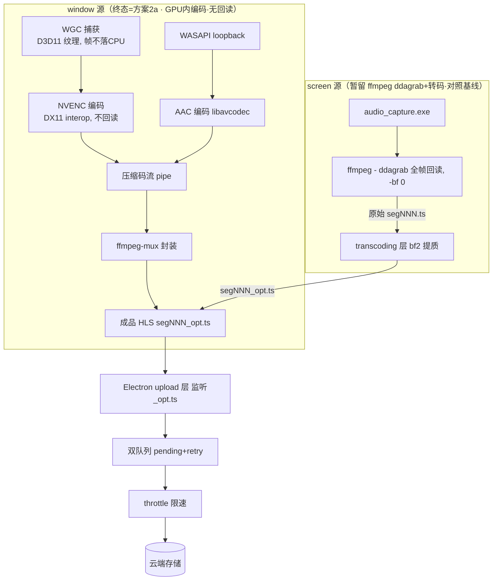

# CoWatch · OBS WGC 独立 exe 方案架构评审（整合版 v2）

**评审人**：高见远（架构师）　**分支**：`feat/obs-wgc-capture`
**依据**：`docs/axy-window-capture-design.md` + 已核实代码 + working_memory（2026-07-09/10/11）+ 用户三轮质疑（含"旧 ffmpeg 单遍也卡 / 非双 NVENC"纠正，以及本轮"GPU→CPU→GPU 全帧回读"尖锐质疑）
**性质**：纯架构分析，不含实现代码。本轮**重写**以整合此前所有轮次结论、纠正与最新质疑，并给出方案选型。

---

## 0. 先给结论（TL;DR · 整合全部轮次）

1. **Q1（exe 职责）**：exe ≈ OBS 录制引擎的"采集 + GPU 内编码"一半（WGC 视频 + WASAPI 回环音频 + NVENC）。**终态必须内嵌 NVENC 编码（方案2a）**，而非"只捕获 + 回读 + pipe 给 ffmpeg（方案1）"。见 §A、§F。
2. **Q2（录制/转码分离）**：**window 模式删除 transcoding 层，单遍成片**——结论保留。但**理由链已修正**：旧"双 NVENC 并发是真凶"的反证是**错误**的；正确根因是 ffmpeg 捕获路径的**全帧 GPU→CPU→GPU 回读**。见 §C。
3. **GPU→CPU→GPU 回读是旧卡顿根因，方案1 未消除它**：OBS 高效是因为帧留在 GPU 上编码（DX11 interop 直送 NVENC），无回读。方案1（exe 回读 raw BGRA → pipe → ffmpeg hwupload 编码）**同样引入全帧回读**，与旧 ffmpeg 卡顿**同源**，平滑性存疑。见 §D。
4. **方案选型**：方案1 仅作"最小验证/对照"，**终态应为方案2a**（exe 内 NVENC(DX11 直送) → 压缩码流 pipe → `ffmpeg-mux` 封装 HLS），与 OBS 架构等价、构建可控、无回读。方案2b（全内嵌）为备选。见 §E。
5. **参数注入**：方案2a 下 exe 仍需可注入参数（捕获 + 编码 + mux 全范围），由主进程 CLI 注入、不写死、不开放终端用户。见 §G。
6. **§A×Y 文档修订**：§1.1 / §1.2 / T02–T05 / T06 / T08 / T09 需按方案2a 行级修订（删 `frame_buffer` 回读、改压缩码流 pipe、加 NVENC 链接）。见 §J。
7. **方案选型已锁定 = 方案2a**（用户拍板终态：exe 内 NVENC + ffmpeg-mux 封装）。方案1 仅作最小验证/对照，不作为终态。见 §I（待拍板项已收敛）。

---

## A. exe 在 A×Y 下的职责清单（终态 = 方案2a）

### 承担（方案2a 目标态）
1. **窗口帧捕获（WGC）**：Windows Graphics Capture 抓 `--hwnd/--title` 窗口，产出 **D3D11 纹理（`ID3D11Texture2D`）**——帧**留在 GPU 上**。
2. **音频捕获（WASAPI loopback）**：内嵌 WASAPI 回环，抓系统/应用输出声；原 `audio_capture.exe` 职责合并进 exe。
3. **GPU 内 NVENC 编码（DX11 输入，不回读）**：直接把 D3D11 纹理交给 NVENC（DX11 interop，`NV_ENC_INPUT_RESOURCE_TYPE_DIRECTX`），产出**压缩码流**（极小）。这是方案2a 相对方案1 的关键增量——编码发生在 exe 内、帧不落 CPU。
4. **（可选）音频编码**：WASAPI PCM → exe 内 AAC 编码（libavcodec `aac`，CPU 占用极小）→ 也产出压缩包。
5. **写压缩码流 pipe**：把视频/音频压缩包经 pipe 交给 `ffmpeg-mux`（或轻量 muxer）。pipe 内容仅为压缩流（MB/s 级，非全帧 GB/s 级）。
6. **控制协议 / 状态行 / 退出码**：stdin `q` 优雅退出；stdout JSON `READY/CLOSED/ERROR`；退出码语义不变。

### 明确不承担
1. **不做全帧 GPU→CPU 回读**（方案1 的 `frame_buffer.*` staging `Map/Unmap` 在方案2a **删除**）。
2. **不做容器封装（mux）**：HLS 切片 `segNNN.ts` / `index.m3u8` 由独立的 `ffmpeg-mux` 进程完成（仅收压缩包做封装，与 OBS 一致）。
3. **不上传**（Electron `upload/` 层职责）。

### 对照 OBS 录制引擎（修正版）

| OBS 组件 | 在方案2a 中对应 | 在方案1（当前 A×Y）中对应 |
|---|---|---|
| source（WGC + WASAPI） | `window_capture.exe`（同） | `window_capture.exe`（同） |
| obs_encoder（NVENC，DX11 输入） | **exe 内 NVENC** | **Node 侧 ffmpeg** |
| obs_output / muxer | **ffmpeg-mux**（仅封装压缩流） | **ffmpeg**（吃 raw pipe，需 hwupload 回 GPU 编码） |
| OBS UI | Electron 主进程 | Electron 主进程 |

**一句话**：方案2a 的 exe ≈ OBS「source + encoder（GPU 内）」，mux 交给轻量 `ffmpeg-mux`；方案1 的 exe 只是「source 的一半」，多出的全帧回读 + 跨进程 hwupload 正是旧卡顿根因。

> 注：方案1（exe 纯捕获 + 回读 + pipe）仍可作为**最小验证/对照**短期存在，但**不作为终态**（见 §E）。A×Y 文档 §1.1/§1.2 当前按方案1 写，需按 §J 修订为方案2a。

---

## B. Electron 侧「捕获 + 编码 + 上传」全链路（当前三层）

（此节与上一轮一致，仅标注 window 终态为方案2a 单遍。）

### 文字说明
当前 `recorder/index.ts` 三层流水线：
1. **recording/**：spawn 捕获 + 编码，落 HLS 切片。
   - screen 源：`ffmpeg -i ddagrab` + `audio_capture.exe`（双进程，ffmpeg ddagrab 走**全帧回读**路径）。
   - window 源（终态 = 方案2a）：`window_capture.exe`(WGC + WASAPI + NVENC，压缩码流 pipe) + `ffmpeg-mux`(封装 HLS)。**无回读**。
2. **transcoding/**：仅 **screen 模式**保留（见 §C 硬约束）。window（方案2a）已单遍成片，跳过。
3. **upload/**：监听 `_opt.ts`（window 成品直接命名 `segNNN_opt.ts` 天然绕过转码）→ 串行上传 + 退避 + 限速。

### 流程图（Mermaid）

```mermaid
flowchart TD
    subgraph WIN["window: 源（终态=方案2a · GPU内编码·无回读·单遍成片）"]
        WE[window_capture.exe<br/>WGC→D3D11纹理→NVENC(DX11,不回读)<br/>WASAPI→AAC]
        WE -->|压缩码流 pipe| WM[ffmpeg-mux<br/>仅封装]
        WM --> WT[成品 HLS 切片 segNNN_opt.ts]
    end
    subgraph SCR["screen: 源（暂保留 ffmpeg ddagrab+转码层·对照基线）"]
        SE[audio_capture.exe] --> SF
        SF[ffmpeg - ddagrab 全帧回读, -bf 0] -->|原始 segNNN.ts| ST[transcoding 层<br/>bf2 提质]
        ST -->|segNNN_opt.ts| WT
    end
    WT --> UP[Electron upload 层<br/>监听 _opt.ts]
    UP --> UQ[双队列: pending+retry]
    UQ --> TH[throttle 应用层限速]
    TH --> CDN[(云端存储)]
```

---

## C. 正面回答「录制/转码是否还要分离」（最关键 · 理由链已修正）

### 直接结论（保留）
**window 模式：删除 transcoding 层，单遍成片（一次编码即成品）。** 这条结论不变。

### 但理由链必须修正（重要）
上一轮评审 §C 用「当前架构同时跑两个 NVENC（录制 -bf0 + 转码 bf2），所以加 B 帧到录制层就塌其实是双 NVENC 抢资源造成的假象」作为反证——**这个反证是错误的，本轮删除。**

正确事实链（来自用户实测与 OBS 管线分析）：
1. **用户实测**：即便**关掉转码层、ffmpeg gfxcapture/ddagrab 单遍带 B 帧**，画面**仍然卡**。说明真凶**不是**「双 NVENC 并发」，也**不是** B 帧本身贵。
2. **根因**：ffmpeg 的 gfxcapture/ddagrab 捕获路径是 `捕获→GPU→CPU 回读(raw)→hwupload 再回 GPU 编码` 的**全帧 GPU→CPU→GPU 回读**。每一次全帧回读都吃内存带宽 + PCIe + 一次额外 GPU 上传，帧率被 DWM/负载门控后进一步恶化，与是否 B 帧无关。
3. **OBS 为何高效**：OBS 的 WGC/Game Capture 产出 **GPU 纹理**，NVENC **直接从 D3D11 纹理编码（DX11 interop）**，全程视频帧不落 CPU，只有压缩后的码流（极小）到 CPU 交给 mux。因此 OBS 录制/直播是「单遍成片且平滑」。

### 因此结论的成立前提是「编码在 GPU 内」（即方案2a）
- window 模式「单遍成片」要真正平滑，**必须**像 OBS 一样把编码放在 GPU 内（NVENC 直吃 D3D11 纹理），即**方案2a**，而不是「删掉转码层但仍在 ffmpeg 里走回读路径编码」（方案1）。
- 方案1 即便删了转码层、单遍带 B 帧，也会因为**回读**继续卡——和旧 ffmpeg 卡顿**同源**。所以「删转码层」是对的，但「编码交给 ffmpeg 回读路径」是错的。

### screen 模式：为何暂留转码层（硬约束）
- screen 源用的是 `ffmpeg -i ddagrab`，**仍然走全帧回读路径**。要保录制实时不塌，录制层必须 `-bf 0`；最终质量（B 帧/lookahead）只能由转码层事后补。
- screen 既不能（像 OBS 那样）在 GPU 内编码，又必须实时——**因此 screen 暂保留「录制(-bf0) + 转码(bf2)」双阶段作为对照基线**，这是硬约束，不是偷懒。
- 待 window（方案2a）在码率/质量/实时性上验证无回归后，再评估 screen 是否也换 GPU 内编码路径（另一个独立议题）。

### 对 A×Y 设计文档的修订指向（详见 §J）
- window 单遍参数 `bf 2 / rc-lookahead 20`（与现 transcoding 一致），但**编码发生在 exe 内 NVENC（方案2a）**，成品直接命名 `segNNN_opt.ts` 绕过 transcoding。

---

## D. GPU→CPU→GPU 回读是旧卡顿根因，方案1 未消除它（核心新增）

### OBS 真实管线（纠正误解）
- OBS 录制路径**不是**「捕获→GPU→CPU→GPU 全帧回读」。
- WGC/Game Capture 产出 **GPU 纹理（`ID3D11Texture2D`）**；**NVENC 编码器直接从该 D3D11 纹理编码**（DX11 interop，`NV_ENC_INPUT_RESOURCE_TYPE_DIRECTX`），视频帧全程不落 CPU。只有**压缩后的码流（很小）**才到 CPU 交给 mux。
- OBS 捕获与 NVENC 编码**不以 ffmpeg 为主体**：NVENC 走 NVENC SDK（或其 `obs-ffmpeg` 封装 nvenc）；容器封装由独立的 `ffmpeg-mux` 进程完成（只 mux 已编码包，经 pipe 收压缩流）。所以「obs 用的不是 ffmpeg 做捕获/编码」基本正确——ffmpeg 只在 mux 环节以轻量形式（ffmpeg-mux）出现。
- 含义：旧 ffmpeg 方案卡顿根因正是「捕获→CPU 回读→hwupload 再编码」这个**全帧 GPU→CPU→GPU 搬运**；而方案1（exe 捕获→staging 回读 raw BGRA → pipe → ffmpeg hwupload 编码）**同样引入了全帧回读**，所以方案1 很可能并不能消除卡顿——它只是少了一个 transcode 层，但保留了最贵的那次搬运。

### 用「是否全帧回读」作为判据，重评三方案

| 维度 | 方案1（当前 A×Y：exe纯捕获+回读+ffmpeg） | 方案2a（OBS式混合：exe内NVENC+ffmpeg-mux封装）★推荐 | 方案2b（全内嵌：exe捕获+NVENC+mux） |
|---|---|---|---|
| **全帧回读 GPU→CPU→GPU** | ⚠️ **有**（staging `Map/Unmap` raw BGRA 全帧） | ✅ **无**（DX11 interop 直送 NVENC） | ✅ **无** |
| **pipe 里传的内容** | raw BGRA + raw PCM（全帧，带宽 GB/s 级） | 压缩码流 + 音频包（极小，MB/s 级） | 无外部 pipe |
| **pipe 管理复杂度** | 高（双路异步消费死锁风险，全帧背压） | 低（仅压缩流，背压小） | 无 |
| **构建复杂度** | 低（exe 零 libav） | 中（exe 链 libavcodec nvenc/aac，mux 仍 ffmpeg-mux） | 高（exe 链 编码+封装） |
| **平滑性风险** | **高（与旧 ffmpeg 卡顿同源）** | **低（与 OBS 等价）** | 低 |
| **参数灵活性** | 高（ffmpeg 全参数在 Node 侧） | 中（CLI 注入到 exe，需 exe 解析） | 中 |
| **进程模型** | exe + ffmpeg | exe + ffmpeg-mux（轻） | 单一 exe |
| **与 OBS 架构等价度** | 低（多了回读+hwupload） | **高（source+encoder 在 exe，mux 分离）** | 高（但 mux 也内嵌） |

> 判据一句话：**只要视频帧发生全帧 GPU→CPU→GPU 回读，就与旧卡顿同源；只有「帧留在 GPU 上编码」才安全。** 方案1 满足前者，方案2a/2b 满足后者。

---

## E. 方案选型建议（📌 已锁定 = 方案2a）

> **状态：方案选型已于用户拍板锁定为方案2a 终态。** 方案1 仅作最小验证/对照，不作为终态；方案2b 为后续可选升级（零外部进程），非首选项。下游执行项见 §I。

### 明确推荐：终态 = 方案2a
- **方案1 仅作「最小验证/对照」用**：它构建最简单、参数最灵活，适合在正式调试前快速验证「WGC 能出图、pipe 能通、ffmpeg 能封装」。但因为它**保留全帧回读**，一旦进入真实高分辨率/高 fps 场景，很可能重蹈旧 ffmpeg 卡顿——不应作为终态。
- **终态 = 方案2a**：exe 内 NVENC（DX11 输入、不回读）→ 压缩码流 pipe → `ffmpeg-mux` 封装 HLS。与 OBS 架构等价，平滑性有保证；mux 仍交给独立的轻量 `ffmpeg-mux`，exe 不需链接 libavformat，构建可控。
- **方案2b 备选**：若后续希望「零外部进程、单一 exe 最简洁进程模型」，可升级为全内嵌（exe 内再链 libavformat 做 mux）。但构建最重，非首选项。

### 理由（回应本轮用户的权衡）
用户在本轮提出的核心权衡：「若回读/pipe 风险不大，保持 exe 纯粹只做捕获；若像脉冲/GPU 击穿那样风险大，应在 exe 内直接出片。」
- 我们的判断：**全帧回读的风险与旧 ffmpeg 卡顿同源，不是「可能不大」的小风险**——用户自己实测单遍带 B 帧的 ffmpeg 仍卡，已证实回读路径在真实负载下会塌。
- 因此「为保持 exe 纯粹而只做捕获」的代价，是**很可能重蹈卡顿**，不划算。正确做法是在 exe 内直接出片（方案2a，GPU 内编码），同时把 mux 留在轻量 `ffmpeg-mux` 以保持构建轻——这正是 OBS 的做法，也是「exe 直接出片」与「构建可控」的最优折中。

---

## F. 方案2a 的 exe 内部架构定义

### 管线（终态）

```
WGC 捕获
   │ (GPU 纹理 ID3D11Texture2D，帧不落 CPU)
   ▼
[可选 GPU 色彩/缩放 shader]  （如需要限宽 1280，仍在 GPU 上做）
   │
   ▼
NVENC 编码  (DX11 interop, NV_ENC_INPUT_RESOURCE_TYPE_DIRECTX, 不回读)
   │ 压缩码流 (H.264/HEVC NAL, 极小)
   ▼
WASAPI loopback ──► AAC 编码 (libavcodec aac, CPU 轻) ──┐
   │                                                      │
   ▼                                                      ▼
压缩码流 pipe (video + audio 包) ──► ffmpeg-mux (libavformat) ──► segNNN.ts + index.m3u8 (HLS)
```

### 关键定义
1. **WGC → D3D11 纹理**：沿用 OBS `winrt-capture.cpp` 剥离（同 A×Y §1.1 的 MSVC/C++/WinRT 工程），帧写入共享 `ID3D11Texture2D`。
2. **NVENC（DX11 输入，不回读）**：用 NVENC SDK（或 libavcodec `h264_nvenc` 配 DX11 设备）直接吃 D3D11 纹理。**禁止** `frame_buffer.*` 的 staging `Map/Unmap` 回读——该文件在方案2a **删除**，改为「纹理直送 NVENC」。
3. **压缩码流 pipe**：exe 把 NVENC 输出的编码包（及 AAC 音频包）经 pipe 交给 `ffmpeg-mux`。pipe 内容仅为压缩流，带宽与旧「全帧 raw」差 2–3 个数量级，背压与死锁风险极低。
4. **ffmpeg-mux 仅封装**：独立的轻量 muxer（libavformat）收压缩包，写 HLS 切片。不包含捕获、不包含编码。
5. **WASAPI → 音频**：WASAPI 原始 PCM → exe 内 AAC 编码（libavcodec `aac`，48k stereo / 128k 占用极小）→ 与视频包一起进 mux。若不愿在 exe 内链 AAC，可改为「raw PCM 经第二路 pipe 给一个仅编码音频的轻 ffmpeg」，但会引入额外进程——**推荐 exe 内 AAC**，保持「仅一个 ffmpeg-mux」的进程模型。

### 与 A×Y 当前（方案1）的 diff 要点
- **删除** `frame_buffer.h/.cpp`（staging 回读）。
- **新增** `nvenc_encoder.*`（DX11 输入 NVENC）+ 复用/新增 `audio_encoder.*`（AAC）。
- **改写** `pipe_output.*`：从「写 raw BGRA/PCM」改为「写压缩包流」（或改用 libavformat 的 pipe muxer 接口）。
- **新增链接**：libavcodec（nvenc + aac）、NVENC SDK（或经 libavcodec 间接）。`ffmpeg-mux` 独立进程由 Node 侧 spawn（同现在 spawn ffmpeg 的方式，只是换进程角色）。

---

## G. 参数注入设计（方案2a）

### 原则（整合上一轮需求）
方案2a 下 exe 仍需可注入参数，且**范围扩大到「捕获 + 编码 + mux」全部**；仍由**主进程 CLI 注入，不写死**；不开放给终端用户。这与「OBS UI 改参、CoWatch 由主进程注入、不开放给终端用户」完全一致——主进程集中维护 `CaptureProfile` / `EncodeProfile` 配置，按硬件/模式下发给 exe。

### 注入范围

| 类别 | 参数 | 示例 |
|---|---|---|
| 捕获 | 分辨率 `--w --h`、帧率 `--fps`、窗口 `--hwnd/--title`、光标 `--cursor` | `--w 1920 --h 1080 --fps 30` |
| 编码 | 编解码器 `--codec`、码率/CBR `--bitrate`、B 帧 `--bf`、前瞻 `--rc-lookahead`、预设 `--preset` | `--codec h264_nvenc --bitrate 8M --bf 2 --rc-lookahead 20 --preset p4` |
| 音频 | 设备 `--audio-device`、是否启用 `--audio` | `--audio --audio-device <loopback-id>` |
| 封装/mux | 输出目录 `--out`、切片时长 `--seg` | `--out <tmpDir> --seg 10` |

### 方案2a CLI 示例

```
window_capture.exe \
  --hwnd 123456 \
  --fps 30 --w 1920 --h 1080 \
  --codec h264_nvenc --bitrate 8M --bf 2 --rc-lookahead 20 --preset p4 \
  --audio --audio-device <loopback-id> \
  --out <tmpDir>
```

- exe 内部：WGC 按 `--w/--h/--fps` 配置（或首帧决定后经 `--w/--h` 覆盖）；NVENC 按 `--codec/--bitrate/--bf/--rc-lookahead/--preset` 配置（CBR≈可承受上行 X%，软限速交给应用层 `throttle`）；AAC 固定 48k / 128k；`ffmpeg-mux` 按 `--out/--seg` 写 HLS。
- **不在 exe 内硬编码任何质量/码率**：全部来自主进程注入的 `CaptureProfile` / `EncodeProfile`。

---

## H. 修订后整体架构图（Mermaid）



> 方案2a 的 exe 内无「全帧回读」，与 OBS 等价；screen 因仍走 ffmpeg ddagrab 全帧回读路径，暂保留转码层作为硬约束对照。

---

## I. 待用户拍板 / 待办（原 §F 更新 · 📌 方案选型已锁定=方案2a，以下仅剩执行项与可选项）

1. **[已锁定·终态] 方案选型 = 方案2a**：用户已拍板，终态为「exe 内 NVENC(DX11 直送) + AAC → 压缩码流 pipe → ffmpeg-mux 封装 HLS」。**不再存在「选 1/2a/2b」的待定措辞。** 方案1 仅作最小验证/对照，不作为终态；方案2b（全内嵌）为后续可选升级。
2. **[固化] exe 内嵌 NVENC 编码（是，方案2a）+ ffmpeg-mux 仅做封装**：确认 exe 链接 libavcodec nvenc/aac，mux 留独立 ffmpeg-mux 进程。
3. **[固化] window 上 B 帧 = YES**：`bf 2 / rc-lookahead 20`，编码在 GPU 内（方案2a）故无回读风险，平滑性由 GPU 内编码保证。
4. **[固化] screen 暂留转码层（硬约束）**：screen 仍走 ffmpeg ddagrab 全帧回读，录制须 `-bf 0`，质量由转码层补；不在此次 window 修订范围。
5. **[固化] 主进程集中参数配置 `CaptureProfile` / `EncodeProfile`**：捕获 + 编码 + mux 全参数由主进程 CLI 注入 exe，不写死、不开放终端用户（与 OBS UI 改参一致）。
6. **[已完成] A×Y 文档 `docs/axy-window-capture-design.md` 已按方案2a 修订**：删 `frame_buffer` 回读、改压缩码流 pipe、加 NVENC/AAC 链接、新增 §1.5 参数注入（CaptureProfile/EncodeProfile/MuxProfile）、T02–T09 同步扩写。行级清单见 §J。
7. **[QA] 增补对比测试（T09）**：**方案1 vs 2a 在平滑性（帧率/是否掉帧/是否拖游戏）上的对比**，作为选型与删除回读的最终验收依据。
8. **[可选] 复盘「录制必须 -bf 0」原始实测**：在「关闭转码层 + GPU 内编码（方案2a）」前提下重测加 B 帧是否真的塌——预期证明当初是「ffmpeg 回读路径」导致的假象，可作权威佐证。

---

## J. 对 `docs/axy-window-capture-design.md` 的行级修订清单

> 仅改设计文档，不改实现代码。下列为 A×Y 文档需要按方案2a 修订的条目。

| 位置 | 现状（方案1） | 修订为（方案2a） |
|---|---|---|
| **§1.1** 构建/链接 | 「捕获 exe 不依赖 ffmpeg：exe 只写 raw 字节，ffmpeg 由 Node spawn」 | 「exe 内嵌 NVENC 编码（libavcodec nvenc / NVENC SDK，DX11 输入不回读）+ AAC 编码；`ffmpeg-mux` 仅做封装，由 Node 另 spawn。exe 链接 libavcodec + NVENC SDK。」 |
| **§1.2** 双 pipe 契约 | 视频 fd3 raw BGRA、音频 fd4 raw PCM；ffmpeg 吃双 pipe 做 hwupload 编码 | 改为**压缩码流 pipe**：exe 输出 NVENC 视频包 + AAC 音频包 → `ffmpeg-mux` 封装 HLS。**删除** raw BGRA/PCM 双 pipe 与「ffmpeg hwupload 编码」描述 |
| **§1.2** 视频编码参数 | `-bf 0` | window（方案2a）`bf 2 / rc-lookahead 20 / CBR≈上行`，编码在 exe 内 NVENC 完成 |
| **§1.3** 架构模式 | 「exe 内部：WGC 回调→共享纹理→主循环读纹理→**回读 CPU**→写 pipe」 | 「exe 内部：WGC 回调→共享纹理→**NVENC 直吃 D3D11 纹理（不回读）**→压缩包→pipe 给 ffmpeg-mux」 |
| **T02** C++ 工程骨架 | 仅 MSVC/CMake，零 libav | 增加 libavcodec + NVENC SDK 链接配置（CMakeLists 加 `avcodec`/`nvenc`）；`build.ps1` 增加 ffmpeg 开发库 / `ffmpeg-mux` 产物前置 |
| **T03** WGC 端口 | 帧回调写共享纹理（不变） | 不变（WGC→D3D11 纹理），但**明确纹理后续直送 NVENC，不进 frame_buffer** |
| **T04** WASAPI loopback | 回调交 PipeOutput（raw PCM） | 回调交 AudioEncoder（AAC）后再进压缩流 pipe |
| **T05** 双 pipe + frame_buffer | `frame_buffer.*` staging 回读 + `pipe_output.*` 写 raw BGRA/PCM | **改写为**：`nvenc_encoder.*`（DX11 输入 NVENC，不回读）+ `audio_encoder.*`（AAC）+ `pipe_output.*` 写**压缩包流**（删 `frame_buffer.*`） |
| **T06** recording 层 window 改造 | spawn exe(等READY) + spawn ffmpeg 双 pipe | spawn exe(等READY, 内 NVENC) + spawn `ffmpeg-mux`（收压缩流封装 HLS）；保留 pause/resume/stop + 锚点 + `-force_key_frames` |
| **T08** 构建/打包集成 | 产出 `window_capture.exe` 入 `electron/bin/` | 同，另确保 `ffmpeg-mux` 一并入 `electron/bin/`（extraResources 自动打包） |
| **T09** QA 真机验证 | staging 带宽 / 双 pipe 死锁等 | **增补**：方案1 vs 2a **平滑性对比测试**（同分辨率/fps 下帧率、掉帧、是否拖游戏）；删除「staging 带宽」项（方案2a 无回读），改为 NVENC DX11 interop 可用性、压缩流 pipe 背压验证 |

---

## 附：关键术语与判据速记
- **全帧回读 GPU→CPU→GPU**：视频帧以 raw 形式从 GPU 拷到 CPU 再回 GPU 编码。旧 ffmpeg 卡顿根因；方案1 仍带此问题；方案2a/2b 消除。
- **DX11 interop 直送 NVENC**：`NV_ENC_INPUT_RESOURCE_TYPE_DIRECTX`，帧留在 GPU 编码。OBS 做法，方案2a 采用。
- **ffmpeg-mux**：OBS 式轻量封装进程，只收压缩包、写容器。方案2a 的 mux 角色。
- **单遍成片**：一次编码即成品，删 transcoding 层。window（方案2a）成立；screen（ffmpeg ddagrab 回读）因硬约束暂不成立。

---

## K. 独立诊断模式设计结论（本轮新增 · 编译前可诊断性需求）

> 依据：用户编译 `window_capture.exe`（方案2a 终态）前提出的"无法判断问题出在 exe / pipe / ffmpeg-mux 哪一层"的可诊断性需求；落点见 `docs/axy-window-capture-design.md` §1.6（mux target 抽象 / 窗口定位 / 遥测 / CLI 示例 / 护栏）与任务分解 T05a/T05b/T05c。

1. **为什么要加**：方案2a 下 exe 把压缩流写 fd3/fd4 两路 pipe，且**必须**有 `ffmpeg-mux` 在另一端读；否则 pipe 写满（默认 64KB 内核缓冲）后 exe 的写操作**阻塞死锁**，第一帧后卡死。故"不挂 mux 直接命令行跑 exe"在当前设计下**不可行**。用户需要编译前"单独命令行启动 exe、隔离测 exe 自身 CPU/GPU"，必须引入 mux target 抽象把 mux 目标从硬编码 pipe 提升为**一等公民**。
2. **三态 mux target**：`pipe`（生产态，写 fd3/4 给 ffmpeg-mux）/ `file`（诊断态，exe **私有 spawn ffmpeg-mux** 写 HLS 到 `--out`）/ `null`（性能基准态，捕获+编码后**丢弃压缩包**，不写 fd、不 spawn mux）。`null` 是用户隔离判因的最关键手段——它让 exe 完全脱离下游独立运行，任何 CPU/GPU 占用都 100% 归因 exe 内部。
3. **新增 `--pid` / `--window-index`**：按进程 PID 枚举顶层窗口定位目标（覆盖标题会变 / 多窗口 / 只想锁某 PID），优先级 PID > hwnd > title；新增 `--stats` 遥测（每 1~2s 向 stderr 打 JSON：capture/encode fps、GPU%/CPU%、丢帧、字节率），把"exe 内部 capture+encode 负载"与"pipe/mux 下游"彻底分离。
4. **与隔离判因的关系**：开 `--null --stats` 看 exe **自身天花板**（无 pipe / 无 mux / 无下游）；再开 `pipe`/`file` 模式看是否由下游引入抖动。由此把"卡顿/高占用"干净二分到 **exe 内部** vs **pipe / ffmpeg-mux 外部**，正面回应了用户"编译前无法判断问题在 exe 还是 pipe/ffmpeg-mux"的诉求。
5. **file 模式实现决策**：采纳"exe 私有 spawn ffmpeg-mux 子进程（继承压缩流 fd，与 Electron 侧同构）"，**不**让 exe 链 libavformat——守住方案2a"mux 不进 exe"的架构边界，零新代码、复用同一契约、产出与 `pipe` 模式逐字节等价，诊断结论可直接外推到生产态。
6. **护栏**：standalone 诊断是一等公民，任何"exe 假定 ffmpeg-mux 必然存在 / fd3/4 必有读者"的实现视为**偏离方案2a 终态，应驳回**（与"禁止 `frame_buffer` 回读"护栏并列）。

> 本文件为**架构评审/分析文档**，不含实现代码，无需 IS_PASS 代码审查。
