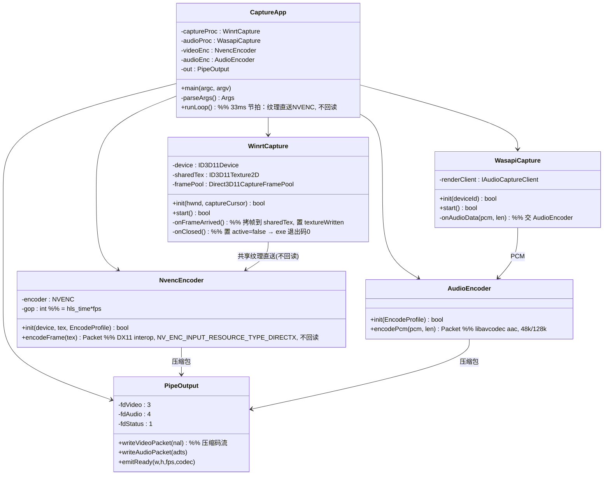
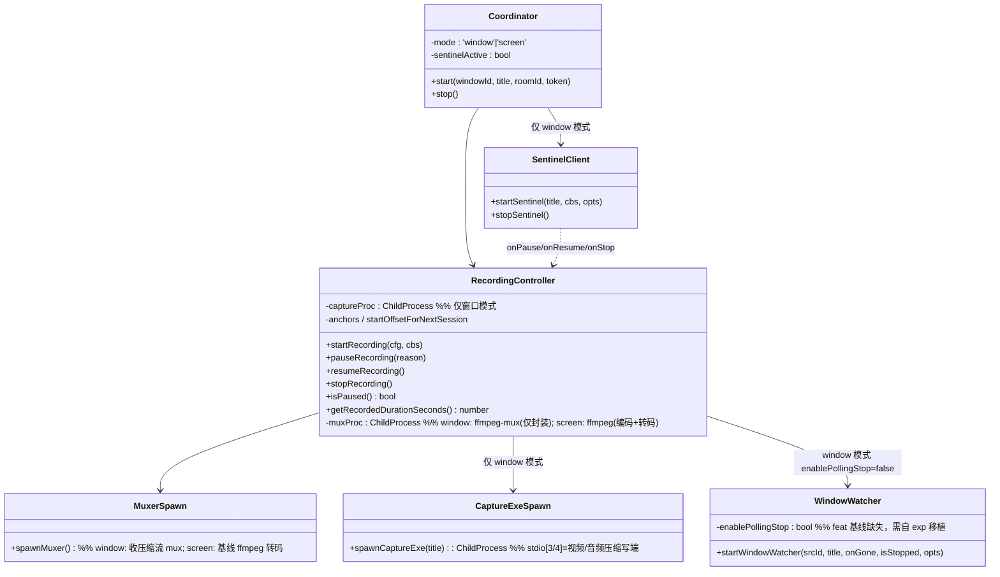
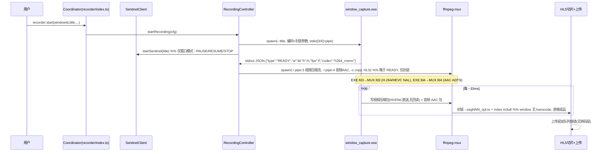
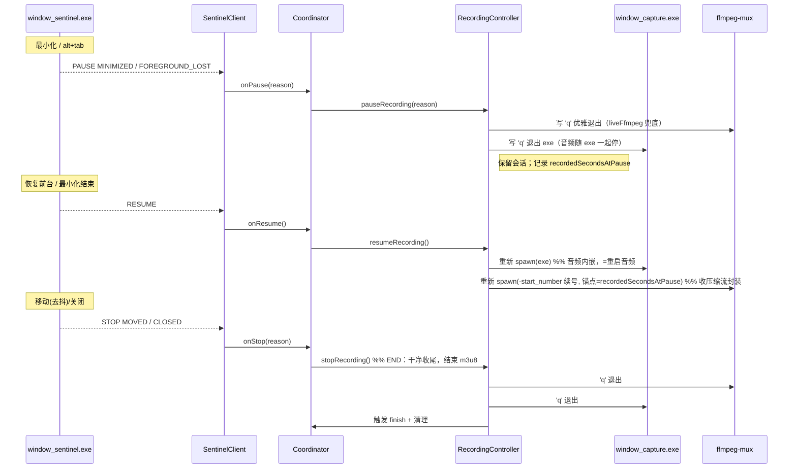
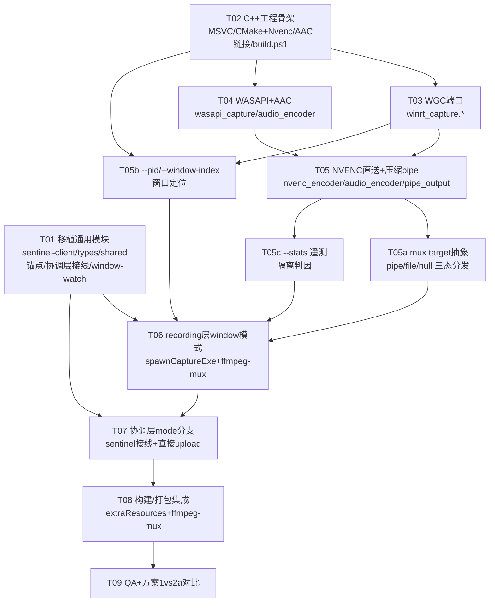

# A×Y 增量架构设计：窗口录制换 OBS WGC 独立 exe（仅窗口模式 · 方案2a 终态）

> 作者：高见远（架构师 Bob） ｜ 日期：2026-07-11 ｜ 分支：`feat/obs-wgc-capture` ｜ 状态：**方案2a（已锁定终态）**
> 范围：**仅窗口录制（`window:` 源）** 替换为 `window_capture.exe`（OBS WGC 剥离 + 内嵌 WASAPI loopback + **exe 内 NVENC 编码（DX11 纹理直送，不回读）** + 内嵌 AAC），输出**压缩码流 pipe** → 独立的 `ffmpeg-mux` 仅做 HLS 封装；**全屏录制（`screen:` 源）保持 ddagrab + audio_capture.exe 双进程 + 转码层不变（硬约束）**。Electron 不拆分。
> 性质：**纯设计 + 任务分解**，不含实现代码（实现交给 Engineer）。
> 关联文档：`docs/obs-wgc-capture-analysis.md`、`docs/7.11-窗口化捕获.md`、`docs/ddagrab-crop-incremental-design.md`、`docs/architecture-review-obs-wgc.md`（§F 内部架构 / §G 参数注入 / §J 行级清单）。

---

## 0. 已对照源码核实（迁移缺口锁定）

| 核实项 | feat 分支现状 | 结论 |
|---|---|---|
| `electron/handlers/recorder/recording/index.ts` | 干净基线版；`window:` 源仍走 `gfxcapture=window_title=...`（第 272–276 行） | 需重写，window 模式改吃 exe **压缩码流 pipe** + `ffmpeg-mux` 封装（移除逐片 transcode 接线） |
| `electron/handlers/recorder/window-watch.ts` | `startWindowWatcher(srcId, title, onGone, isStopped)` 仅 4 参数，**无 `opts.enablePollingStop`** | T01 需整体移植 exp 版的 `opts?: { enablePollingStop?: boolean }` |
| `electron/handlers/recorder/sentinel-client.ts` | **不存在** | T01 从 exp 分支新建 |
| `electron/handlers/recorder/recording/types.ts` | **不存在**（基线 recording/ 仅 index.ts + diagnostics.ts） | T01 从 exp 分支新建（`CropRect`/`PauseReason`/`StopReason`） |
| `electron/handlers/recorder/shared.ts` | 仅 `getFfmpegPath` + `HLS_SEGMENT_DURATION` | T01 增补 `registerSessionAnchor`/`resetSessionAnchors`/`getOutputTsOffset` |
| `electron/handlers/recorder/index.ts`（协调层） | 无 sentinel 接线 | T07 从 exp 分支移植 `startSentinel`/`stopSentinel` 接线 |
| `electron/bin/capture-src/` | **不存在** | T02 新建 C++ 工程（**链接 libavcodec nvenc/aac + NVENC SDK**） |
| exp 实验版 `recording/index.ts` | 已含 `liveFfmpeg` + pause/resume/stop + 时间轴锚点 + 音频崩溃重连 + `-force_key_frames` | 这些通用健壮性在 A×Y window 模式**保留/重做** |

> 实验版 `recording/index.ts` 关键事实：pause 时把 `ffmpegProcess` 置空并由 `liveFfmpeg` 持有真实进程；`recordedSecondsAtPause = currentRecordedSeconds()` 作为续录时间轴起点；resume 时 `startOffsetForNextSession = recordedSecondsAtPause` 并登记锚点。A×Y window 模式完全沿用该机制（仅将"重连 audio_capture.exe"替换为"重启 window_capture.exe"，将"重启 ffmpeg 编码"替换为"重启 ffmpeg-mux 封装"）。

---

## 1. 实现方案 + 框架选型

> **方案2a 一句话定性**：exe ≈ OBS「source + encoder（GPU 内）」，把 WGC 纹理**直接送入 NVENC（DX11 interop，不回读）**、WASAPI PCM 在 exe 内编码为 AAC，二者压缩包经 pipe 交给独立轻量 `ffmpeg-mux` 封装 HLS；**不存在全帧 GPU→CPU→GPU 回读**，与 OBS 架构等价、平滑性有保证。

### 1.1 C++ 构建工具选型（exe 职责：内嵌 NVENC + AAC）

| 候选 | 结论 | 理由 |
|---|---|---|
| **MSVC（VS 2022 Build Tools / cl.exe）+ CMake + Ninja** | ✅ 采用 | WGC/WinRT 需 `winrt::` C++ 投影与 `windowsapp.lib`；MinGW-w64 的 WinRT 头支持不完整，**不可用**。 |
| MinGW-w64 (gcc) | ❌ 否决 | C++/WinRT 投影、DispatcherQueue、GraphicsCapture 头依赖 MSVC 工具链 + Windows SDK。 |
| clang-cl + MSVC SDK | ⚠️ 备选 | 偏好 clang 时可用 clang-cl 驱动 MSVC 标准库；优先标准 MSVC 以降低离散度。 |

- **C++/WinRT**：NuGet `Microsoft.Windows.CppWinRT`（提供 `winrt/` 头与 `cppwinrt.exe` 代码生成）。
- **Windows SDK 10.0.19041+**：提供 D3D11 / DXGI / `DispatcherQueue.h` / `dwmapi.lib` / `windows.graphics.capture.interop.h`。
- **链接库（运行时）**：`windowsapp.lib`、`dwmapi.lib`、`d3d11.lib`、`dxgi.lib`。
- **⚠️ 方案2a 相对方案1 的关键增量——exe 内嵌编码**：
  - **NVENC（视频编码，DX11 输入，不回读）**：用 **NVENC SDK**（或经 libavcodec `h264_nvenc`/`hevc_nvenc` 配 DX11 设备）直接吃 `ID3D11Texture2D`（`NV_ENC_INPUT_RESOURCE_TYPE_DIRECTX`）。**禁止**任何形式的 staging `Map/Unmap` 全帧回读。
  - **AAC（音频编码）**：WASAPI PCM → 在 exe 内用 **libavcodec `aac`** 编码（48k stereo / 128k，CPU 占用极小）→ 与视频压缩包一起进压缩流 pipe。
  - **链接库（编码）**：`avcodec`（nvenc + aac）、`avutil`（可选 `swscale` 若需 GPU 缩放）、**NVENC SDK**（或经 libavcodec 间接引入）。
  - **mux 不进 exe**：HLS 切片封装交给独立的 `ffmpeg-mux` 进程（仅收压缩包，与 OBS 一致），exe **不链接 libavformat**。诊断态 `--file` 模式同样复用 `ffmpeg-mux`（exe 私有 spawn、继承本地压缩流 pipe，与 Electron 侧同构），**不**改变此约束（详见 §1.6）。
- **结论**：exe 不再是「零 libav 纯捕获」，而是「捕获 + GPU 内编码 + 音频编码」；mux 仍由 Node 侧另外 spawn 的 `ffmpeg-mux` 承担。构建可控、进程模型清晰（exe + ffmpeg-mux，无逐片转码层）。

### 1.2 ffmpeg-mux 压缩码流 pipe 契约（核心 · 方案2a）

单一 `ffmpeg-mux` 进程，**两个继承的文件描述符（fd）输入**：视频走 exe 的 fd 3，音频走 exe 的 fd 4。**pipe 内容物为压缩流（MB/s 级），不再是全帧 raw（GB/s 级）**。

- Node 侧 `spawn('window_capture.exe', […], { stdio: ['pipe', 'pipe', 'pipe', 'pipe', 'pipe'] })`
  - `stdio[0]`=stdin（控制通道，Node 写 `q` 优雅退出；exe 也可读 stdin 控制）
  - `stdio[1]`=stdout（**JSON 状态行**：READY / CLOSED / ERROR）
  - `stdio[2]`=stderr（人类可读日志）
  - `stdio[3]`=视频写端（exe 写 **压缩码流**：H.264/HEVC Annex-B NAL）
  - `stdio[4]`=音频写端（exe 写 **AAC ADTS 包**）
- Node 从 `captureProc.stdio[3].fd` / `captureProc.stdio[4].fd` 取得**读端 fd 号**，以 `{ fd: <n> }` 形式继承给 `ffmpeg-mux` 的 `stdio[3]` / `stdio[4]`（mux 的 fd 3/4 即其 `pipe:3` / `pipe:4` 输入）。
- `ffmpeg-mux` 参数（窗口模式，方案2a，设计规格，非代码）：
  ```
  视频输入 : -f h264 -i pipe:3            # 已编码流(Annex-B)；HEVC 用 -f hevc
  音频输入 : -f aac  -i pipe:4            # AAC ADTS 包
  映射     : -map 0:v -map 1:a            # 视频=input0, 音频=input1
  封装     : -c copy -f hls \             # 仅复制封装，零重编码
             -hls_time 10 -hls_list_size 0 -start_number {N} \
             -hls_segment_filename seg%03d.ts index.m3u8
  关键帧对齐: 由 NVENC GOP 保证（见 §1.5 -g = hls_time×fps），
              mux 仅 -c copy，不再用 ffmpeg -force_key_frames
  ```
  > ⚠️ **必须先等 exe 的 `READY` JSON（含 W/H/fps/codec）再 spawn `ffmpeg-mux`**，因为 mux 的 `-f h264/hevc` 与 `-start_number` 依赖首帧协商结果。
  > ⚠️ 方案2a 下 **彻底删除**方案1 的「raw BGRA/PCM 双 pipe + ffmpeg hwupload 编码 + `frame_buffer.*` 回读」路径——任何全帧 GPU→CPU→GPU 回读都会重蹈旧 ffmpeg 卡顿（见 `architecture-review-obs-wgc.md` §D）。

### 1.3 架构模式

- **window 源（终态 = 方案2a）：无回读单遍成片，无 transcoding 层**
  - 捕获 exe 内部：沿用 OBS 双线程解耦——WGC 回调线程异步把最新帧拷入共享 `ID3D11Texture2D`；主渲染线程按固定节拍（~33ms）把**共享纹理直接交给 NVENC（DX11 interop，不回读）**，产出压缩包写 pipe；WASAPI loopback 在独立线程 PCM → AAC 编码后写音频 pipe。**全程视频帧不落 CPU**。
  - Node/Electron 侧：`recording` 层 spawn `window_capture.exe`（内 NVENC）+ `ffmpeg-mux`（仅封装），**下游直接进 `upload/`（成品 `segNNN_opt.ts`），跳过 transcoding 层**。
  - 单遍成片成立前提：编码在 GPU 内（方案2a），故 B 帧可用（`bf 2 / rc-lookahead 20`），平滑性由「帧留 GPU」保证。
- **screen 源（维持方案1 式双进程 + 转码层 · 硬约束，非保守）**
  - `ffmpeg -i ddagrab` + `audio_capture.exe` 双进程不变；ffmpeg ddagrab **仍走全帧 GPU→CPU→GPU 回读**，实时录制必须 `-bf 0`，质量（B 帧/lookahead）由 transcoding 层事后补（`bf 2`）。
  - 这是**硬约束不是保守**：screen 既不能在 GPU 内编码（无 OBS 式纹理直送路径），又必须实时，故暂保留「录制(-bf0) + 转码(bf2)」双阶段作为对照基线。待 window（方案2a）验证无回归后，再独立评估 screen 是否也换 GPU 内编码路径。
- **行为模型四态与捕获源解耦**：sentinel（`window_sentinel.exe`）事件 → 协调层 → recording 层 pause/resume/stop。窗口模式**忽略 RECT/crop**（不再需要裁剪），仅取 PAUSE/RESUME/STOP/NOT_FOUND。

### 1.4 exe 接口契约（窗口捕获子进程 · 方案2a）

| 维度 | 约定 |
|---|---|
| **命令行参数（捕获 + 编码 + 封装全量，主进程注入）** | 窗口定位：`--hwnd <十进制HWND>` / `--title <标题子串>` / `--pid <十进制PID>` / `--window-index <n>`（互斥优先级 **PID > hwnd > title**，三者皆缺则退出码 2）；`--fps <n>`（默认 30）；`--w <n>` `--h <n>`（可选，强制输出尺寸，覆盖首帧）；`--cursor`（捕获光标）；`--no-border`（去 WGC 黄边，默认已去）；`--codec <h264_nvenc\|hevc_nvenc>`；`--bitrate <n>`（CBR，如 8M）；`--bf <n>`（如 2）；`--rc-lookahead <n>`（如 20）；`--preset <p1..p7>`（如 p4）；`--gop <n>`（= hls_time×fps，默认 300）；`--audio`（启用内嵌 WASAPI loopback）；`--audio-device <id>`（可选，默认回环设备）；`--out <dir>`（HLS 输出目录，由 ffmpeg-mux 使用）；`--seg <秒>`（切片时长，如 10）；**诊断/隔离**：`--mux-target <pipe\|file\|null>`（默认 `pipe`，主进程注入；诊断切 `file`/`null`，见 §1.6）、`--stats`（每 1~2s 向 stderr 打 JSON 遥测，见 §1.6.C） |
| **stdin 控制** | 收到 `q`（或 `\n`）→ 优雅退出（等同窗口关闭的干净收尾） |
| **stdout（fd1）JSON 状态行** | `{"type":"READY","w":W,"h":H,"fps":F,"codec":"h264_nvenc"}`（启动握手，首帧尺寸+编码格式）；`{"type":"CLOSED","reason":"window_closed"|"user_quit"}`；`{"type":"ERROR","code":N,"msg":"..."}`（含初始化失败原因，含 NVENC DX11 interop 不可用） |
| **stderr（fd2）** | 人类可读日志（设备丢失、帧率、NVENC 初始化、异常） |
| **视频流（fd3）** | **压缩码流**：H.264/HEVC Annex-B NAL（NVENC 直出，帧不落 CPU）；无新帧时复用上一帧（冻结帧对应的最后一包） |
| **音频流（fd4）** | **AAC ADTS 包**（exe 内 libavcodec `aac` 编码，48k stereo / 128k）；非 raw PCM |
| **退出码** | `0`=干净退出（窗口关闭 / 收到 `q` / NOT_FOUND 优雅）；`1`=初始化失败（无 D3D11 / WGC 不支持 / NVENC DX11 interop 不可用 / fd 继承失败 / 窗口未找到）；`2`=运行时致命（设备丢失无法恢复） |

### 1.5 参数注入设计（方案2a · 主进程 CLI 注入，不写死、不开放终端用户）

#### 原则
方案2a 下 exe 仍需可注入参数，且**范围扩大到「捕获 + 编码 + 封装(mux)」全部**；由**主进程 CLI 注入，不写死**；不开放给终端用户。主进程集中维护 `CaptureProfile` / `EncodeProfile` / `MuxProfile`，按硬件/模式下发给 exe 与 `ffmpeg-mux`（与「OBS UI 改参、CoWatch 由主进程注入」一致）。

#### 注入范围

| 类别 | 参数 | 示例 | 注入目标 |
|---|---|---|---|
| 捕获 | 分辨率 `--w --h`、帧率 `--fps`、窗口 `--hwnd/--title/--pid/--window-index`、光标 `--cursor` | `--w 1920 --h 1080 --fps 30 --pid 1234` | exe |
| 编码(视频) | 编解码器 `--codec`、码率/CBR `--bitrate`、B 帧 `--bf`、前瞻 `--rc-lookahead`、预设 `--preset`、GOP `--gop` | `--codec h264_nvenc --bitrate 8M --bf 2 --rc-lookahead 20 --preset p4 --gop 300` | exe |
| 编码(音频) | 设备 `--audio-device`、是否启用 `--audio`（AAC 固定 48k/128k） | `--audio --audio-device <loopback-id>` | exe |
| 封装/mux | 输出目录 `--out`、切片时长 `--seg` | `--out <tmpDir> --seg 10` | exe 转发 → `ffmpeg-mux` 经 fd 继承消费 |
| 诊断/隔离 | mux 目标 `--mux-target <pipe\|file\|null>`、遥测 `--stats` | `--mux-target pipe`（生产） / `--mux-target null --stats`（诊断） | exe（默认 `pipe`；诊断切 `file`/`null`，见 §1.6） |

#### 方案2a CLI 示例

```
window_capture.exe \
  --hwnd 123456 \
  --fps 30 --w 1920 --h 1080 \
  --codec h264_nvenc --bitrate 8M --bf 2 --rc-lookahead 20 --preset p4 --gop 300 \
  --audio --audio-device <loopback-id> \
  --out <tmpDir> --seg 10 \
  --mux-target pipe   # 主进程注入默认 pipe；诊断态改 --file / --null（见 §1.6）
```

- exe 内部：WGC 按 `--w/--h/--fps` 配置；NVENC 按 `--codec/--bitrate/--bf/--rc-lookahead/--preset/--gop` 配置（CBR≈可承受上行 X%，软限速交给应用层 `throttle`）；AAC 固定 48k / 128k；`--out/--seg` 仅用于经 fd 继承把压缩流交给 `ffmpeg-mux` 写 HLS。
- **不在 exe 内硬编码任何质量/码率**：全部来自主进程注入的 `CaptureProfile` / `EncodeProfile` / `MuxProfile`。

#### Node 侧 spawn 展开（主进程职责，伪代码示意）

```ts
// 主进程从配置中心取 profile，展开为 exe 参数 + ffmpeg-mux 参数
function buildExeArgs(p: CaptureProfile & EncodeProfile & MuxProfile) {
  const target = p.muxTarget ?? 'pipe';   // 主进程注入默认 pipe；诊断切 file/null
  const winArgs = p.pid != null
    ? ['--pid', String(p.pid), '--window-index', String(p.windowIndex ?? 0)]
    : p.hwnd != null
      ? ['--hwnd', String(p.hwnd)]
      : ['--title', p.title];
  return [
    ...winArgs,
    '--fps', String(p.fps),
    '--w', String(p.w), '--h', String(p.h),
    '--codec', p.codec, '--bitrate', p.bitrate,
    '--bf', String(p.bf), '--rc-lookahead', String(p.rcLookahead),
    '--preset', p.preset, '--gop', String(p.gop),
    p.audio ? '--audio' : '', '--audio-device', p.audioDevice,
    '--out', p.outDir, '--seg', String(p.seg),
    '--mux-target', target,
    p.stats ? '--stats' : '',
  ].filter(Boolean);
}
function buildMuxArgs(p: MuxProfile) {
  const vfmt = p.codec.startsWith('hevc') ? 'hevc' : 'h264';
  return [
    '-y', '-fflags', '+genpts',
    '-f', vfmt, '-i', 'pipe:3',   // 视频压缩流
    '-f', 'aac', '-i', 'pipe:4',  // 音频 AAC 包
    '-c', 'copy',                 // 仅封装，零重编码
    '-f', 'hls', '-hls_time', String(p.seg),
    '-hls_list_size', '0', '-start_number', String(p.startNumber),
    '-hls_segment_filename', path.join(p.outDir, 'seg%03d.ts'),
    path.join(p.outDir, 'index.m3u8'),
  ];
}
// spawn：exe 占 stdio[3/4]=pipe；mux 经 {fd:n} 继承这两路读端
captureProc = spawn('window_capture.exe', buildExeArgs(p), STDIO5);
// 等 READY 后 spawn mux
muxProc = spawn('ffmpeg-mux', buildMuxArgs(p), { stdio: [ 'pipe','pipe','pipe', {fd: captureProc.stdio[3].fd}, {fd: captureProc.stdio[4].fd} ] });
```

> exe 的 `--out/--seg` 不直接写盘；它们用于主进程计算 `ffmpeg-mux` 的 `-hls_segment_filename` / `-hls_time`（主进程持有路径与续号 `startNumber`）。exe 仅负责产出压缩流并交由 fd 3/4 管道。

---

## 1.6 独立启动与隔离诊断模式（方案2a 一等公民）

> **背景（编译前可诊断性需求）**：方案2a 下 exe 把压缩流写 fd3/fd4 两路 pipe，且**必须**有 `ffmpeg-mux` 在另一端读；否则 pipe 写满（默认 64KB 内核缓冲）后 exe 的写操作会**阻塞死锁**，第一帧后卡死。因此"不挂 ffmpeg-mux 直接命令行跑 exe"在当前设计下**不可行**。为满足编译前"单独命令行启动 exe、隔离测 exe 自身 CPU/GPU"的需求，须把 mux 目标从"硬编码 pipe"提升为**一等公民的抽象**（类比"禁止 `frame_buffer` 回读"护栏，见 §1.6.F）。

### 1.6.A mux target 抽象

`MuxTarget` 三态（由 `--mux-target` 选择，主进程注入默认 `pipe`，诊断切 `file`/`null`）：

| 模式 | 行为 | 是否写盘 | 是否依赖下游 | 用途 |
|---|---|---|---|---|
| `pipe`（默认 · 生产态） | 压缩流写**继承的 fd3/fd4** → `ffmpeg-mux`（由 Electron 侧 spawn）封装 HLS | 否（由 mux 写） | 是（需下游在读） | 生产录制 |
| `file`（诊断态） | exe **私有 spawn `ffmpeg-mux`**，把本地压缩流 pipe 继承给它，写 HLS 到 `--out <dir>` | 是 | 否（exe 自管 mux 子进程） | 自包含验证成品 |
| `null`（性能基准态） | exe 照常捕获+编码，但**丢弃压缩包**（或仅计数字节），不写 fd、不 spawn mux | 否 | 否 | **隔离测 exe 自身 CPU/GPU 天花板** |

**`file` 模式的两种实现取舍（已决策）**：

- **方案 X（exe 自链接 libavformat，自己写 HLS）**：exe 直接调 libavformat 落盘，最自包含、无子进程。但**违反方案2a 的核心构建原则**"exe 不链 libavformat，mux 留独立 ffmpeg-mux"，增加 exe 体积与构建耦合，且与 Electron 侧 mux 路径分叉、易双重维护。✗ **不采纳**。
- **方案 Y（exe 私有 spawn `ffmpeg-mux` 子进程，继承压缩流 fd）✅ 推荐**：复用与 Electron 侧**同构**的 `ffmpeg-mux` 二进制与 pipe 契约——exe 创建本地双 pipe，把 NVENC/AAC 压缩包写进去，再 spawn `ffmpeg-mux` 继承这两路读端（与 `recording/index.ts` 里 `spawn('ffmpeg-mux', …, {stdio:[…, {fd:…}, {fd:…}]})` **完全对称**），由 ffmpeg-mux 写 HLS 到 `--out`。优点：① 守住"mux 不进 exe"的架构边界；② 零新代码、复用同一契约、无分叉；③ `file` 模式产出的切片与 `pipe` 模式**逐字节等价**，诊断结论可直接外推到生产态。

> ⚠️ **死锁根因修复**：`null`/`file` 模式下 exe **不再假定 fd3/fd4 必有读者**。`pipe_output` 的写路径必须按 `MuxTarget` 分支——`pipe` 才写 fd3/fd4；`file` 写本地 pipe（自有 mux 消费）；`null` 直接丢弃/计数不写任何 fd。这是与"禁止 `frame_buffer` 回读"并列的**护栏**。

### 1.6.B 窗口定位参数扩展

在既有 `--hwnd` / `--title` 基础上新增按**进程**定位，覆盖"标题会变 / 多窗口 / 只想锁定某 PID"的场景：

| 参数 | 含义 | 备注 |
|---|---|---|
| `--hwnd <十进制HWND>` | 窗口句柄 | 既有 |
| `--title <标题子串>` | 标题匹配 | 既有 |
| `--pid <十进制PID>` | **按进程 PID 枚举其顶层窗口**，选首个可见窗口 | **新增** |
| `--window-index <n>` | PID 命中多窗口时选第 n 个（0 基，默认 0） | **新增**（仅与 `--pid` 配合） |

- **互斥优先级**：`PID > hwnd > title`（PID 最稳，标题会变时优先）。
- **都不给** → 参数校验失败，退出码 **2**（与"窗口未找到"同档）。

### 1.6.C 诊断遥测输出（隔离判因核心）

新增 `--stats`（或 `--telemetry`）开关：exe 周期性（每 **1~2s**）向 **stderr 打 JSON 行**，字段：

| 字段 | 含义 | 取样来源 |
|---|---|---|
| `capture_fps` | 实测 presented 帧率（WGC 实际出帧） | WGC 帧到达计数 / 时间窗 |
| `encode_fps` | NVENC 实际编码帧率 | `encodeFrame` 调用计数 / 时间窗 |
| `gpu_pct` | GPU 占用 | 优先 NVENC SDK `NvEncGetEncodeStats`；退化 NVML `nvmlDeviceGetUtilizationRates`；再退化 DX11 `IDXGIAdapter` 查询 |
| `cpu_pct` | 进程自身 CPU 占用 | `GetProcessTimes` 差分 |
| `drop_cnt` / `resend_cnt` | 丢帧 / 重发计数 | WGC 跳帧 + NVENC `frameDropCnt`（若可用） |
| `out_bps` | 输出字节率 | 压缩包字节计数 / 时间窗（`null` 模式来自计数） |

**隔离判因方法学**（用户最关心的落点）：
1. 开 `--null --stats` → 看 exe **自身天花板**（capture+encode 的 CPU/GPU/字节率），此时无 pipe、无 mux、无下游，任何占用都 100% 归因 exe 内部。
2. 再开生产 `pipe` 模式（或 `--file --stats`）→ 同样看 `--stats`，若 `capture_fps`/`encode_fps`/`cpu_pct` 与 `null` 一致但**出现抖动/掉速**，则锅在 pipe/mux 下游；若 `null` 下本身就高，则锅在 exe 内部。
3. 由此把"卡顿/高占用"干净二分到 **exe 内部** vs **pipe / ffmpeg-mux 外部**。

### 1.6.D 独立启动 CLI 示例（可直接抄测）

```bash
# ① 隔离测 exe 自身（最常用）：捕获+编码后丢弃，仅打遥测
window_capture.exe --title "记事本" --fps 30 --w 1920 --h 1080 \
  --codec h264_nvenc --bitrate 8M --bf 2 --rc-lookahead 20 \
  --null --stats

# ② 自包含落盘（验证成品，不依赖 Electron）：exe 私有 spawn ffmpeg-mux 写 HLS
window_capture.exe --pid 1234 --out D:\tmp\cap --seg 10 --file

# ③ 生产态（由 Electron 注入，默认 pipe，下游 ffmpeg-mux 由主进程 spawn）
window_capture.exe --hwnd 0x123 --out <tmpDir> --seg 10   # 默认 --mux-target pipe
```

### 1.6.E 退出码与 stdin 控制（沿用 + standalone 语义）

- 退出码沿用：`0`=干净退出（窗口关闭 / `q` / NOT_FOUND）；`1`=初始化失败；`2`=运行时致命 / 参数校验失败（含窗口定位三参数皆缺）。
- stdin `q`（或 `\n`）→ 优雅退出；stdout 仍发 `READY` / `CLOSED` / `ERROR`。
- **standalone 语义**：`READY` 后——
  - `--null`：不等待任何 ffmpeg-mux，**直接开始**捕获+编码（输出丢弃），可独立 `Ctrl+C` / `q` 退出；
  - `--file`：exe 在 `READY` 前已私有 spawn ffmpeg-mux（继承本地 pipe），`q` 时先写 `q` 退出 mux 再退出 exe；
  - `--pipe`（生产）：`READY` 即代表"已就绪等待下游"——standalone 手动跑时若下游未挂会按 §1.6.A 护栏在首帧后阻塞，故**手动诊断优先用 `--null`/`--file`**。

### 1.6.F 护栏与约束（方案2a 一等公民）

- **standalone 诊断能力是方案2a 的一等公民，不是事后补丁。** 任何"exe 假定 `ffmpeg-mux` 必然存在 / fd3/4 必有读者"的实现都视为**偏离方案2a 终态，应驳回**——与现有"禁止 `frame_buffer` 回读"护栏并列。
- `--null` 模式下：**不写盘、不 spawn mux、不写 fd3/4**，exe 可完全独立地 `Ctrl+C` / `q` 退出，不依赖任何下游进程。
- `--mux-target` 缺省时（主进程注入）固定为 `pipe`；诊断态（人工命令行）显式传 `file`/`null`。**禁止**在生产态误传 `null`（会丢录制）。
- 窗口定位三参数（PID/hwnd/title）皆缺 → 退出码 2，不在 exe 内猜默认窗口。

---

## 2. 文件清单及相对路径

### 2.1 新增 C++ 工程（`electron/bin/capture-src/`，备选名 `electron/bin/window-capture/`）

> 沿用现有 `electron/bin/build-sentinel/` 的目录约定，放在 `electron/bin/capture-src/` 下。**方案2a 删除 `frame_buffer.*`（staging 回读），新增 `nvenc_encoder.*` + `audio_encoder.*`，改写 `pipe_output.*`（写压缩包）。**

| 文件 | 职责 | 预估行数 |
|---|---|---|
| `capture-src/CMakeLists.txt` | MSVC 构建配置：cppwinrt、链接 windowsapp/dwmapi/d3d11/dxgi、**avcodec/avutil + NVENC SDK**，输出 `window_capture.exe` 至 `electron/bin/` | ~70 |
| `capture-src/main.cpp` | 参数解析（含编码/mux 参数）、`D3D11CreateDevice`、NVENC 初始化、进程主管、stdin `q` 控制、退出码、READY 握手（含 codec）、编排 WGC+WASAPI+NvencEncoder+AudioEncoder+PipeOutput、主循环（~33ms 节拍，纹理直送 NVENC，不回读） | ~300 |
| `capture-src/winrt_capture.h` | WGC 端口接口声明（init / start / stop / 帧回调签名 / 共享纹理句柄） | ~45 |
| `capture-src/winrt_capture.cpp` | **核心**：从 OBS `winrt-capture.cpp` 剥离 libobs（`gs_texture`→`ID3D11Texture2D`、`gs_get_device_obj`→自建 D3D11 device、`obs_enter_graphics`→`CRITICAL_SECTION`、日志→stderr）；WinRT STA 初始化（`CreateDispatcherQueueController`）；帧到达回调写共享纹理 | ~620 |
| `capture-src/wasapi_capture.h` | WASAPI loopback 接口声明 | ~30 |
| `capture-src/wasapi_capture.cpp` | 从 OBS `win-wasapi.cpp` 子集剥离：默认回环设备（`IAudioClient` + `IAudioCaptureClient`）拉 PCM，回调交 `AudioEncoder`（不再直接写 pipe） | ~240 |
| `capture-src/nvenc_encoder.h` | **[新增]** NVENC 编码器接口（DX11 输入，不回读）：init(device, tex, EncodeProfile)、encodeFrame(tex)→Packet | ~40 |
| `capture-src/nvenc_encoder.cpp` | **[新增]** NVENC SDK（或 libavcodec nvenc）DX11 interop：`NV_ENC_INPUT_RESOURCE_TYPE_DIRECTX` 直吃 `ID3D11Texture2D`；GOP/CBR/B 帧配置；输出 Annex-B NAL 包。**无 staging 回读** | ~350 |
| `capture-src/audio_encoder.h` | **[新增]** AAC 编码器接口（libavcodec aac）：init(EncodeProfile)、encodePcm(pcm,len)→Packet | ~25 |
| `capture-src/audio_encoder.cpp` | **[新增]** libavcodec `aac` 编码 48k stereo / 128k，PCM → ADTS 包 | ~160 |
| `capture-src/pipe_output.h` | 压缩流双 pipe 写出接口（video/audio 包写、READY 发、帧率节流、退出码） | ~45 |
| `capture-src/pipe_output.cpp` | **[改写]** 视频压缩 NAL 包 + 音频 AAC ADTS 双 fd 写出；无新帧复用上一视频包；`setvbuf` 禁用缓冲防阻塞（**不再写 raw BGRA/PCM**） | ~200 |
| `capture-src/build.ps1` | MSVC/CMake 构建脚本：检测 VS 工具链 + **ffmpeg 开发库 / NVENC SDK 前置** → cmake 配置 → 编译 → 拷贝 `window_capture.exe` 到 `electron/bin/` | ~90 |

> ⚠️ **`frame_buffer.h/.cpp`（方案1 的 staging `CopyResource`+`Map/Unmap` 全帧回读）在方案2a 正式删除，不新建。** 总 C++ 代码量 ≈ **OBS 核心 ~620 行 + 编码/封装配套 ~1500 行 ≈ 2100 行**；工期预估 6–8 天（C++ 部分，含 NVENC/AAC 链接）+ recording/协调层改造 1–2 天 + QA 2–3 天（含方案1 vs 2a 对比测试）。

### 2.2 改动/新增的 TypeScript 文件

| 文件 | 改动性质 | 说明 |
|---|---|---|
| `electron/handlers/recorder/recording/index.ts` | **重写** | 按 mode 分支：window→先 spawn `window_capture.exe` 等 READY 再 spawn `ffmpeg-mux` 收压缩流封装（**取代原 spawn ffmpeg 吃 raw 双 pipe**）；**去除逐片 transcode 接线**（成品直接 `segNNN_opt.ts` 进 upload）；保留 pause/resume/stop + `liveFfmpeg` + 时间轴锚点；screen→原样保留基线 ddagrab+audio_capture+转码 |
| `electron/handlers/recorder/recording/types.ts` | **新建（自 exp 移植）** | `CropRect` / `PauseReason` / `StopReason` 类型（窗口模式仅用后两者；`CropRect` 保留供 sentinel 类型完整，但窗口模式不接线 crop） |
| `electron/handlers/recorder/sentinel-client.ts` | **新建（自 exp 移植，不改）** | `window_sentinel.exe` 客户端 + 行协议解析（RECT/PAUSE/RESUME/STOP/NOT_FOUND） |
| `electron/handlers/recorder/shared.ts` | **修改（补 exp 锚点函数）** | 增补 `SessionAnchor` / `registerSessionAnchor` / `resetSessionAnchors` / `getOutputTsOffset`，支撑 pause/resume/crash 跨进程连续时间轴 |
| `electron/handlers/recorder/index.ts`（协调层） | **修改** | 按 mode 分支：window→`startSentinel`+拉起 exe/**ffmpeg-mux**（下游直接 upload，无 transcode），sentinel 回调接 pause/resume/stop；screen→原样（无 sentinel）；stop 守卫沿用 `liveFfmpeg` |
| `electron/handlers/recorder/window-watch.ts` | **修改（自 exp 移植 `opts`）** | ⚠️ feat 基线无 `enablePollingStop` 参数，**需整体移植 exp 版 `startWindowWatcher(srcId, title, onGone, isStopped, opts?)`**；window: 源一律 `enablePollingStop:false`（sentinel 接管生命周期），不再有 crop 三元判断 |

> ⚠️ **移植缺口**（均不在 `feat` 分支，须从 `exp/ddagrab-crop-window` 作为 T01 移植）：`sentinel-client.ts`、`recording/types.ts`、`shared.ts` 锚点函数、`recorder/index.ts` 的 sentinel 接线、`window-watch.ts` 的 `enablePollingStop`。窗口模式不再使用 crop，故可精简 crop 相关接线（不调用 `onRect`）。

### 2.3 打包（无需改 electron-builder.yml）

`electron-builder.yml` 已有 `extraResources: from electron/bin/ filter **/*` → `resources/bin/`。把编译产物 `window_capture.exe` 与 `ffmpeg-mux.exe`（或复用 `electron/bin/ffmpeg.exe` 的 mux 能力，仅以 `-c copy` 模式调用）放进 `electron/bin/` 即被自动打包，与 `ffmpeg.exe`/`audio_capture.exe`/`window_sentinel.exe` 同机制。

---

## 3. 类图 / 数据结构

> 完整 Mermaid 见 `docs/class-diagram.mermaid`。下图说明捕获 exe 内部模块与 recorder 侧接口的边界与关系。

### 3.1 捕获 exe 内部模块（C++ · 方案2a）



### 3.2 recorder 侧接口（TypeScript）



### 3.3 关键接口契约（非实现，仅签名）

- **C++ `CaptureApp::runLoop()`**：每 ~33ms 读 `WinrtCapture.sharedTex` → `NvencEncoder.encodeFrame(tex)`（**DX11 直送，不回读**）→ `PipeOutput.writeVideoPacket`；`textureWritten==false` 时 `PipeOutput` 复用上一视频包（冻结帧对应压缩包）。WASAPI `onAudioData` → `AudioEncoder.encodePcm` → `PipeOutput.writeAudioPacket`。
- **TS `spawnCaptureExe(title): ChildProcess`**：返回 capture 进程；`proc.stdio[1]` 解析 JSON 状态行，`proc.stdio[3].fd` / `proc.stdio[4].fd` 供 `ffmpeg-mux` 继承（消费压缩流，非 raw 帧）。
- **TS `pauseRecording(reason)` / `resumeRecording()`**：维持实验版语义——pause 杀 `ffmpeg-mux`（`liveFfmpeg` 兜底）+ 杀 capture exe、保留会话；resume 以 `-start_number` 续号重建（窗口模式 = 重启 exe + ffmpeg-mux；音频随 exe 一起重启，即"音频重连=重启 exe"）。
- **window 模式下游**：`ffmpeg-mux` 产出 `segNNN_opt.ts` 直接进 `upload/` 层，**无 transcoding 层**。

---

## 4. 时序图

> 完整 Mermaid 见 `docs/sequence-diagram.mermaid`。

### 4.1 启动录制（窗口模式 · 方案2a）：spawn exe + 等 READY + ffmpeg-mux 收压缩流 → HLS（无 transcode）



### 4.2 pause / resume / stop（窗口模式 · 捕获源解耦）



---

## 5. 任务列表（有序、含依赖、按实现顺序 · 方案2a）

> 由 Engineer 实现；本设计为设计与分解，不含代码。任务间依赖用 `→` 表示。**T01/T02 为根，可并行。**

| ID | 任务 | 源文件（新建/改） | 依赖 | 优先级 |
|---|---|---|---|---|
| **T01** | **移植实验版通用模块到 feat 分支**：新建 `sentinel-client.ts`、`recording/types.ts`；`shared.ts` 补 `registerSessionAnchor`/`resetSessionAnchors`/`getOutputTsOffset`；`recorder/index.ts` 移植 sentinel 接线骨架（`startSentinel`/`stopSentinel` + `pauseRecording`/`resumeRecording`/`getRecordedDurationSeconds` 导入）；`window-watch.ts` 整体移植 exp 版 `opts.enablePollingStop`（feat 基线缺此参数）；**窗口模式不接 `onRect`/crop** | `sentinel-client.ts`(新) `recording/types.ts`(新) `shared.ts`(改) `recorder/index.ts`(改) `window-watch.ts`(改) | 无（可与 T02 并行） | P0 |
| **T02** | **C++ 工程骨架 + MSVC/CMake 构建脚本（链接 NVENC + AAC）**：建立 `capture-src/` 工程，空 `main.cpp` 能编译出 `window_capture.exe` 入 `electron/bin/`；CMakeLists 增 `avcodec`/`avutil`/`nvenc` 链接；`build.ps1` 增 ffmpeg 开发库 / NVENC SDK 前置检查；参数解析占位（含编码/mux 参数）、stdin `q`、退出码占位、README 注明 `where cl`/`cmake` 前置 | `capture-src/CMakeLists.txt` `main.cpp` `build.ps1` | 无 | P0 |
| **T03** | **WGC 端口**：`winrt_capture.*` 从 OBS 剥离 libobs（`gs_texture`→`ID3D11Texture2D`、自建 D3D11 device、`CRITICAL_SECTION`、stderr 日志），WinRT STA 初始化、帧回调写共享纹理、窗口关闭/最小化检测；**明确纹理后续直送 NVENC，不进 frame_buffer（方案1 回读路径已删除）** | `winrt_capture.h/.cpp` | T02 | P0 |
| **T04** | **WASAPI loopback + 内嵌 AAC**：`wasapi_capture.*` 子集，默认回环设备拉 PCM，回调交 `AudioEncoder`（AAC）后再进压缩流 pipe（不再写 raw PCM） | `wasapi_capture.h/.cpp` `audio_encoder.h/.cpp`(新) | T02 | P1 |
| **T05** | **[删 frame_buffer 回读] NVENC 编码（DX11 纹理直送）+ AAC → 压缩包 → 抽象 MuxTarget 分发（含 T05a/b/c）**：`nvenc_encoder.*`（DX11 输入 NVENC，`NV_ENC_INPUT_RESOURCE_TYPE_DIRECTX`，不回读）+ `audio_encoder.*`（AAC 见 T04）+ **改写** `pipe_output.*` 写**压缩包流**（删 `frame_buffer.*`） | `nvenc_encoder.h/.cpp`(新) `audio_encoder.h/.cpp`(新 T04) `pipe_output.h/.cpp` `frame_buffer.*`(删) | T03, T04 | P0 |
| **T05a** | **mux target 抽象（pipe/file/null 三态分发）**：`pipe_output.*` 抽象 `MuxTarget`——`pipe`=写继承的 fd3/fd4（生产态，假定下游 ffmpeg-mux 在读）；`file`=exe **私有 spawn `ffmpeg-mux`**（继承本地压缩流 pipe，与 Electron 侧同构）写 HLS 到 `--out`；`null`=照常捕获+编码但**丢弃压缩包**（仅计数字节），不写 fd、不 spawn mux。注入默认 `pipe`，诊断切 `file`/`null`。**护栏**：`null` 下任何写 fd3/4 的代码路径必须短路，否则视为偏离方案2a（见 §1.6.A/F）。 | `pipe_output.h/.cpp` `main.cpp` | T05 | P0 |
| **T05b** | **`--pid/--window-index` 窗口定位**：`main.cpp` 参数解析新增 `--pid <int>` / `--window-index <n>`；新增"按 PID 枚举顶层窗口选首个可见窗口"逻辑（多窗口用 `--window-index`）；定位优先级 PID > hwnd > title，三者皆无 → 退出码 2。 | `main.cpp` `winrt_capture.cpp` | T02, T03 | P1 |
| **T05c** | **`--stats` 遥测输出**：`main.cpp` 新增 `--stats` 开关，每 1~2s 向 stderr 打 JSON 行（`capture_fps` / `encode_fps` / `gpu_pct` / `cpu_pct` / `drop_cnt` / `out_bps`）；GPU 优先 NVENC SDK `NvEncGetEncodeStats`，退化 NVML `nvmlDeviceGetUtilizationRates` / 进程 `GetProcessTimes`；`null` 模式字节率来自计数。用于把"exe 内部负载"与"pipe/mux 下游"隔离判因（见 §1.6.C）。 | `main.cpp` | T05 | P1 |
| **T06** | **recording 层 window 模式改造**：`spawnCaptureExe` + 等 READY 后 spawn `ffmpeg-mux`（收压缩流封装 HLS，**取代原 spawn ffmpeg 吃 raw 双 pipe**）；参数来自 `CaptureProfile`/`EncodeProfile`/`MuxProfile`；**去除逐片 transcode 接线**（成品直接 `segNNN_opt.ts` 进 upload）；保留 pause/resume/stop + `liveFfmpeg` + 锚点；移除 crop 滤镜链/`CropRect` 接线；screen 分支原样保留基线 | `recording/index.ts`(重写) | T01, T05 | P0 |
| **T07** | **协调层 mode 分支**：window→`startSentinel` + 拉起 exe/**ffmpeg-mux**（下游直接 upload，无 transcode），sentinel 回调接 pause/resume/stop；screen→原样（无 sentinel，保留转码层）；stop 守卫沿用 `liveFfmpeg` | `recorder/index.ts`(改) | T01, T06 | P0 |
| **T08** | **构建/打包集成**：`build.ps1` 产出 `window_capture.exe` 入 `electron/bin/`；确保 `ffmpeg-mux`（或复用 `ffmpeg.exe` 的 `-c copy` mux 能力）一并入 `electron/bin/`；验证 `extraResources` 自动打包；本地 `npm run build` 闭环 | `build.ps1` `electron/bin/` | T05, T07 | P1 |
| **T09** | **QA 真机验证 + 方案1 vs 2a 对比测试**：**[选型验收]** 同分辨率/fps 下对比方案1（raw 回读）与方案2a（压缩流无回读）的 GPU/CPU 占用、帧率稳定性、是否拖游戏、有无回读脉冲；另验证 NVENC DX11 interop 可用性、压缩流 pipe 背压、WASAPI loopback 无声卡、exe 崩溃重启/上报、fd 继承跨进程、UWP/无边框边界 | 全链路 | T07, T08 | P1 |

> 依赖图（Mermaid）见 §9.1。简化：`T01/T02` 为根（可并行）；`T03/T04→T05→(T05a/T05b/T05c)→T06→T07→T08→T09`；`T01→T06/T07`；T05a/T05b/T05c 为 T05 的隔离诊断子任务（新增 §1.6）。

---

## 6. 依赖包（C++ · 方案2a）

| 依赖 | 来源 | 用途 | 第三方网络库 |
|---|---|---|---|
| Windows SDK 10.0.19041+ | VS Installer | D3D11 / DXGI / `DispatcherQueue.h` / `dwmapi.lib` / WGC interop 头 | 否 |
| C++/WinRT (`cppwinrt`) | NuGet `Microsoft.Windows.CppWinRT` | `winrt::Windows.Graphics.Capture` 等投影 | 否 |
| `windowsapp.lib` / `dwmapi.lib` / `d3d11.lib` / `dxgi.lib` | Windows SDK | 运行时链接（捕获/纹理） | 否 |
| **FFmpeg 开发库（libavcodec / libavutil）** | **方案2a 新增，进 exe** | NVENC（`h264_nvenc`/`hevc_nvenc`）编码 + AAC（`aac`）编码；**不链 libavformat（mux 在 ffmpeg-mux）** | 否 |
| **NVENC SDK（或经 libavcodec 间接）** | NVIDIA Video Codec SDK | DX11 interop 直送 NVENC（`NV_ENC_INPUT_RESOURCE_TYPE_DIRECTX`，不回读） | 否 |
| MSVC (cl.exe) + CMake + Ninja | VS 2022 Build Tools | 编译工具链 | 否 |
| ffmpeg（`ffmpeg-mux` 或 `ffmpeg.exe` 的 `-c copy` mux 模式） | **不进 exe**，Node 侧另 spawn | 仅收压缩包封装 HLS（已自带 `electron/bin/ffmpeg.exe`） | 否 |

**结论：方案2a 下 exe 需链接 libavcodec（nvenc + aac）+ NVENC SDK；mux 仍由 Node 侧独立 `ffmpeg-mux` 承担，exe 不链 libavformat。**

---

## 7. 共享知识（跨文件约定 · 方案2a）

| 约定 | 值 / 说明 |
|---|---|
| **pipe fd 编号** | `fd0`=stdin（控制 `q`）｜`fd1`=stdout（JSON 状态行）｜`fd2`=stderr（日志）｜`fd3`=**视频压缩码流**（H.264/HEVC Annex-B NAL）｜`fd4`=**音频 AAC ADTS 包**。注：`--mux-target null` 模式**不写 fd3/4**；`file` 模式写 exe 本地 pipe（非继承 fd，由 exe 私有 ffmpeg-mux 消费），见 §1.6 |
| **像素格式（exe 内部）** | 纹理为 `DXGI_FORMAT_B8G8R8A8_UNORM`（`ID3D11Texture2D`）；**pipe 不传像素**（NVENC 在 GPU 内编码，帧不落 CPU） |
| **音频格式** | exe 内 AAC 编码，**48k stereo / 128k**，输出 ADTS 包（非 raw PCM）；AAC 参数固定，不开放终端用户 |
| **JSON 状态行（fd1）** | `{"type":"READY","w":W,"h":H,"fps":F,"codec":"h264_nvenc"}`、`{"type":"CLOSED","reason":...}`、`{"type":"ERROR","code":N,"msg":"..."}`（含 NVENC DX11 interop 不可用） |
| **退出码** | `0`=干净退出（窗口关闭 / 收到 `q` / NOT_FOUND 优雅）｜`1`=初始化失败（无 D3D11 / WGC 不支持 / **NVENC DX11 interop 不可用** / fd 继承失败 / 窗口未找到）｜`2`=运行时致命（设备丢失无法恢复） |
| **ffmpeg-mux 输入顺序** | 视频=input 0（`pipe:3`，`-f h264`/`hevc`），音频=input 1（`pipe:4`，`-f aac`）；映射 `-map 0:v -map 1:a`；封装 `-c copy` |
| **关键帧对齐（方案2a 变更）** | 由 **NVENC GOP** 保证：`--gop = hls_time × fps`（默认 300）；`ffmpeg-mux` 仅 `-c copy`，**不再用 ffmpeg `-force_key_frames`**（方案1 因重编码才需要）。续录边界靠新会话首帧 IDR + `-start_number` 续号 |
| **续录约定（复用）** | `-start_number` 取自 `getNextSegmentNumber()`；`registerSessionAnchor` 登记时间轴锚点 |
| **`liveFfmpeg` 约定（复用，语义变更）** | window 模式 `liveFfmpeg` 指向 **`ffmpeg-mux`**（仅封装）；screen 模式指向 **`ffmpeg`**（编码+转码）。pause 不丢引用，stop 能强杀 in-flight 孤儿进程 |
| **HLS 常量** | `HLS_SEGMENT_DURATION=10`；`-hls_list_size 0`；NVENC `--gop 300` 与切片对齐 |
| **sentinel 协议（复用）** | `RECT/PAUSE/RESUME/STOP/NOT_FOUND`；窗口模式**忽略 RECT**（不用 crop），仅取 PAUSE/RESUME/STOP/NOT_FOUND |
| **fd 继承机制（待验证）** | `child_process.spawn` 的 `stdio` 数组支持 `{ fd: <n> }` 对象继承；备选 Windows 命名管道 `\\.\pipe\cowatch_capture_video` / `_audio` |
| **参数注入（方案2a 新增）** | 捕获+编码+mux 全量由主进程 `CaptureProfile`/`EncodeProfile`/`MuxProfile` CLI 注入 exe，不写死、不开放终端用户（见 §1.5）；隔离诊断参数 `--mux-target pipe\|file\|null` / `--stats` / `--pid` / `--window-index` 见 §1.6 |

---

## 8. 风险与待真机验证项

| 风险 | 说明 | 缓解 / 验证 |
|---|---|---|
| **WinRT STA 初始化** | WGC `FrameArrived` 回调须在 STA 注册，否则不触发 | 沿用 OBS `CreateDispatcherQueueController`；T03 真机验证回调触发 |
| **NVENC DX11 interop 可用性** | 旧/核显/驱动不支持 DX11 直送 NVENC | T09 真机：枚举 NVENC 能力 + `NV_ENC_INPUT_RESOURCE_TYPE_DIRECTX` 握手；失败时 exe 退出码 1 明确上报，**禁止回退到方案1 回读路径** |
| **WASAPI loopback 无声卡播放** | 无音频输出设备时回环是否仍可用 | T09 真机：静音/无扬声器场景验证 loopback 持续出 PCM → AAC |
| **压缩流 pipe 背压** | 虽带宽仅 MB/s 级（远小于全帧 GB/s），仍须异步并发消费 | Node 用 fd 继承让 `ffmpeg-mux` 直接读；exe 侧 `setvbuf` 禁缓冲；T09 压测 |
| **OBS WGC 在 UWP/无边框窗口边界** | 部分 UWP/无边框窗口 WGC 捕获受限或黑屏 | T09 覆盖 Chrome/游戏/无边框/UWP 多类窗口 |
| **exe 崩溃时 recorder 重启/上报** | exe 崩 → 窗口多半已消失 → 应走 END 而非无限重启 | 复用 `handleFfmpegCrash` 的窗口存活检测：窗口不在 → `stop()`；否则限次重启 exe |
| **设备丢失（DXGI_ERROR_DEVICE_REMOVED）** | GPU 切换/驱动更新丢设备 | 简化策略：exe 退出码 2 → recorder 按崩溃重启 exe（不内重建 device） |
| **尺寸动态变化** | 窗口缩放/最大化导致 W×H 变化 | 见 §9③ 待明确：默认固定首帧尺寸，exe 内部 letterbox，变化不通知 mux |
| **fd 继承跨进程可用性** | `stdio:[{fd:n}]` 在目标 Node/Electron 版本是否稳定 | T05/T06 真机验证；失败则回退命名管道方案 |
| **方案1 vs 2a 平滑性对比（选型验收）** | 是否真消除回读卡顿 | **T09 强制对比测试**：同分辨率/fps，测 GPU/CPU 占用、帧率、是否拖游戏、有无回读脉冲 |

> ⚠️ **方案1 的「staging 纹理带宽」风险在方案2a 已彻底消除**（无全帧回读）；若 T09 发现任何实现试图引入 `frame_buffer.*` 式回读，视为偏离方案2a 终态，应驳回。

---

## 9. 待明确事项（需用户拍板 / 真机验证）

1. **[已收敛·方案2a] 音频在 exe 内 AAC 编码**
   方案1 遗留的「raw PCM vs wav」待拍板项在方案2a **不再存在**——音频在 exe 内由 libavcodec `aac` 编码为 ADTS 包经 fd4 输出，pipe 不再传 raw PCM/wav。此决策已锁定（见 §1.1 / §1.5）。

2. **Node 侧 fd 继承机制可用性**
   设计依赖 `child_process.spawn` 的 `stdio` 数组支持 `{ fd: <n> }` 对象继承（把 capture 的压缩流 pipe 读端 fd 继承给 `ffmpeg-mux` 的 fd 3/4）。需工程师确认本机 Electron/Node 版本支持该写法；**备选**：Windows 命名管道（`\\.\pipe\cowatch_capture_video` 等）或临时文件。需真机验证后方可锁定 T05/T06 实现细节。

3. **窗口尺寸动态变化策略**
   WGC 捕获尺寸随窗口缩放/最大化改变。选项：A）固定首帧尺寸，exe 内部对变化做 letterbox/居中，mux 不感知（**推荐，最简**）；B）尺寸变化经 stdout 发 `RESIZE`，mux 动态重建（复杂，HLS 切片需重对齐）。**需拍板。**

4. **本机构建工具链就绪度（方案2a 扩展）**
   当前机器用 MSYS2/gcc 编过 ffmpeg，但 WGC 需 **MSVC + Windows SDK 10.0.19041+ + cppwinrt**；方案2a 另需 **FFmpeg 开发库（libavcodec/libavutil）+ NVENC SDK**。需确认 VS2022 Build Tools 与 ffmpeg 开发头/库已就位；若未装，T02/T08 前需先装。建议先 `where cl` / `cmake --version` / 查 Windows SDK 版本 / 确认 `avcodec` 开发库路径（已写入 T02 的 README 检查项）。

### 9.1 任务依赖图



---

## 10. 设计结论摘要

- **方案（已锁定=方案2a 终态）**：窗口录制 = `window_capture.exe`（OBS WGC 剥离 + 内嵌 WASAPI loopback + **exe 内 NVENC 编码（DX11 纹理直送，不回读）** + 内嵌 AAC）→ **压缩码流 pipe（fd3 视频 NAL / fd4 音频 AAC）** → 独立 `ffmpeg-mux` 仅做 HLS 封装。全屏录制**原封不动**保留 ddagrab + `audio_capture.exe` + 转码层（硬约束，非保守）。
- **构建**：C++ 用 **MSVC + CMake + C++/WinRT**（MinGW 不可用）；exe 链接 **libavcodec（nvenc + aac）+ NVENC SDK**（mux 不进 exe）；产出放入 `electron/bin/` 即被 `extraResources` 自动打包。
- **recording 层**：重写为 mode 分支——window 模式**先等 exe `READY` 再 spawn `ffmpeg-mux` 收压缩流封装**，**去除逐片 transcode 接线**（成品直接 `segNNN_opt.ts` 进 upload）；screen 模式逐字保留基线（连 gfxcapture 残留都不动）。保留实验版 pause/resume/stop 状态机 + `liveFfmpeg` + 时间轴锚点。
- **架构模式**：window = 无回读单遍成片、无 transcoding 层（编码在 GPU 内，B 帧可用）；screen = 维持方案1 式双进程 + 转码层（硬约束，因 ffmpeg ddagrab 仍全帧回读）。
- **行为模型**：sentinel（`window_sentinel.exe`）事件与捕获源解耦，窗口模式复用 PAUSE/RESUME/STOP（忽略 RECT/crop）；窗口模式 `window-watch` 轮询 stop 关闭（`enablePollingStop:false`，sentinel 接管生命周期）。
- **参数注入（方案2a 新增）**：捕获+编码+mux 全量由主进程 `CaptureProfile`/`EncodeProfile`/`MuxProfile` CLI 注入 exe 与 `ffmpeg-mux`，不写死、不开放终端用户（见 §1.5）。
- **移植缺口（已核实）**：`sentinel-client.ts` / `recording/types.ts` / `shared.ts` 锚点 / `recorder/index.ts` sentinel 接线 / `window-watch.ts` 的 `enablePollingStop`——当前均不在 `feat` 分支，须从 `exp/ddagrab-crop-window` 作为 T01 移植。
- **任务**：T01→T09 有序分解（C++ 骨架→WGC→WASAPI+AAC→NVENC 直送+压缩 pipe→recording 改造→协调层分支→打包→QA+对比测试），根任务 T01/T02 可并行。**T05 删除 `frame_buffer.*` 回读路径，改为 NVENC DX11 直送。**
- **最关键风险**：NVENC DX11 interop 可用性、压缩流 pipe 背压、WinRT STA 初始化、无声卡 loopback、exe 崩溃重启、`{fd:n}` 继承可用性；均在 T09 真机验证。**方案1 的「staging 带宽/全帧回读」风险在方案2a 已不存在。**
- **选型验收**：T09 强制 **方案1 vs 2a 平滑性对比测试**（GPU/CPU 占用、帧率稳定性、是否拖游戏、有无回读脉冲），作为删除回读路径的最终依据。
- **需拍板 1 验证 + 1 选配**：② `{fd:n}` 继承 vs 命名管道（待工程师真机确认）；③ 窗口尺寸变化策略（**推荐固定首帧+letterbox**）；④ 本机 MSVC/SDK/cppwinrt/ffmpeg-dev/NVENC SDK 就绪度（T02 前置检查）。
- **独立启动与隔离诊断模式（方案2a 一等公民 · 新增 §1.6）**：引入 `--mux-target pipe|file|null` 三态抽象根治"不挂 ffmpeg-mux 直接跑 exe 会死锁"——`pipe`=写继承 fd3/4（生产）、`file`=exe 私有 spawn ffmpeg-mux 写 HLS（不链 libavformat）、`null`=捕获+编码后丢弃仅测 exe 自身 CPU/GPU；新增 `--pid/--window-index` 按进程定位窗口、`--stats` 向 stderr 打 JSON 遥测（capture/encode fps、GPU%/CPU%、丢帧、字节率）用于把"卡顿/高占用"二分到 exe 内部 vs pipe/mux 下游；任务分解为 T05a（mux target）/ T05b（窗口定位）/ T05c（遥测）。任何"exe 假定 ffmpeg-mux 必然存在"的实现视为偏离，应驳回（与禁止回读护栏并列）。

> 本文件为**设计文档**，不含实现代码，无需 IS_PASS 代码审查。方案选型依据见 `docs/architecture-review-obs-wgc.md`（§D 回读根因 / §E 选型 / §F 内部架构 / §G 参数注入 / §J 行级清单）。
