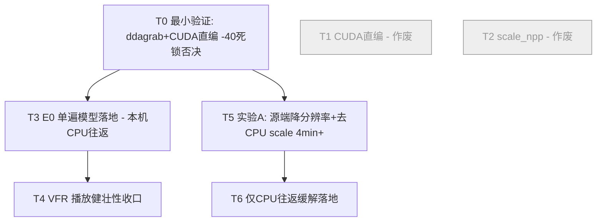

# CoWatch 捕获/编码管道重构方案（架构设计 + 任务分解）

> 作者：高见远（架构师） ｜ 范围：`electron/handlers/recorder` 捕获/编码管道 ｜ 目标：消除录制期游戏卡顿（fps 塌陷）+ 保证 HLS 播放不卡
> 设计原则：**先用最小验证确认 CUDA 直编可行，再分阶段落地，绝不一次大改。**
> 约束回顾：①三层架构保留（轻量录制 → 转码提质 → 令牌桶限速上传）；②仅独显 NVIDIA 用户；③三目标（游戏不卡 / 上传不占带宽 / 停止即可复盘，放宽 30s~1min）。

> ⚠️ **修订（T0 真机硬件死锁后）**：T0 的 CUDA 直编路径在用户真机被 **硬件死锁** 否决——`hwmap=derive_device=cuda` 返回 **-40 (-ENOSYS)**，本机 FFmpeg 构建 / 驱动**不支持从 D3D11 捕获设备派生 CUDA 设备**；`scale_npp` 在本机构建中不存在、`scale_cuda` 依赖同一 CUDA 派生。故 **111.md 约束4 在本机成立，不可绕过**。
> **硬约束（本机）**：D3D11 捕获帧 → CUDA 编码的零拷贝路被彻底堵死，**唯一可用路径是 CPU 往返** `hwdownload → CPU 格式转换/scale → hwupload_cuda → h264_nvenc`。因此 **T1（CUDA 直编）/ T2（scale_npp）作废**（见 §5 标注 + §9 修订版）。根因假设"往返饿死 DWM"被削弱（录制#2 完整旧链 <1min 稳 25fps），需按 §9 重新定位。本文件保留初版推理作为决策记录，勿删。

---

## 1. 实现方案 + 框架选型

### 1.1 根因与解耦核心论证

当前管道铁证（来自实验证据）：

| 证据 | 含义 |
|---|---|
| 跳过转码 → 10s 迟滞消失、游戏顺 | 10s 迟滞 = 转码脉冲，与录制编码链无关（已证伪"录制须去 B 帧"前提） |
| VFR 下 `dup=0` 全程为 0 | 推翻"CFR dup 放大器"假设，卡顿不是 dup 造成 |
| `inferredCaptureFps` 从 ~25 单调平滑跌到 5~8 且不回升 | **capture 侧铁证**：ffmpeg 真的只收到 5~8fps |
| 浏览器（轻负载）/ ddagrab 全屏 / 窗口丢失反相关 | 与内容、捕获方式、窗口事件无关 → 系统性**共享下游**问题 |

**唯一共同点**是 CoWatch 的录制/编码链：

```
捕获(CUDA/D3D11 帧) → hwdownload(GPU→CPU, 占复制引擎)
                    → CPU libswscale scale
                    → hwupload_cuda(CPU→GPU, 占复制引擎)
                    → h264_nvenc
```

该链**每帧都占用 GPU 复制引擎（DMA copy engine）两次**（下载+上传），而复制引擎与 OS 合成器 **DWM 的 present/复制操作共享同一硬件**。持续占用 → 饿死 DWM → WGC/DDA 忠实交付更少帧 → capture fps 渐近塌陷到 5~8。

**解耦核心**：让捕获帧**全程留在 GPU 设备内存**，杜绝 `hwdownload→CPU→hwupload` 的复制引擎往返，把复制引擎还给 DWM。NVENC 本身是独立于 3D 引擎的硬件块（证据1 已证伪"编码拖游戏"），故编码本身不是元凶，**复制引擎的来回搬运才是**。

> ⚠️ **此根因假设已被动摇（见顶部硬约束 + §9）**：若"往返饿死 DWM"是唯一致因，录制#2（完整旧链、<1min）也应塌，但它稳 25fps → 塌陷是"随时间/有条件"的，非滤镜链本身静态成本。真因更可能在**捕获背压**或**资源/管道累积**（音频 pipe、HLS 写盘、Node 读流、ffmpeg 输入缓冲增长等），详见 §9。

> 次级疑点（VFR 播放端卡顿）：浏览器录制终端被截断、缺 `inferredCaptureFps`，未确认其 capture 侧是否也塌。即便 capture 正常，VFR+HLS 时间戳也可能单独造成播放卡。本方案在 §1.4 / T4 收口。

### 1.2 (a) 删除 GPU↔CPU↔GPU 来回  🚫 初版路径已作废（硬件限制）

> 🚫 **本小节初版路径（CUDA 直编 / hwmap 派生 / scale_npp）已作废**——硬件限制见顶部硬约束 + §9。但其中"源端降分辨率 + 去掉 CPU libswscale scale"的思路在 CPU 往返约束下仍可用，归并于 §9.3 实验A / §9.4 缓解。

**No-downscale 默认路径（capture 分辨率 ≤ 目标 1280）：**

```
gfxcapture/ddagrab(硬件帧) → [hwmap: D3D11→CUDA 原地映射, 仅一次, 无拷贝]
                          → [format=nv12 (GPU 内, 若源非 NV12)]
                          → h264_nvenc(直接读 CUDA 表面)
```

- **彻底删除** `hwdownload` / CPU `scale` / `hwupload_cuda` 三个环节。
- 若源直接产出 **CUDA NV12** 帧（gfxcapture 经 WGC 多为 D3D11，需实测），则退化为 `gfxcapture=... → h264_nvenc`，零拷贝、零拷贝引擎占用。
- 格式转换（BGRA→NV12）改在 **GPU 内** 做（`format=nv12` 在 cuda 设备上），属 CUDA 计算操作，**不碰复制引擎**。

**降分辨率路径（capture > 目标）：**
- 优先 **"捕获即按目标分辨率出图"**：让 gfxcapture/ddagrab 在源端直接以 ≤1280 出图（WGC/DDA 支持指定输出尺寸），从根本上**消除降分辨率需求** → 连 GPU scale 都不需要。
- 确需降分辨率时，用 **`scale_npp`**（NPP，跑在 CUDA 计算引擎，GPU 内完成，**不 hwdownload 到 CPU**，也不占复制引擎）替代 `scale_cuda`。

**约束4（111.md：gfxcapture + scale_cuda 因 CUDA↔D3D11 context 冲突 + `-vf` 拆链破坏帧节拍而不可行）是否仍成立？**

> **结论：在"去 hwdownload/hwupload、CUDA 帧直编"的新结构下，约束4 不再阻断 no-downscale 路径。**

理由：
1. 约束4 失败的是 **`scale_cuda` 这个 GPU scale 算子**在 `-vf` 链中触发 context 冲突。新结构 **no-downscale 路径完全不用 scale_cuda**（不需要缩放），故约束4 在此路径**不适用**。
2. 新结构用 **`hwmap`（D3D11→CUDA 原地映射）取代 `hwdownload`/`hwupload`**：`hwmap` 是一次性映射（建 view，不搬运像素），**不触发 per-frame 复制引擎往返**，也就不会像旧链那样饿死 DWM，也不再是"拆链做 scale_cuda"的场景。
3. 111.md 中 hwdownload 不可去的结论基于**双显卡笔记本**（ddagrab 走 Intel GPU、NVENC 走 NVIDIA，跨 GPU 必过系统内存）。**本项目硬约束仅独显 NVIDIA**，该前提已被移除 → 单 GPU 桌面机可全程留在 NVIDIA 设备内存。
4. 降分辨率若必须 GPU scale，改用 **`scale_npp`**（与 `scale_cuda` 不同代码路径，避开了约束4 记载的 context 冲突），仍需 T2 验证。

**绕行（捕获即目标分辨率）是最稳解**：把缩放责任上移给捕获源，录制层零缩放、零 hwdownload，彻底绕开约束4 与一切 scale 风险。

### 1.3 (b) 最小化 NVENC / 复制引擎对 DWM 的占用

| 杠杆 | 措施 | 依据 |
|---|---|---|
| **复制引擎（主因）** | 删除 hwdownload + hwupload，帧全程留 GPU | §1.2，直接归还复制引擎给 DWM |
| **NVENC session** | 保持**单个常驻** NVENC session（当前已是一个 ffmpeg 进程内 HLS 切片，满足） | 避免 session 反复建/拆的峰值占用 |
| **B 帧 / lookahead** | 证据1 已证伪"录制须去 B 帧" → 可恢复 `-bf 2 -rc-lookahead 20` | NVENC 与 3D 引擎物理分离，不拖游戏 |
| **编码预设** | 中等 `p5`（质量优先），代价在 NVENC 硅片，不占 3D 引擎 | 不影响游戏帧率 |
| **码率** | E0 下 CBR ≈ 上行硬顶（~6-7Mbps），避免巨大中间文件与二次编码 | 见 §1.4 |
| **捕获源背压** | 新链更高效（无 CPU 瓶颈）→ 更快排空 gfxcapture/ddagrab 帧池 → 缓解潜在背压 | 两源行为一致支持"共享下游" |

> 仍建议 T0/T1 用 `inferredCaptureFps` + 游戏顺滑度**实测确认**"去往返"即足以解饿 DWM（而非仅 NVENC 单独仍饿死）。

### 1.4 (c) E0 直播单遍模型（长期形态）

**形态**：录制期即按最终质量参数**单遍 NVENC 编码**（允许 B 帧/lookahead、中等 preset、CBR≈上行 X%）→ 令牌桶限速**直传** → **删除录制期转码调用**（已通过 `SKIP_TRANSCODE_IN_MODE_A=true` 实装 raw 直传）。

- 直接消除"每 10s 转码脉冲"（证据1 证实其为 10s 迟滞根因）。
- 三层架构仍保留语义：①轻量录制（现已是最终质量单遍）→ ②转码提质（改为 **stop 时一次性 finalize**，非录制期脉冲）→ ③令牌桶直传（已具备）。

**最小改动路径（避免一次大改）：**
1. 保持 `SKIP_TRANSCODE_IN_MODE_A=true`（raw 直传）—— 已落地。
2. 新增 `E0_SINGLE_PASS` 开关（默认 false）：
   - `false`：录制用现"高质 CQ26 raw"参数，保留 stop 时转码提质作为兜底（旧行为）。
   - `true`：录制用**最终质量**参数（`-bf 2 -rc-lookahead 20 -preset p5 -rc cbr -b:v ~6-7M`），产出的 .ts 即上传就绪。
3. stop 时若需播放健壮性，跑 **一次性 `finalizeVfrToCfr`**（见 T4），**非每 10s 脉冲** → 不 reintroduce 迟滞。

### 1.5 (d) VFR 播放健壮性

证据2 已证明 VFR `dup=0` 全程为 0 → VFR **不是** capture 塌陷原因；但 VFR+HLS 时间戳**可能单独造成播放卡**（次级疑点）。两条收口路线：

| 方案 | 做法 | 取舍 |
|---|---|---|
| **A. 回到 CFR（推荐默认）** | `RECORD_CFR=true` → 录制用 `-vsync cfr -r 30`（复原 `USE_VFR_RECORDING=false`） | VFR 实验已证伪其价值，CFR 直接消除播放端时间戳风险；dup 放大器已被证伪非元凶，CFR 的 dup 无妨 |
| **B. mux 写 PCR** | HLS muxer 写正确 PCR（`-muxdelay 0 -muxpreload 0` + 单调 PTS/DTS） | 保留 VFR 优点，但需播放器兼容验证 |
| **C. 转码层 VFR→CFR 重采样** | 在 finalize 阶段 `-fps_mode cfr -r 30`（现有 transcoding 已用） | 与 A 二选一；E0 直传下需在 finalize 做 |

**建议**：默认 **A（回到 CFR）** 作为最小风险解；VFR 保留为实验开关（`USE_VFR_RECORDING`）仅用于 T0 浏览器 capture 侧验证。T4 在 stop 的 finalize 中按需做 VFR→CFR 重采样以双保险。

---

## 2. 文件列表（相对 `electron/handlers/recorder`）

| # | 文件 | 改动类型 | 改什么 |
|---|---|---|---|
| 1 | `shared.ts` | 改 | 新增开关：`CUDA_DIRECT_ENCODE`(Phase1主开关,默认false)、`CAPTURE_TARGET_WIDTH`(默认1280)、`USE_SCALE_NPP`(降分辨率GPU路径,默认false)、`E0_SINGLE_PASS`(单遍模型,默认false)、`RECORD_CFR`(默认true,回CFR)、`ENABLE_DIAG_FILE_LOG`(落盘诊断,默认true)。保留 `SKIP_TRANSCODE_IN_MODE_A`/`USE_VFR_RECORDING` 用于回滚（false=复原）。 |
| 2 | `recording/index.ts` | 改 | `spawnFfmpeg` 改为调用新 `pipeline-builder` 组装参数；no-downscale 路径去除 hwdownload/CPU scale/hwupload，改 hwmap→直编；降分辨率走 scale_npp；接入 `diagnostics.ts` 落盘日志；`parseFfmpegLine` 同时写文件。 |
| 3 | `recording/pipeline-builder.ts` | **新** | 纯函数：`buildCaptureSource()`、`buildVideoFilterChain()`（no-scale / scale_npp / legacy-cpu 三分支）、`buildEncodeArgs()`（legacy / E0）、`assembleFfmpegArgs()`。可单测。 |
| 4 | `recording/capture-config.ts` | **新** | 集中管理捕获源 lavfi 串（gfxcapture/ddagrab/avfoundation）、目标分辨率协商、`needsHwmap()` 决策（源是 CUDA 还是 D3D11）。 |
| 5 | `recording/diagnostics.ts` | **新** | `DiagnosticLogger`：把 `inferredCaptureFps`/dup/drop/window-watch/audio discontinuity 写入 `tmpDir/diag-<sessionId>.log`，**绕开终端截断**（同时解决浏览器录制 capture 侧未确认的开放问题）。 |
| 6 | `transcoding/index.ts` | 改 | 新增 `finalizeVfrToCfr(input, output)`（stop 时一次性 VFR→CFR 重采样 + 质量精修），替换每 10s 脉冲；现有逐片队列在 E0/raw 下不启动（已由 SKIP 控制）。保留 `-vsync cfr -r 30`。 |
| 7 | `index.ts`（协调层） | 改 | `start()` 按新开关选管线；`stop()` 在 raw 且需播放健壮性时调用 `finalizeVfrToCfr`（受 `RECORD_CFR` 控制，已 CFR 则跳过）；固化 E0 语义。 |
| 8 | `upload/index.ts` | 基本不变 | E0 下保留令牌桶限速直传；可选增加切片大小日志。 |
| 9 | `upload/throttle.ts` | 基本不变 | 令牌桶已具备；可选暴露硬顶常量（7Mbps）供录制层读取以定 CBR。 |
| 10 | `window-watch.ts` | **不变** | 与本管道重构无关。 |
| 11 | `persistence/index.ts` | **不变** | 持久化逻辑不受影响。 |
| 12 | `external-transcode/index.ts` | **不变** | 验证 E0 不破坏外部视频转码路径（其走直传）。 |

---

## 3. 数据结构 / 接口草图

见 `docs/class-diagram.mermaid`（Mermaid classDiagram）。要点：

- **`PipelineConfig`**：聚合所有开关与源/目标分辨率/编码器信息，供 builder 读取。
- **`CaptureSourceBuilder`**：`buildLavfiSource(cfg): string`、`needsHwmap(): boolean` —— 决定 D3D11→CUDA 映射。
- **`VideoFilterChainBuilder`**：`buildNoScaleChain()` / `buildScaleNppChain()` / `buildLegacyCpuChain()` 三分支。
- **`EncodeArgsBuilder`**：`buildLegacyArgs()`（现 `-bf 0 -tune ll -preset p4`）/ `buildE0Args(uploadBps)`（`-bf 2 -lookahead 20 -preset p5 -rc cbr`）。
- **`PipelineAssembler`**：`assemble(cfg): string[]` 串联上述三者产出完整 ffmpeg 参数。
- **`DiagnosticLogger`**：`logProbe(sessionId, line)` / `logTotals(sessionId, totals)`，落盘。
- **`RecordingController`**（现 `recording/index.ts` 函数组）：`startRecording`/`stopRecording`/`spawnFfmpeg`，依赖 Assembler + DiagnosticLogger。
- **`TranscodeController`**（现 `transcoding/index.ts`）：新增 `finalizeVfrToCfr`。
- **`UploadController`**（现 `upload/index.ts`）：`initUploader`/`enqueueRawUpload`/`doUpload`，令牌桶直传。

---

## 4. 程序调用流程（时序图）

见 `docs/sequence-diagram.mermaid`（Mermaid sequenceDiagram）。覆盖：

1. **start 装配新管道**：`Recorder → RecordingController → PipelineAssembler →(CaptureSourceBuilder / VideoFilterChainBuilder / EncodeArgsBuilder)→ ffmpeg`，帧流 `capture → hwmap → h264_nvenc → HLS .ts`。
2. **诊断落盘**：ffmpeg stderr → `parseFfmpegLine` → `DiagnosticLogger.logProbe`（写 `diag-<sessionId>.log`，绕开终端截断）。
3. **直传**：raw watcher → `UploadController`（令牌桶限速直传，E0）。
4. **stop 收口**：`stopRecording('q') → close → logTotals → waitForUploadQueue → finish`；若需播放健壮性，`finalizeVfrToCfr` 在 stop 阶段一次性跑（非每 10s 脉冲）。

---

## 5. 有序任务列表（按依赖/阶段）

> 规则：T0 为**阻塞后续的最小验证**；所有新开关默认 false（保持旧行为可回滚）；每任务 ≥3 文件。T1/T2 因本机硬件限制（见顶部硬约束 + §9）**作废**，保留作决策记录。

| ID | 任务 | 源文件（相对 recorder） | 依赖 | 优先级 |
|---|---|---|---|---|
| **T0** | **最小验证：ddagrab + CUDA 直编 30s（已做，硬件死锁否决）** —— 真机验证 `hwmap=derive_device=cuda → -40 (-ENOSYS)` 死锁；`scale_npp` 本机缺失、`scale_cuda` 依赖同派生 → **结论：本机零拷贝 CUDA 直编不可行**。落盘诊断 `diagnostics.ts` 保留，仍用于后续实验。 | `shared.ts`、`recording/index.ts`、`recording/diagnostics.ts` | 无 | **P0（已完成/否决）** |
| ~~**T1**~~ 🚫 **作废** | ~~捕获即目标分辨率 + CUDA 直编~~ —— **硬件限制：CUDA 派生不可用（-40），本机无零拷贝路**。详见 §9。 | — | — | 作废 |
| ~~**T2**~~ 🚫 **作废** | ~~降分辨率 GPU 路径（scale_npp）~~ —— **硬件限制：本机构建无 `scale_npp`，`scale_cuda` 依赖不可用派生**。详见 §9。 | — | — | 作废 |
| **T3** | **E0 单遍模型落地（仍有效，本机走 CPU 往返编码）** —— `shared.ts` 开 `E0_SINGLE_PASS`；`recording/index.ts` 编码参数改最终质量（B 帧/lookahead/CBR≈上行）；`index.ts` 固化 SKIP_TRANSCODE 语义为 E0 默认（删录制期转码调用）。编码仍走 `hwdownload→CPU→hwupload→h264_nvenc`。 | `shared.ts`、`recording/index.ts`、`index.ts` | T0 | **P1** |
| **T4** | **VFR 播放健壮性收口（仍有效）** —— `shared.ts` 开 `RECORD_CFR=true`（回 CFR）；`transcoding/index.ts` 新增 `finalizeVfrToCfr`（stop 时一次性重采样，替换每 10s 脉冲）；`index.ts` 在 stop 调用。 | `shared.ts`、`transcoding/index.ts`、`index.ts` | T3 | **P1/P2** |
| **T5** | **实验A：源端降分辨率 + 去 CPU scale 验证（定位根因）** —— ddagrab `video_size=1280x720` 源端降分辨率 + 滤镜仅 `hwdownload,format=nv12,hwupload_cuda`（去 libswscale CPU scale），录 4min+ 看 `inferredCaptureFps` 是否仍塌；落盘 diag 对比分段 fps。 | `shared.ts`、`recording/index.ts`、`recording/diagnostics.ts` | T0 | **P0** |
| **T6** | **仅 CPU 往返缓解落地（依实验A 结果）** —— 源端降分辨率减 hwdownload/CPU 负载、最小滤镜链、`h264_nvenc` 预设/队列调优、令牌桶与写盘节奏优化、必要时 gdigrab 对照。详见 §9.4。 | `shared.ts`、`recording/index.ts`、`recording/capture-config.ts` | T5 | **P1** |

**依赖关系图**（Mermaid graph）：



---

## 6. 依赖包列表

> 核心改动由 ffmpeg 完成，**无需新增 npm 包**。

| 包 | 版本 | 用途 | 状态 |
|---|---|---|---|
| `ffmpeg-static` | 现有 | 提供 ffmpeg 二进制（需含 ddagrab/gfxcapture/nvenc） | 沿用 |
| `chokidar` | 现有 | 切片文件监听（raw watcher / transcode watcher） | 沿用 |
| `p-retry` | 现有 | 上传重试 | 沿用 |
| `uuid` | 现有 | sessionId 生成 | 沿用 |
| Node `fs` | 内置 | `diagnostics.ts` 落盘日志 | 沿用（无新依赖） |
| `electron-log`（可选） | — | 如需日志轮转可引入，否则用 `fs` 即可 | 可选，默认不引入 |

---

## 7. 跨文件共享约定

- **开关命名**：所有实验/特性开关集中在 `shared.ts`，布尔常量全大写 `USE_*` / `*_ENABLED` / `*_MODE`。回滚用 `SKIP_TRANSCODE_IN_MODE_A` / `USE_VFR_RECORDING`（改回 false = 复原旧行为）。**新开关默认 false（保持旧行为），分阶段翻 true**。
- **日志前缀**：统一 `[recording]` / `[transcoding]` / `[upload]` / `[recorder]`；诊断 `[rec-probe]` / `[rec-watch]` / `[rec-audio]`；落盘统一写 `tmpDir/diag-<sessionId>.log`。
- **inferredCaptureFps 反推公式**（全层统一）：`captured = frame - dup; inferredFps = captured / elapsedWallClock`；`elapsedWallClock` 以**当前 ffmpeg 进程启动墙钟**为基准（crash 重启重置 `ffmpegStartWallClock`）。
- **文件命名**：原始 `segNNN.ts`；转码 `_opt.ts`；E0 最终 `segNNN.ts`（直传）。
- **错误处理（best-effort，永不因网络/转码停录制）**：
  - ffmpeg 异常退出 → `onCrash` → `handleFfmpegCrash`（窗口消失则 `stop()`，否则重启 ≤3 次）。
  - 转码失败 → 降级直传原始切片（`enqueueRawUpload`）。
  - 上传失败 → 进 `pendingQueue` + 30s 指数退避补录。
- **令牌桶**：上传层硬顶 7Mbps（70% 上行），游戏留 30% 头 room；E0 的 CBR 录制码率与之对齐（~6-7Mbps）。

---

## 8. 待明确事项 / 开放问题

1. **浏览器录制 capture 侧是否也塌？**（次级疑点关键）
   - 现状：浏览器那次终端被截断，缺 `inferredCaptureFps` 数字，未能确认其 capture 侧是否塌。
   - **方案**：T0 的 `diagnostics.ts` 落盘日志直接解决——把 `inferredCaptureFps` 写文件，重跑浏览器录制即可确证。若浏览器 capture 也塌 → 与游戏一致，坐实"共享下游"结论；若浏览器 capture 正常但播放卡 → 锁定为 VFR 播放端问题（由 T4 收口）。

2. **CUDA 帧直编是否 100% 可行？**
   - **结论：不能 100% 确定，必须先做最小验证。**
   - **T0 验证设计**：ddagrab（全屏，最简单，排除窗口匹配干扰）+ 直编（hwmap→h264_nvenc，无 hwdownload/CPU scale/hwupload）录 30s，看 `inferredCaptureFps` 是否稳 ~30。
   - 若稳 30 → 直编可行，进 T1；若仍塌 → 指向捕获源自身帧池背压（gfxcapture/ddagrab 自建池），需深入源端背压调优，而非管道结构问题。

3. **gfxcapture/ddagrab 产出帧的像素格式？**（CUDA NV12 vs D3D11 BGRA）
   - 决定 `hwmap` vs 直连 + 是否需 GPU 内 `format=nv12`。T0 探针会暴露源格式；`capture-config.ts` 的 `needsHwmap()` 须自适应。

4. **scale_npp 与 gfxcapture 帧型是否有 context 冲突？**
   - 约束4 记载的是 `scale_cuda` 冲突；`scale_npp` 是不同路径，但需 T2 实测确认无冲突。若仍有冲突 → 退回"捕获即目标分辨率"绕行（最稳）。

5. **去往返后 DWM 是否确获解放？**
   - 需 T0/T1 用 `inferredCaptureFps` + **游戏实际顺滑度**双指标实测，确认"去复制引擎往返"即足以解饿 DWM（而非 NVENC 单独仍饿死）。

6. **E0 的 CBR 取值？**
   - 建议 = 上行硬顶（7Mbps）的 ~85% ≈ 6-7Mbps CBR，使产出即上传就绪。需确认 replay 画质可接受。

7. **HLS PCR 是否需显式写？**
   - 若 T4 回 CFR 仍播放卡，再加 mux PCR 标志（`-muxdelay 0 -muxpreload 0` + 单调 PTS/DTS），在浏览器播放器验证。

---

## 9. 修订版（T0 真机硬件死锁后重做）

> 背景：初版设计（§1.2）的"去 hwdownload/hwupload、CUDA 帧直编 / scale_npp"被用户真机**硬件死锁**否决。本节推翻并重做，原 §1–§8 推理保留作决策记录，不删。

### 9.1 硬件硬约束（本机，坐实）

真机跑 `ddagrab=...,hwmap=derive_device=cuda,scale_cuda=format=nv12` 直接崩：

```
[Parsed_hwmap_1] Failed to created derived device context: -40.   (-40 = -ENOSYS "Function not implemented")
[Parsed_hwmap_1] Failed to configure output pad on Parsed_hwmap_1
[in#1] Error opening input: Function not implemented
ffmpeg 异常退出 code=4294967256（连崩 4 次放弃重启）
```

- **-40 = -ENOSYS**：本机 FFmpeg 构建 / 显卡驱动**不支持从 D3D11 捕获设备派生 CUDA 设备**。`hwmap=derive_device=cuda` 这条最先崩。
- `scale_npp` 也崩（gyan.dev full build **不含该 filter**）；`scale_cuda` 依赖 CUDA 派生——故"D3D11 捕获帧 → CUDA 编码"整条零拷贝路在本机被同一硬件限制彻底堵死。
- **坐实 111.md 约束4 在本机成立，不可绕过。**

**硬约束（本机唯一可用路径）：**

```
gfxcapture/ddagrab(D3D11 硬件帧) → hwdownload(GPU→CPU)
                              → CPU 格式转换 / scale
                              → hwupload_cuda(CPU→GPU)
                              → h264_nvenc
```

即 **T1（CUDA 直编）/ T2（scale_npp）作废**（§5 已标注）。本文件保留初版推理作决策记录。

### 9.2 根因重定位

原假设"往返搬运饿死 DWM → fps 塌"**被动摇**：若往返是唯一致因，录制#2（完整旧链、<1min）也应塌，但它稳 25fps。→ 塌陷是**随时间 / 有条件**的，不是滤镜链本身静态成本。塌陷特征"单调、平滑、渐近到 5~8 且不回升"是**累积 / 反馈型**过程签名（而非恒定开销）。

**候选真因排名（均不依赖 CUDA 派生，可在本机验证）：**

| 排名 | 候选 | 机制 | 为何"随时间" |
|---|---|---|---|
| 1 | **音频 pipe（fd 3）背压** | 音频经 `pipe:3` 喂入 ffmpeg；若生产侧（音频捕获）stall 或 pipe 缓冲满，ffmpeg 交错读循环阻塞 → 整个捕获节流 | 音频源行为条件化，stall 后持续 |
| 2 | **捕获源（WGC/DDA）节流背压** | 消费慢 → 源帧池积压 → 源逐步减少交付（"忠实交付更少帧"） | 积压渐近饱和 |
| 3 | **CPU scale 延迟累积** | 每帧 libswscale lanczos scale 固定延迟；若 capture 率 > 消费率（含 scale），积压增长 → 源节流 | 实验A 区分项 |
| 4 | **ffmpeg 输入缓冲 / thread_queue 增长** | `-thread_queue_size` 不足或捕获快于消费 → 缓冲增长后节流 / 丢帧 | 渐近 |
| 5 | **Node 侧读流阻塞** | 若 `child.stderr/stdout` 未排空，ffmpeg 写满 pipe 缓冲 → 阻塞 | 取决于消费 |
| 6 | **HLS 分段写盘累积** | 4min≈120 段，每段开/写/关；磁盘慢则节流（次要） | 随段数 |

### 9.3 实验设计（不依赖 CUDA 派生）

**实验A（主，团队已定）：滤镜成本 vs 非滤镜问题**

- 配置：`ddagrab=output_idx=0:framerate=30:video_size=1280x720`（**源端降分辨率**）→ 滤镜 `hwdownload,format=nv12,hwupload_cuda`（**去 libswscale CPU scale**）→ `h264_nvenc`。
- 录 **4min+**，落盘诊断观察 `inferredCaptureFps` 分段曲线。
- 判读：
  - **稳 25~30fps** → CPU scale 是重要触发项（每帧 CPU 成本累积致源背压）→ 缓解方向 §9.4 有效。
  - **仍塌** → 排除 CPU scale，真因在候选 1/2/4/5/6（捕获背压或资源累积）→ 进实验B + 诊断埋点。

**实验B（对照，建议加）：gdigrab 软件捕获**

- `gdigrab` 走 GDI（截 DWM 合成图像），不用 WGC/DDA/GPU 捕获。若 gdigrab 稳 → 指向 WGC/DDA 捕获路径或 DWM 交互；若 gdigrab 也塌 → 锁定 ffmpeg/Node/音频 pipe/资源（非捕获 API）。

**诊断埋点（实验A/B 必带，复用 `diagnostics.ts` 落盘）：**

1. **分段 `inferredCaptureFps`**：每完成一个 HLS 段记该段捕获 fps + 墙钟时间，定位塌陷起始（早/晚、与段数/音频状态相关？）。
2. **音频 pipe 心跳**：在音频生产侧记 bytes/sec；若塌陷 onset 处音频吞吐掉到 0 → 坐实候选1。
3. **分段写盘耗时**：记每段 `close` 耗时，排除候选6。
4. **stderr 排空校验**：确认父进程持续 drain `child.stderr`（防候选5）；诊断里记 stderr 最后行时间戳间隔。
5. **ffmpeg 输入缓冲指示**：若可行，加 `-loglevel debug` 观察 `thread_queue`/input 缓冲增长（候选4）。

### 9.4 仅 CPU 往返下的可达缓解方向（即便不根治）

| 方向 | 做法 | 作用 |
|---|---|---|
| **源端降分辨率** | `ddagrab video_size=1280x720` / gfxcapture 目标尺寸 | 减小 hwdownload 帧体积（省复制引擎带宽 + 内存）+ 免去 CPU scale |
| **最小滤镜链** | `hwdownload,format=nv12,hwupload_cuda`（去掉 `scale` 与 `format=bgra→yuv420p` 往返） | 去掉最重 CPU 步骤（实验A 同款），减每帧延迟 |
| **NVENC 预设/队列** | `-preset p1`（最快）、`-rc-lookahead 0`、`-bf 0`、降 `-surfaces`/`async_depth` | 降每帧编码占用与 NVENC 积压，加快消费减源背压 |
| **令牌桶/写盘节奏** | 切片写本地高速 tmp、异步上传；必要时 `-flush_packets 0` 调段 muxer | 防写盘阻塞捕获线程（候选6） |
| **音频解耦** | 音频独立进程采集 + 末尾 mux，或环形缓冲隔离 stall | 若候选1 坐实，根除 pipe 背压节流 |
| **gdigrab 对照** | 实验B 用，非生产（截硬件加速窗口能力弱） | 仅诊断 |

> 上述均**不触及 T3(E0)/T4(VFR)** 框架；E0 在本机仍走 CPU 往返编码（单遍最终质量 + 直传，删录制期转码脉冲）。

### 9.5 T3 / T4 状态

- **T3（E0 单遍）仍有效**：与 CUDA 派生无关。本机录制编码仍走 `hwdownload→CPU→hwupload→h264_nvenc`，仅参数改为最终质量单遍 + 删转码脉冲（治 10s 迟滞，证据1）。
- **T4（VFR 播放）仍有效**：回 CFR / stop 一次性 finalize，与本机限制无关。

### 9.6 开放问题

1. 实验A 结果决定 T6 细化方向（稳 → 源端降分辨率 + 最小滤镜链即可；塌 → 进实验B + 音频解耦）。
2. 本机 CUDA 派生是否可在**其他 FFmpeg 构建（如官方 NVIDIA 构建）/ 更新驱动**下复活？若可，T1/T2 在其他环境仍可能成立——但当前用户真机不可行，本机方案不依赖它。
3. 音频 pipe（fd 3）生产侧实现位置与 stall 条件待排查（若实验A 仍塌，优先查此）。
