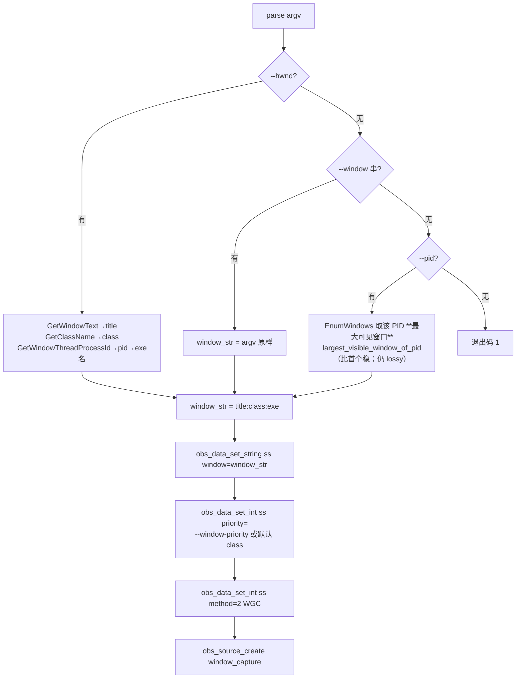

# window_capture（OBS 自编译）↔ CoWatch 集成手册（修订版 v2.1）

> **用途**：本文件是 `window_capture` 接入 `CoWatch/electron` 的**唯一集成事实源**。
> 后续任何集成/排错都先读本文件，不要再去读 `window_capture` 的 C++ 源码或 README。
> 源码级细节以 `C:\Users\绝绝子\Desktop\Co\window_capture\` 下的 `README.md` / `ARCHITECTURE.md` / `AGENTS.md` 为准。
>
> **最后更新**：2026-07-21（v2.1 修订 —— 纠正「sourceId→PID」错契约，改为「sourceId→HWND」并对齐 OBS 窗口模型；坐实上传边界；确认 capture-src 删除）。

---

## 0. 本次修订摘要（v2.0 → v2.1）

| # | 修订项 | 影响 |
|---|---|---|
| 1 | **纠正错契约**：原 §2.1/§2.2/§6 写「exe 只认 `--pid`，Coordinator 从 sourceId 取 PID」——**错**。Windows 上 `sourceId` 形如 `window:<HWND十进制>`，中间是 **HWND 不是 PID**。sourceId→PID 的 TODO 已删除。 | 契约重写 |
| 2 | **新窗口选择契约**：主契约 `--hwnd <十进制HWND>`，CoWatch 从 sourceId 直传；exe 用 `GetWindowText/GetClassName/GetWindowThreadProcessId` 反推 `title:class:exe` 喂 OBS；对齐 OBS 的 `--window "title:class:exe" --window-priority class\|title\|exe` 兜底；`--pid` 降级为 documented-lossy 兜底。 | 契约重写 |
| 3 | **坐实上传边界（决策 1）**：上传层（`upload/index.ts`+`throttle.ts`+`window-watch` 触发收尾）只关心本地 `.ts` 文件，与录制/转码实现无关。本次**只改 chokidar 监听目录 + 文件名匹配规则**，实时上传/自定义限速/其他功能代码零改动。 | 见 §6 |
| 4 | **子目录 + DLL 隔离**：`electron/bin/window_capture/` 自包含部署布局保留（v2.0 已定），列出 DLL 清单与冲突规避。 | 见 §1 |
| 5 | **删除 capture-src**：`electron/bin/capture-src/`（旧手搓窗口录制）随新 exe 转正正式删除；旧 `window_capture.exe` 142KB 构建被新 exe 子目录取代。 | 见 §1.2 |

---

## 1. 要移动 / 删除的内容

### 1.1 部署布局：`window_capture` 作为完整自包含子目录（DLL 隔离）

`window_capture/dist/` 是**已组装好的完整运行时**（仓库里 `build-shell` 只产出薄壳 exe，真实运行时在 `dist/`），整包搬进 CoWatch：

```
dist/
├── bin/64bit/
│   ├── window_capture.exe        ← 新 OBS 自编译 exe（薄壳 + 动态链 libobs）
│   ├── obs.dll                   ← libobs 核心
│   ├── libobs-d3d11.dll          ← 图形模块（ovi.graphics_module="libobs-d3d11"）
│   ├── libobs-winrt.dll          ← WGC 依赖
│   ├── w32-pthreads.dll          ← OBS 线程库
│   ├── obs-ffmpeg-mux.exe        ← ffmpeg_muxer 内部 spawn 的子进程（写 HLS 靠它）
│   ├── get-graphics-offsets64.exe← WGC 偏移探测（win-capture 插件需要）
│   ├── win-capture.dll / win-wasapi.dll / obs-nvenc.dll / obs-ffmpeg.dll / obs-outputs.dll  ← 插件
│   ├── avcodec-62 / avformat-62 / avutil-60 / avdevice-62 / avfilter-11 / swresample-6 / swscale-9.dll  ← ffmpeg（obs-ffmpeg-mux 依赖）
│   ├── libcurl / librist / srt / libx264-164 / zlib.dll  ← OBS 传递依赖
│   └── win-capture / rundir / …  ← 个别子目录随包携带，原样保留
└── data/                         ← libobs effects + obs-plugins/<name>/ 数据（模块加载必需）
```

**目标落点**：`CoWatch/electron/bin/window_capture/`（**独立子目录**，不要平铺进 `electron/bin/`）：

```
CoWatch/electron/bin/window_capture/   ← 直接放 dist/bin/64bit/* 与 dist/data/*
   ├── window_capture.exe
   ├── obs.dll …（全部 DLL 同上）
   ├── data/  ← 来自 dist/data/
   └── (其余子目录原样)
```

> ⚠️ **为什么必须放独立子目录**：CoWatch 的 **screen 模式（ffmpeg ddagrab）仍使用 `electron/bin/ffmpeg.exe` + 同目录的 `avcodec-62/avutil-60/swresample-6.dll`**。
> 新 OBS 包也带同名 ffmpeg DLL（版本/构建可能不同）。Windows DLL 搜索先查 exe 自身目录，
> 把 OBS 包放 `electron/bin/window_capture/` 子目录可实现 **DLL 隔离**，避免两套 ffmpeg 互相覆盖导致加载崩溃。
> **打包（electron-builder）后同样要保留子目录结构**（`resources/bin/window_capture/` 与 `resources/bin/ffmpeg.exe` 分开），否则扁平化会 DLL 冲突。

### 1.2 删除：仅旧的「窗口录制模式」内容

| 操作 | 路径 | 理由 |
|---|---|---|
| **删除** | `CoWatch/electron/bin/capture-src/` | 旧手搓 OBS 式窗口录制源码（已被 OBS 自编译 exe 取代）。新 exe 编译完成、窗口模式正式切换，回退不再需要。 |
| **删除/不再平铺** | `CoWatch/electron/bin/window_capture.exe`（142KB 旧构建） | 旧 `capture-src` 产物，统一改为 `electron/bin/window_capture/window_capture.exe` 子目录部署。CoWatch 侧启动路径须指向子目录（见 §4 与 `recording/index.ts::getCaptureExePath` 已指向 `electron/bin/window_capture/window_capture.exe`）。 |

### 1.3 保留（全屏 / screen 模式仍用 ffmpeg，不受影响）

- `electron/bin/ffmpeg.exe`、`avcodec-62.dll`、`avutil-60.dll`、`swresample-6.dll`（screen 模式 ddagrab + 旧 mux 依赖）
- `electron/bin/audio_capture.exe`（screen 模式系统音频采集）
- `electron/bin/window_sentinel.exe`、`build-sentinel/`（窗口存活探测，窗口/全屏模式共用；sentinel 本次改为吃 `--hwnd`，见 §3.4）

---

## 2. 窗口选择契约（v2.1 核心修订 —— 对齐 OBS）

> **结论先行**：CoWatch 侧**只传 HWND**（`sourceId.split(':')[1]` 直取十进制 HWND），零歧义；exe 内把 HWND 反推为 OBS 的 `window="title:class:exe"` + `priority`，与 OBS UI 100% 一致（OBS 每 tick 再用 `ms_find_window_top_level(priority,class,title,exe)` 重解析 HWND）。这样：
> - 多进程游戏（启动器 + 游戏 + 反作弊）不丢窗；
> - 同类多实例（两个 Chrome 窗口）的锁定行为就是 OBS 原生行为，我们一致即可，不额外发明逻辑。

### 2.1 为什么改（错契约复盘）

- `preload.ts:33-38` `recorder:start` 收 `windowId`(desktopCapturer sourceId) + `displayTitle`；`recorder/index.ts` 中 `currentSourceId` 直接来自 `desktopCapturer.getSources()`。**Windows 上 sourceId 形如 `window:<HWND十进制>[:suffix]`**，中间是 **HWND 不是 PID**。
- OBS 原生（`obs-studio/plugins/win-capture/window-capture.c`）：`update_settings`(:211) 读 `window` 字符串 + `priority`，`ms_build_window_strings` 拆成 class/title/exe；每 tick(:630) 用 `ms_find_window_top_level(priority,class,title,exe)` **重解析 HWND**。**OBS 从不用 PID/HWND 做存储**。
- 旧 exe 内 `resolve_pid_to_window`（EnumWindows 取「首个可见窗口」按 PID 匹配）是**丢精度且 OBS 没有的自定义逻辑**——多进程游戏下首个可见窗口往往不是真正要录的游戏窗口。

### 2.2 CLI 参数（窗口定位，优先级从高到低）

| 参数 | 必需？ | 语义 | 内部映射 |
|---|---|---|---|
| `--hwnd <十进制HWND>` | **主契约（推荐）** | 捕获目标窗口 HWND（CoWatch 从 sourceId 直传）。缺失→退出码 1（当无 `--window`/`--pid` 时）。 | exe 内 `GetWindowText`→title、`GetClassName`→class、`GetWindowThreadProcessId`→pid→exe 名，拼成 `title:class:exe` 喂 OBS `window`；`priority` 默认 `class`。 |
| `--window "title:class:exe"` | 可选 | OBS 原生窗口串，**原样直传** OBS `window` 属性。便于 sentinel/测试直接指定。 | 不经反推，直接 `obs_data_set_string(ss,"window",argv)`。 |
| `--window-priority class\|title\|exe` | 可选 | OBS 匹配优先级（`WINDOW_PRIORITY_CLASS/TITLE/EXE`）。配合 `--window` 或 `--hwnd` 使用；缺省 `class`。 | 映射到 OBS `priority` 枚举，`obs_data_set_int(ss,"priority", ...)`。 |
| `--pid <n>` | **兜底（documented-lossy）** | 旧「按 PID 取窗口」路径，**保留不删**，但文档标注风险。 | 复用 `largest_visible_window_of_pid`（取该 PID **最大可见窗口**，比旧版「首个可见窗口」更稳；仍为 lossy 兜底，非主路径）。⚠️ 多进程/多实例下仍可能选错窗口。 |

> **解析优先级（exe 内部裁决）**：`--hwnd` 存在用 hwnd；否则 `--window` 存在用窗口串；否则 `--pid` 存在用 pid；三者皆无 → 退出码 1。
> 三种方式最终都落到 OBS `window` 属性（±`priority`），与 OBS UI 行为等价。

### 2.3 exe 内部映射流程



> 注：`method=2`（METHOD_WGC）保持不变；OBS 每 tick 用 `ms_find_window_top_level(priority,class,title,exe)` 重解析 HWND，天然抗窗口移动/重建。

### 2.4 sentinel 同步改吃 `--hwnd`（消除标题同名歧义）

`window_sentinel.py` 现有 `target_hwnd = find_target_window(title)`（按标题子串 EnumWindows，:513）已有 `_get_window_pid`/`_get_window_class`（hwnd→三元组工具）。改为：
- 入参由 `title` 改为 `--hwnd <十进制>`（或位置参数 hwnd）；
- `win_event_proc`(:402) 直接以 `target_hwnd` 做 move/close/foreground 判定，不再按标题重找；
- CoWatch 侧 `sentinel-client.ts::startSentinel` 把 `[windowTitle, ...]` 改为 `[String(hwnd), ...]`。

这样 **HWND 成为 capture + detect 的单一事实源**，与 `--hwnd` 主契约一致。

---

## 3. 启动参数契约（Electron 主进程该传什么）

### 3.1 新 exe 的 CLI（最小必需）

```
window_capture.exe \
  --hwnd <目标窗口HWND十进制> \
  --mux-target file \
  --out <唯一.m3u8路径> \
  [--window-priority class]   # 可选，默认 class
```

| 参数 | 是否必需 | 说明（对接要点） |
|---|---|---|
| `--hwnd <n>` | **主契约，必需**（无 `--window`/`--pid` 时） | 捕获目标窗口 **HWND 十进制**。CoWatch 从 sourceId 直传，**不要**自行 PID 解析。 |
| `--window "t:c:e"` | 可选 | OBS 原生窗口串直传（测试/sentinel 用）。 |
| `--window-priority class\|title\|exe` | 可选 | 默认 `class`。 |
| `--pid <n>` | 可选（兜底） | documented-lossy，多进程风险。 |
| `--mux-target file` | **必需** | 写本地 HLS。`null`=只跑 source+encoder 供 STATS（不落盘）。 |
| `--out <path>` | file 建议传 | HLS 播放列表路径。**三种形态**（源码 `resolve_output_path`，见 §5）：① 以 `.m3u8`/`.m3u` 结尾 → CoWatch 指定的完整路径（基名可做 token 展开）；② 空 → 落到相对 cwd 的 `recordings/` + 默认文件名；③ 非空非 `.m3u8` → 视为**目录** → `dir/<token>.m3u8`。**推荐 ①**：传唯一路径，零歧义。 |
| `--fps <n>` | 否（默认 30） | |
| `--cqp <n>` | 否（默认 24） | H264 1–51，越小越清晰。CQP 模式 **忽略 bitrate**。 |
| `--codec h264\|hevc` | 否（默认 h264） | |
| `--width/--height` | 否 | 不传则 exe **自动按 HWND 取窗口 `GetWindowRect` 物理像素**定尺寸（封顶 1440 宽）。一般**不需要传**。 |
| `--segment-time <s>` | 否（默认 10） | 同时驱动编码器 `keyint_sec` 与 muxer `hls_time`，必须对齐。 |
| `--nvenc-preset p1..p7` | 否（默认 p5） | |
| `--nvenc-tune hq\|ll` | 否（默认 hq） | |
| `--nvenc-multipass qres\|disabled` | 否（默认 qres） | |
| `--bf 0..4` | 否（默认 2） | |
| `--lookahead` | flag，默认关 | 存在即开 |
| `--enable-mic` / `--no-audio` / `--stats` | flag | 音频相关 |

### 3.2 Electron 主进程选窗时传参逻辑（修正后）

```js
// 1) 从 sourceId 直取 HWND（Windows 形如 window:<HWND十进制>[:suffix]）
const hwnd = parseInt(currentSourceId.split(':')[1], 10);

// 2) 生成唯一输出路径（与 screen 模式同目录策略：tmpDir 内唯一 .m3u8）
const outM3u8 = path.join(tmpDir, `session_${token}.m3u8`);

// 3) spawn（注意 exePath 指向子目录，见 §1.1）
spawn(exePath, [
  '--hwnd', String(hwnd),
  '--mux-target', 'file',
  '--out', outM3u8,
  // 可选质量档：--nvenc-preset p5 --nvenc-tune hq --nvenc-multipass qres --bf 2
], { stdio: ['ignore', 'pipe', 'pipe'] });
```

- `exePath` = `electron/bin/window_capture/window_capture.exe`（**注意子目录**，见 §1.1 / `recording/index.ts::getCaptureExePath`）。
- 用 `spawn` 数组传参，不要 `exec` 拼接。
- **不再 spawn 独立的 ffmpeg-mux**（旧 pipe 模式已废，exe 内 `ffmpeg_muxer` 直接写本地 HLS）。

### 3.3 READY JSON（对接点 —— 源码 `stats_reporter.cpp::ready`）

exe 就绪后首帧前输出一行：
```json
{"type":"READY","w":1440,"h":810,"fps":30,"codec":"h264","hasAudio":true,
 "encoder":"obs_nvenc_h264_tex","capture_method":"WGC",
 "out":"C:/.../tmp/session_abc.m3u8"}
```
**关键字段 `out`**：本地 HLS 播放列表**绝对路径**。CoWatch 必须读它来决定监听哪个目录（`path.dirname(out)`），**不要自己拼路径**。

> ⚠️ 文件名形态变更（重要）：exe 内 `ffmpeg_muxer` 写出的切片名由 playlist 基名派生 →
> `--out=.../session_abc.m3u8` 时切片为 `session_abc0.ts`、`session_abc1.ts` …（**不再是旧的 `segNNN_opt.ts`**）。
> 上传层 chokidar **文件名匹配规则必须从 `_opt.ts` 改为 `.ts`**（见 §6）。⚠️ 另一 AI 的 handoff 称「chokidar 监听逻辑不用变」仅指**监听目录**取自 `dirname(READY.out)` 不变；但**文件名匹配规则必须改**，否则旧 `_opt.ts` 永远匹配不到新切片 `session_abcN.ts`，切片全部漏传、录制无产出。

---

## 4. 输出路径契约（OBS 模型，不变）

exe 输出的 **唯一真相来自 READY JSON 的 `out` 字段**（绝对路径）。CoWatch 读它决定 `chokidar` 监听目录。

### 4.1 `--out` 的三种形态（与 OBS 机制严格对齐，`config.cpp::resolve_output_path`）

| `--out` 形态 | 解析结果 | 说明 |
|---|---|---|
| 以 `.m3u8` / `.m3u` 结尾 | CoWatch 指定**完整播放列表路径** | 仅对基名做 token 展开，目录沿用所在目录。 |
| 空（不传） | 相对 cwd 的 `recordings/` + token 文件名 + `.m3u8` | headless 偏离 OBS 默认 Videos 路径。 |
| 非空且非 `.m3u8` | 视为**目录** → `dir/token.m3u8` | 目录 + token 文件名拼接。 |

- **不建任何子目录**：唯一性由「CoWatch 传唯一 `--out`」或「exe 的 token 展开 + `FindBestFilename`」负责。
- **冲突加 `(n)` 后缀**：`!overwrite` 且目标已存在时插 ` (2)`/` (3)`…。默认 `overwrite=false`。
- 切片名由 ffmpeg HLS 默认派生（`session_abc.m3u8` → `session_abc0.ts/session_abc1.ts…`），与 playlist 基名一致。

### 4.2 监听约定（与 §6 上传边界一致）

```js
const watchDir = path.dirname(readyMsg.out);   // 从 READY.out 取目录（= tmpDir）
chokidar.watch(watchDir, { /* awaitWriteFinish 防半写 */ })
  .on('add', (p) => { if (p.endsWith('.ts')) onSegment(p); });  // 注意：匹配 .ts 而非 _opt.ts
```

---

## 5. 上传边界坐实（决策 1 —— 本次只动监听目录 + 文件名，其他零改动）

**铁律**：上传层（`upload/index.ts` + `throttle.ts` + `recorder/index.ts` 的收尾逻辑）只关心**本地 `.ts` 文件**，与录制/转码实现（exe 内部 OBS 管线）**完全解耦**。本次窗口选择重构**只改 chokidar 的监听目录与 `.ts` 文件名匹配规则**，实时上传 / 自定义限速 throttle / 其他功能代码**零改动**。

### 5.1 证据（读源码坐实，非假设）

| 文件:行 | 内容 | 结论 |
|---|---|---|
| `recorder/index.ts:623-642` | `startWindowUploadWatcher(dir, _cbs)`：`chokidar.watch(dir,{ignoreInitial,awaitWriteFinish})`；`add` 事件仅 `filePath.endsWith('_opt.ts')` → `enqueueUpload(filePath)` | **唯一改动点**：窗口模式上传的 chokidar 监听在此。改 `dir`（→ `dirname(READY.out)`）与匹配规则（`_opt.ts` → `.ts`）。 |
| `recorder/index.ts:350` | `startWindowUploadWatcher(tmpDir, …)` 调用处（window 分支） | 现传 `tmpDir`；因 `--out` 落在 `tmpDir`，`dirname(READY.out)` 仍为 `tmpDir`，**目录可不变，仅文件名规则变**。 |
| `recorder/index.ts:467` | `stopWindowUploadWatcher()` | 停止监听，无录制/转码耦合。 |
| `upload/index.ts:107-114` | `enqueueUpload(filePath)`：仅 `path.basename` + 入队 | 纯路径操作，无录制感知。 |
| `upload/index.ts:281-286` | `doUpload(filePath)`：读文件 → `objectKey = cowatch/.../segmentName` | 只认本地文件，无 HWND/PID 概念。 |
| `throttle.ts:149-205` | `createThrottledStream(filePath, bps)`：按文件路径节流读流 | 纯文件流，与录制实现无关。 |
| `recorder/index.ts:444-570` | `stop()`：调 `enqueueMissingFiles(sessionTmpDir)`（扫 `.ts` 补传）、`waitForUploadQueue()`、`flushPendingQueue()`、finish API | 全以「目录/队列」为输入，遍历 `.ts` 即可复用，**零改动**。 |
| `recording/index.ts:248-285` | `spawnMuxer()`：读 exe 的 pipe fd3/fd4 喂外部 ffmpeg-mux 写 `segNNN_opt.ts` | **这是录制层**（非上传层）的旧 pipe 路径，须删除（见 §6.2）。它产出的文件名从 `segNNN_opt.ts` 变为 exe 直写的 `session_abcN.ts`，正是 §5.1 匹配规则变更的根因。 |

### 5.2 具体需要改的「配置键 / 匹配规则」

| 位置 | 改动 | 类型 |
|---|---|---|
| `recorder/index.ts::startWindowUploadWatcher` | `filePath.endsWith('_opt.ts')` → `filePath.endsWith('.ts')`（或更精确：`/.+\.ts$/.test`，排除 `.m3u8`） | 文件名匹配规则 |
| `recorder/index.ts::startWindowUploadWatcher` | 监听目录：沿用 `tmpDir`（因 `--out` 落在 `tmpDir`）即可；若改为独立子目录则取 `dirname(READY.out)` | 监听目录 |
| `recording/index.ts::startWindowRecording` / `handleCaptureLine` | 删除 `spawnMuxer`（pipe fd3/fd4），READY 后改为从 `msg.out` 启动 chokidar 监听（见 §6.2） | 录制层（非上传逻辑） |
| `recording/index.ts::gracefulQuitWindow` | 删除对 muxer 的 `stdin 'q'` / SIGKILL；改为对 exe 发 `CTRL_C_EVENT` | 录制层停止方式 |

> **不改动清单（明确）**：`upload/index.ts`（enqueueUpload/doUpload/enqueueMissingFiles/flushPendingQueue/waitForUploadQueue/限速反馈）、`throttle.ts`、`recorder/index.ts` 的 `stop()` 收尾与 finish API、`window-watch.ts`（窗口存活探测，见 §5.3）。

### 5.3 关于 `window-watch.ts` 的澄清（重要命名纠正）

任务描述把 chokidar 上传监听归到 `window-watch.ts`，但**实际不是**：
- `electron/handlers/recorder/window-watch.ts` 是**窗口存活探测器**（desktopCapturer 轮询，匹配 `sourceId`/标题判断窗口消失，:52-88）。它**没有 chokidar、不触发上传、不监听文件**。
- 真正持有窗口模式上传 chokidar 的是 **`recorder/index.ts::startWindowUploadWatcher`（:623-642）**。

> 含义：本次「改 chokidar 监听目录 + 文件名」的落点是 `recorder/index.ts`，**不是 `window-watch.ts`**。`window-watch.ts` 在窗口选择重构中**无需改动**（它本来就基于 `sourceId`/HWND 工作，HWND 直传后更稳）。请勿误改。

---

## 6. 集成重构设计（窗口模式新流程）

### 6.1 架构变化：三层 → 两层（窗口模式）

```
旧（capture-src）：  recording(capture-src) → transcoding(外部 ffmpeg-mux) → upload(CoWatch)
新（OBS exe）    ：  recording+封装(window_capture.exe 内一体) → upload(CoWatch 监听本地 HLS)
```

- **transcoding 层对窗口模式已消失**：编码+封装都在 OBS `ffmpeg_muxer` 内。
- **upload 层不直接接 exe 内部**：exe 写完本地 `.ts` 切片后，由 CoWatch chokidar 监听目录、把切片推给后端。上传边界从「管道收字节」变为「文件系统监听」。
- **不是「成片直接连上传」**：exe 不碰网络/CDN。它只写磁盘；上传是 CoWatch 的责任（与 screen 模式上传层复用）。

### 6.2 窗口模式新流程（替换 `recording/index.ts` 现有 window 分支）

1. **启动**：spawn `window_capture.exe`（见 §3.2，传 `--hwnd`），**不要**再 spawn `ffmpeg-mux`。
2. **READY → 建监听**：解析 `msg.out` → `watchDir = dirname(out)` → `chokidar.watch(watchDir, {glob/匹配:*.ts})`。
   - 每个新增 `.ts` → `enqueueUpload`（复用现有实时上传 + 限速，零改动）。
   - `index.m3u8` **不**由客户端上传：沿用现有 `finish` 流程，后端据 `segmentKeys` 重建 playlist（与 screen 收尾一致）。客户端 chokidar 仅匹配 `.ts`，`enqueueMissingFiles` 也仅扫 `.ts`（`upload/index.ts:192`），playlist 文件本身不上传，无需新增逻辑。
3. **停止（优雅）**：向 exe **进程组发 `CTRL_C_EVENT`**（exe 用 `SetConsoleCtrlHandler` 捕获 → `session.stop()` 写 `#EXT-X-ENDLIST` → 干净退出）。
   - ✅ 正确：`child.kill('SIGINT')`（Windows 上 Node 映射为 `GenerateConsoleCtrlEvent(CTRL_C_EVENT)`）。
   - ❌ 错误：`child.kill('SIGKILL')` / stdin 写 `'q'`（旧 mux 模式写法，对 exe 无效，会丢尾段、playlist 无 ENDLIST）。
   - ⚠️ 风险：Node 的 SIGINT 可能误伤父进程组。若实测 CoWatch 也被中断，需 `spawn(exe, args, {detached:true})` 建独立进程组，再用 `GenerateConsoleCtrlEvent` 定向该组。
4. **crash 重启**：exe 非 0 退出 → 重启（新唯一 `--out` 或同目录新 token）→ 复用现有 `registerSessionAnchor` 续时间轴。
5. **pause/resume**（Windows 不支持 SIGSTOP）：
   - pause = 停止 exe（同停止路径）→ 记录已录秒数偏移。
   - resume = 以新唯一 `--out` 重启 exe，并把续录锚点（segment number / 偏移秒）告知后端，标记为新一段 HLS。复用旧 `restartRecording` 的锚点逻辑，去掉 mux 子进程部分。

### 6.3 屏幕（screen）模式：完全不动

`recording/index.ts` 的 `else` 分支（ffmpeg ddagrab + `audio_capture.exe` + 旧 ffmpeg HLS mux → upload）**原样保留**。仅窗口分支按 §6.2 改写。

### 6.4 上传策略（澄清：本次集成不引入任何上传策略变更）

> ⚠️ 纠正：旧架构**本就实时上传切片**（`recorder/index.ts:614-635` chokidar 匹配 `_opt.ts` → `enqueueUpload`），且 `index.m3u8` **从不由客户端上传**——后端在 `finish` 时据 `segmentKeys` 重建 playlist（后端 `hlsService.ts`）。因此「实时上传」不是本次要新增的能力，而是既有的、本次**完整保留**的能力（仅文件名匹配规则 `_opt.ts`→`.ts` 改变）。

| 维度 | 旧架构事实（源码坐实） | 本次集成 |
|---|---|---|
| 切片实时上传 | ✅ 已有（chokidar `_opt.ts` → enqueueUpload） | 保留，仅匹配规则改 `.ts` |
| playlist 上传 | ❌ 客户端从不传 `index.m3u8`；`enqueueMissingFiles` 只扫 `.ts`（`upload/index.ts:192`） | 不变，后端仍据 `segmentKeys` 重建 |
| 限速 / 收尾逻辑 | 与录制实现解耦 | 零改动 |

**唯一的独立产品决策（不在本次范围，不阻塞集成）**：是否要支持「录制进行中观众即可看」的 **LIVE 直播边缘**？若需要，则须让客户端把 exe 持续更新的 `index.m3u8` 反复推送后端（区别于现有 finish 重建）。这是产品增强项，与窗口选择契约重构无关，需要的话另开一轮评估。

### 6.5 需要改写的 CoWatch TS（明确清单）

| 文件 | 改动类型 | 改动要点 |
|---|---|---|
| `electron/handlers/recorder/recording/index.ts` | 重写窗口分支 | 删 `spawnMuxer`（pipe fd3/fd4）、`gracefulQuitWindow` 的 pipe 写法；改为「等 READY → 从 `msg.out` 建 chokidar 监听 `dirname(out)` 匹配 `.ts`」+ `CTRL_C_EVENT` 停止。保留 `restartRecording`/`pause`/`resume` 锚点逻辑（去掉 mux 子进程）。 |
| `electron/handlers/recorder/recording/profiles.ts` | 改 CLI 展开 | `buildExeArgs`：传 `--hwnd`（替代 `--pid --window-index`），保留 `--mux-target file --out` + nvenc 参数；删 `--window-index/--title/--bitrate/--gop/--rc-lookahead` 等 exe 不认参数（或保留但 exe 忽略）。`buildMuxArgs` 对窗口模式废弃（不再有外部 ffmpeg-mux）。`makeDefaultProfiles` 改用 `hwnd` 定位。 |
| `electron/handlers/recorder/recording/index.ts` 的 `getCaptureExePath()` | 路径修正 | 已指向 `electron/bin/window_capture/window_capture.exe`（子目录，见 §1.1），确认无需再改。 |
| `electron/handlers/recorder/index.ts` | **上传桥接（本次唯一上传改动）** | `startWindowUploadWatcher`：监听目录沿用 `tmpDir`（或 `dirname(READY.out)`），文件名匹配 `_opt.ts` → `.ts`。其余上传/收尾逻辑零改动（见 §5）。 |
| `electron/handlers/recorder/sentinel-client.ts` | 入参改 hwnd | `startSentinel`：`[windowTitle, ...]` → `[String(hwnd), ...]`。 |
| `electron/bin/build-sentinel/window_sentinel.py` | 改吃 hwnd | `find_target_window(title)` → 直接吃 `--hwnd`，`win_event_proc` 用 `target_hwnd` 判定（见 §2.4）。 |
| `electron/handlers/recorder/preload.ts` | 无需改（仅注释） | `recorder:start` 已收 `windowId`(sourceId 含 HWND) + `displayTitle`，HWND 直传即可。可加注释说明 sourceId 中段即 HWND。 |

---

## 7. DLL 布局与踩坑清单（重点防反复踩）

1. **必须整包搬 `dist/`**：`build-shell` 只产薄壳 exe，`libobs/插件/ffmpeg DLL/data` 全在 `dist/`。漏搬任一 → exe 启动报「load-time 缺 DLL」（情形 A：连 `[wc] boot` stderr 都没有）或模块加载失败（`[wc] module check: window_capture=0`）。
2. **`get-graphics-offsets64.exe` 不能丢**：WGC 插件运行期探测 D3D 偏移需要它，缺了 WGC 可能回退/失败。
3. **模块加载路径假设**：exe 内 `obs_add_module_path(exe_dir, exe_dir+"/data")`，OBS 会去 `exe_dir/obs-plugins/64bit/*.dll` 与 `exe_dir/data/obs-plugins/<name>/` 找。**`dist/` 是已验证可运行的布局，整包原样搬运即可**；不要手动「整理」目录结构。
4. **DLL 冲突隔离**：OBS 包与 screen 模式 ffmpeg 都带 `avcodec-62/avutil-60/...`，**务必分目录**（§1.1）。扁平同目录必冲突。
5. **GPU 路由**：exe 首行导出 `NvOptimusEnablement` + `SetProcessDefaultGpuPreference(HIGH_PERFORMANCE)`，把进程默认 adapter 0 路由到独显，确保 NVENC 命中 RTX（源码 `main.cpp` A1 方案）。无需 CoWatch 额外处理。
6. **适配器选择**：`select_nvenc_adapter()` 优先选含 "NVIDIA" 的 adapter 作 libobs 渲染设备；NV_ENC 实际设备由 obs-nvenc 内部 `EnumAdapters(0)` 决定（同上路由）。

### 7.1 真机验证步骤（搬完必跑）

```bat
:: 1) 启动（用真实窗口 HWND，如记事本）
window_capture.exe --hwnd <HWND> --mux-target file --out C:\tmp\wc_test\session.m3u8 --stats

:: 2) 看 stderr 是否有这些黄金日志行（缺任何一行 = 配置错）：
::    [wc] boot: argc=...
::    [wc] obs_startup ok
::    [wc] module check: window_capture=1 wasapi=1
::    [wc] encoder probe: obs_nvenc_h264_tex=available
::    [wc] READY encoder=obs_nvenc_h264_tex capture_method=WGC
:: 3) 看 stdout 是否输出 {"type":"READY",...,"out":"C:/tmp/wc_test/session.m3u8"}
:: 4) 录制几秒，确认 C:\tmp\wc_test\ 下生成 session.m3u8 + session0.ts ... （注意：不是 segNNN_opt.ts）
:: 5) Ctrl+C，确认 stdout 输出 {"type":"EXIT","code":0} 且 m3u8 含 #EXT-X-ENDLIST
```
若 stderr 直接没 `[wc] boot` → load-time 缺 DLL（查 §7.1 第 1 条）；若 `module check=0` → DLL 布局错（第 3 条）。

---

## 8. 参考源（不重复读源码，按需查文档）

- `C:\Users\绝绝子\Desktop\Co\window_capture\README.md` —— **集成契约权威**（CLI 表 / 输出路径 / 生命周期 / 档位）。改参数前先读。
- `C:\Users\绝绝子\Desktop\Co\window_capture\ARCHITECTURE.md` —— 完整架构（构建图 / 薄壳接口 / 任务列表 / §3.1 调用链）。
- `C:\Users\绝绝子\Desktop\Co\window_capture\AGENTS.md` —— 新 AI 窗口认知（含决策记忆位置）。
- `C:\Users\绝绝子\Desktop\Co\window_capture\GPU_TUNING.md` —— NVENC 调参 / 降功耗决策树。
- 决策记忆（CoWatch 仓库内）：`CoWatch/.workbuddy/memory/2026-07-21.md`「OBS 派生 exe」+「窗口选择契约核查」段。

---

## 9. 待办 / 开放风险

- [ ] **上传策略**：A（实时切片上传）还是 B（停止后整批）？影响 `index.m3u8` 是否实时上传（见 §6.4）。切片上传与限速逻辑本身不变。
- [ ] **priority 默认值**：本设计默认 `class`（与 OBS UI 默认一致）。如需更稳可改 `title`，但须与产品确认。
- [ ] **同类多实例锁定**（两个 Chrome 窗口）：OBS 原生 `priority=class` 下锁定「同 class 首个匹配窗口」，这是 OBS 行为，我们一致即可，不额外发明逻辑。
- [ ] **打包验证**：electron-builder 打包后确认 `resources/bin/window_capture/` 子目录 + DLL 隔离成立（§1.1 警告）。
- [ ] **删 `capture-src/`**：确认新 exe 真机验证（§7.1）通过后执行（§1.2）。
- [x] **窗口选择契约**：已纠正（§2），`--hwnd` 主契约 + OBS 对齐兜底 + `--pid` 降级。
- [x] **上传边界**：已坐实（§5），只改 chokidar 监听目录 + 文件名匹配规则。
