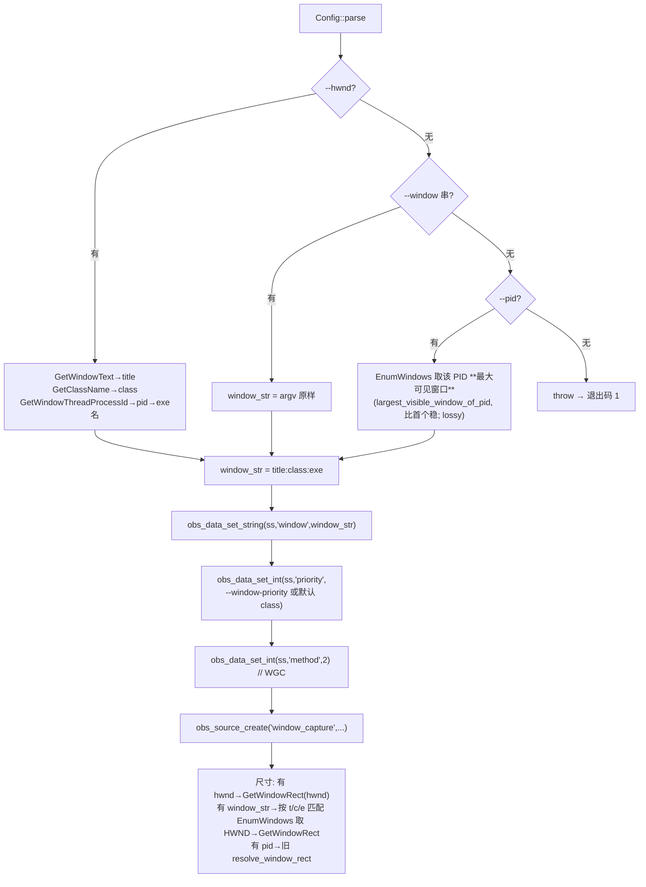

# window_capture 窗口选择对齐 OBS —— 实现蓝图（面向执行 AI）

> **读者**：拿去新窗口执行本蓝图的 AI（寇豆 / 另一实现者）。
> **目标**：把窗口选择契约从「CoWatch 传 PID → exe 用 EnumWindows 取首个可见窗口」改为「CoWatch 传 **HWND** → exe 反推 `title:class:exe` 喂 OBS，并对齐 OBS `--window "t:c:e"` + `--window-priority` 模型」。
> **原则**：录制+转码仍由 OBS 自编译 exe 一体承担；**上传层（实时上传 / 限速 / 收尾）零改动**，只改 chokidar 监听目录 + `.ts` 文件名匹配规则。
> **配套文档**：`window_capture-integration.md`（已同步修订为本契约的唯一事实源）。

---

## 1. 窗口选择契约规格

### 1.1 CLI 参数表（exe 侧）

| 参数 | 必填/可选 | 语义 | 优先级 |
|---|---|---|---|
| `--hwnd <十进制HWND>` | **主契约（推荐）** | 捕获目标窗口 HWND；CoWatch 从 `sourceId.split(':')[1]` 直取 | 最高 |
| `--window "title:class:exe"` | 可选 | OBS 原生窗口串，原样直传 `window` 属性 | 中 |
| `--window-priority class\|title\|exe` | 可选 | OBS 匹配优先级，缺省 `class` | 配合上两者 |
| `--pid <n>` | 可选（兜底） | 旧「按 PID 取窗口」路径，现为「取该 PID **最大可见窗口**」（比首个更稳），documented-lossy（多进程/多实例风险） | 最低 |

> **裁决顺序（exe 内部）**：`--hwnd` 存在 → 用 hwnd；否则 `--window` 存在 → 用窗口串；否则 `--pid` 存在 → 用 pid；三者皆无 → 退出码 1。
> 三者最终都变成 OBS `window` 属性（±`priority`），与 OBS UI 行为等价。OBS 每 tick 用 `ms_find_window_top_level(priority,class,title,exe)` 重解析 HWND，天然抗窗口移动/重建。

### 1.2 exe 内部映射流程



### 1.3 尺寸解析（与窗口选择对齐）

| 选择器 | 取窗口矩形方式 | 说明 |
|---|---|---|
| `--hwnd` | 直接 `GetWindowRect(hwnd)`（带 DPI 感知，沿用现有 `SetThreadDpiAwarenessContext` 写法） | 最精确，无枚举歧义 |
| `--window "t:c:e"` | 把串拆成 class/title/exe，EnumWindows 匹配取首个可见 HWND → `GetWindowRect` | 与 `--pid` 同属枚举，仅匹配键不同 |
| `--pid` | 现有 `largest_visible_window_of_pid`（取该 PID 最大可见窗口，比首个稳） | 保留为兜底 |

---

## 2. 影响面清单

| 文件 | 仓库 | 改动类型 | 改动要点 |
|---|---|---|---|
| `src/config.h` | window_capture | 改结构 | `Config` 增 `hwnd` / `window_str` / `window_priority` 字段；保留 `pid`（兜底）。 |
| `src/config.cpp` | window_capture | 改解析 | 增 `--hwnd`/`--window`/`--window-priority` 解析；`--pid` 改为非必需；裁决顺序 hwnd>window>pid；皆无则退出码 1。 |
| `src/capture_session.h` | window_capture | 改方法 | `largest_visible_window_of_pid`（取最大可见窗口）保留为兜底；新增 `resolve_hwnd_to_window(hwnd)`、`resolve_hwnd_rect(hwnd,...)`。 |
| `src/capture_session.cpp` | window_capture | 改逻辑 | `init()` 按选择器分支取矩形 + 窗口串；删「首个可见窗口」作为主路径；设置 OBS `window` + `priority` 属性（原仅设 `window`）。 |
| `README.md` | window_capture | 改文档 | §2.1/§5：加 `--hwnd`/`--window`/`--window-priority`；`--pid` 标为可选兜底；§2.2 示例改 `--hwnd`。 |
| `ARCHITECTURE.md` | window_capture | 改文档 | 更新窗口选择节（§3.1 T3 / §D 小節 / CLI 示例 :274/:409/:925/:929 等）为 `--hwnd` 主契约。 |
| `recording/profiles.ts` | CoWatch | 改展开 | `CaptureProfile` 增 `window?`/`windowPriority?`；`buildExeArgs` 传 `--hwnd`（或 `--window`+`--window-priority`），删 `--window-index`；`makeDefaultProfiles` 改收 `hwnd`。 |
| `recording/index.ts` | CoWatch | 重写窗口分支 | 删 `spawnMuxer`（pipe fd3/fd4）；READY 后从 `msg.out` 启动 chokidar 监听 `dirname(out)`；`gracefulQuitWindow` 改 `CTRL_C_EVENT`。 |
| `index.ts`（recorder） | CoWatch | **上传桥接（唯一上传改动）** | `startWindowUploadWatcher`：监听目录沿用 `tmpDir`（或 `dirname(READY.out)`），文件名匹配 `_opt.ts` → `.ts`。其余上传/收尾零改动。 |
| `sentinel-client.ts` | CoWatch | 改入参 | `startSentinel`：`[windowTitle,...]` → `[String(hwnd),...]`。 |
| `build-sentinel/window_sentinel.py` | CoWatch | 改吃 hwnd | 入参由 title 改 `--hwnd`；`win_event_proc` 直接用 `target_hwnd` 判定。 |
| `preload.ts` | CoWatch | 不改（仅注释） | `recorder:start` 已收 `windowId`(含 HWND)，可加注释说明中段即 HWND。 |
| 文档 | CoWatch | 已交付 | `window_capture-integration.md`（本蓝图配套，已修订）。 |

> **零改动确认**：`upload/index.ts`、`throttle.ts`、`window-watch.ts`、`recorder/index.ts` 的 `stop()` 收尾与 finish API —— 均不触碰（证据见 integration.md §5.1）。

---

## 3. 逐文件伪改动描述

### 3.1 `window_capture/src/config.h`

```cpp
// 改前（节选）
struct Config {
    Mode mode = Mode::NULL_;
    uint32_t pid = 0;                 // 唯一窗口选择器
    std::string out;
    // ...
};

// 改后（节选）
enum class WindowPriority { CLASS, TITLE, EXE };  // 映射 OBS WINDOW_PRIORITY_*
struct Config {
    Mode mode = Mode::NULL_;
    uint32_t pid = 0;                 // 兜底选择器（lossy）
    uint32_t hwnd = 0;                // 主选择器
    std::string window_str;           // --window "title:class:exe"
    WindowPriority window_priority = WindowPriority::CLASS;  // 默认 class（=OBS UI 默认）
    std::string out;
    // ...
};
```

### 3.2 `window_capture/src/config.cpp`

```cpp
// 改前：--pid 必需，缺失即抛
std::string pid_s;
if (!match_value(argc, argv, "--pid", pid_s))
    throw std::invalid_argument("missing required --pid");
cfg.pid = static_cast<uint32_t>(to_int(pid_s));

// 改后：三种选择器，至少一种；裁决 hwnd > window > pid
bool has_hwnd = match_value(argc, argv, "--hwnd", s_hwnd);
bool has_window = match_value(argc, argv, "--window", s_window);
bool has_pid = match_value(argc, argv, "--pid", s_pid);
if (has_hwnd)        cfg.hwnd = static_cast<uint32_t>(to_int(s_hwnd));
if (has_window)      cfg.window_str = s_window;
if (has_pid)         cfg.pid = static_cast<uint32_t>(to_int(s_pid));
if (!has_hwnd && !has_window && !has_pid)
    throw std::invalid_argument("need one of --hwnd/--window/--pid");

// 新增 --window-priority 解析
std::string wp;
if (match_value(argc, argv, "--window-priority", wp)) {
    if (wp == "title")       cfg.window_priority = WindowPriority::TITLE;
    else if (wp == "exe")    cfg.window_priority = WindowPriority::EXE;
    else if (wp == "class")  cfg.window_priority = WindowPriority::CLASS;
    else throw std::invalid_argument("--window-priority must be class|title|exe");
}
// 注：--mux-target / --out / fps / codec / nvenc* / segment-time 解析全部保持不变
```

### 3.3 `window_capture/src/capture_session.h`

```cpp
// 改前
std::string largest_visible_window_of_pid(uint32_t pid);   // 最大可见窗口启发式（取代旧 resolve_pid_to_window）

// 改后
std::string largest_visible_window_of_pid(uint32_t pid);   // 保留为兜底（最大可见窗口，标注 lossy）
std::string resolve_hwnd_to_window(uint32_t hwnd);         // 新增：HWND→"title:class:exe"
bool        resolve_hwnd_rect(uint32_t hwnd, int &w, int &h); // 新增：HWND→物理矩形
```

### 3.4 `window_capture/src/capture_session.cpp`

```cpp
// 新增：HWND → "title:class:exe"（零歧义，对应 OBS ms_build_window_strings 反向）
std::string CaptureSession::resolve_hwnd_to_window(uint32_t hwnd) {
    wchar_t t[512] = {0}, c[256] = {0};
    ::GetWindowTextW((HWND)(uintptr_t)hwnd, t, 512);
    ::GetClassNameW((HWND)(uintptr_t)hwnd, c, 256);
    DWORD pid = 0; ::GetWindowThreadProcessId((HWND)(uintptr_t)hwnd, &pid);
    std::string exe = get_process_exe_name(pid);
    return to_utf8(t) + ":" + to_utf8(c) + ":" + exe;
}

// 新增：HWND → 物理矩形（沿用现有 DPI 感知写法，去掉 EnumWindows）
bool CaptureSession::resolve_hwnd_rect(uint32_t hwnd, int &out_w, int &out_h) {
    RECT r; set_thread_dpi_to_window(hwnd);   // 现有 GetWindowDpiAwarenessContext+SetThreadDpiAwarenessContext 封装
    ::GetWindowRect((HWND)(uintptr_t)hwnd, &r);
    restore_thread_dpi();
    out_w = r.right - r.left; out_h = r.bottom - r.top;
    return out_w > 0 && out_h > 0;
}

// init() 窗口段（改前→改后要点）
// 改前：
//   int win_w=0,win_h=0; bool got_rect = resolve_window_rect(cfg.pid, win_w, win_h);
//   ...
//   std::string window_str = largest_visible_window_of_pid(cfg.pid);
//   obs_data_set_string(ss, "window", window_str.c_str());
//   obs_data_set_int(ss, "method", 2);
//
// 改后：
//   int win_w=0,win_h=0; bool got_rect=false; std::string window_str;
//   if (cfg.hwnd)            { got_rect = resolve_hwnd_rect(cfg.hwnd, win_w, win_h); window_str = resolve_hwnd_to_window(cfg.hwnd); }
//   else if (!cfg.window_str.empty()) { /* 拆 t:c:e → EnumWindows 匹配取 HWND → GetWindowRect + 重组串 */ }
//   else if (cfg.pid)       { got_rect = resolve_window_rect(cfg.pid, win_w, win_h); window_str = largest_visible_window_of_pid(cfg.pid); } // 兜底 lossy
//   if (window_str.empty()) { error_code_=4; stats_.error(4,"window not found"); return false; }
//   obs_data_set_string(ss, "window", window_str.c_str());
//   int pri = (cfg.window_priority==TITLE)?WINDOW_PRIORITY_TITLE:(cfg.window_priority==EXE)?WINDOW_PRIORITY_EXE:WINDOW_PRIORITY_CLASS;
//   obs_data_set_int(ss, "priority", pri);   // 新增：原 exe 从未设 priority
//   obs_data_set_int(ss, "method", 2);       // WGC 不变
```

> 注：`WINDOW_PRIORITY_*` 取自 `win-capture/window-capture.h`（OBS 插件头），`capture_session.cpp` 已 `#include <obs.h>`，按需在 ovi 后引用或硬编码数值（CLASS=1/TITLE=0/EXE=2，以 OBS 枚举为准）。

### 3.5 `window_capture/README.md`

- §2.1 最小必需参数表：把 `--pid` 行改为「可选（兜底）」，新增 `--hwnd`（必需，当无 `--window` 时）、`--window`、`--window-priority` 三行。
- §5 完整 CLI 表：同上增删；`--pid` 备注加「documented-lossy：多进程游戏可能选错窗口」。
- §2.2 spawn 示例：`--pid <targetPid>` → `--hwnd <targetHwnd>`。

### 3.6 `window_capture/ARCHITECTURE.md`

- §3.1 T3（:457）：「用 `--pid` 解析窗口串」→「用 `--hwnd` 反推 `title:class:exe`，或 `--window` 原样直传；`priority` 默认 class」。
- CLI 示例（:274/:409/:925/:929）：`CreateProcess(... --pid ...)` → `--hwnd ...`。
- 数据结构（:319/:343/:368）：`Config` 增 `hwnd/window_str/window_priority`；`largest_visible_window_of_pid` 标注「兜底 lossy」，新增 `resolve_hwnd_to_window`/`resolve_hwnd_rect`。

### 3.7 `CoWatch/.../recording/profiles.ts`

```ts
// 改前 CaptureProfile
export interface CaptureProfile {
  pid?: number; hwnd?: number | string; title?: string; windowIndex?: number;
  fps: number; w?: number; h?: number; cursor?: boolean;
}
// buildExeArgs 节选
if (cap.pid != null) { args.push('--pid', String(cap.pid), '--window-index', String(cap.windowIndex ?? 0)); }
else if (cap.hwnd != null) { args.push('--hwnd', String(cap.hwnd)); }
else if (cap.title) { args.push('--title', cap.title); }

// 改后 CaptureProfile
export interface CaptureProfile {
  pid?: number;                 // 兜底
  hwnd?: number | string;     // 主选择器（十进制 HWND；string 或 number 均可，下传时 String()）
  window?: string;             // "title:class:exe" 直传
  windowPriority?: 'class'|'title'|'exe';
  fps: number; w?: number; h?: number; cursor?: boolean;
}
// buildExeArgs 节选（裁决 hwnd > window > pid）
if (cap.hwnd != null) {
  args.push('--hwnd', String(cap.hwnd));
  if (cap.windowPriority) args.push('--window-priority', cap.windowPriority);
} else if (cap.window) {
  args.push('--window', cap.window);
  if (cap.windowPriority) args.push('--window-priority', cap.windowPriority);
} else if (cap.pid != null) {
  args.push('--pid', String(cap.pid));   // 兜底 lossy
}
// 保留：--fps / --codec / --cqp / --bf / --mux-target / --out / --seg / --stats
// 删除：--window-index / --title（exe 不再识别）

// makeDefaultProfiles 改前收 title → 改后收 hwnd
export function makeDefaultProfiles(detectedEncoder, tmpDir, hwnd: number, fps=30) {
  // ...
  capture: { hwnd, fps, cursor: true }   // 不再用 title
}
```

### 3.8 `CoWatch/.../recording/index.ts`

```ts
// 改前：handleCaptureLine 的 READY 分支 → spawnMuxer(cfg, cbs)
// 改后：READY 分支 → 通知协调层启动 chokidar 监听 dirname(msg.out)
function handleCaptureLine(line, cfg, cbs) {
  const msg = safeParse(line);
  if (msg.type === 'READY') {
    if (currentMuxProfile) currentMuxProfile.hasAudio = !!msg.hasAudio;
    // 旧：spawnMuxer(cfg, cbs);
    // 新：把本地 HLS 目录交给上传层监听（不再有外部 ffmpeg-mux）
    cbs.onCaptureReady?.(String(msg.out));   // 协调层用 dirname(out) 启动/复用 startWindowUploadWatcher
  } else if (msg.type === 'CLOSED') { ... }   // 不变
}

// 删：spawnMuxer() 整个函数（pipe fd3/fd4 + 外部 ffmpeg-mux）

// gracefulQuitWindow 改前（写 'q' + SIGKILL muxer/exe）
// 改后：仅对 exe 发 CTRL_C_EVENT，等干净退出
function gracefulQuitWindow(): Promise<void> {
  return new Promise((resolve) => {
    if (!captureProc) return resolve();
    const t = setTimeout(() => { try { captureProc?.kill('SIGKILL'); } catch {} resolve(); }, 8000);
    captureProc.on('close', () => { clearTimeout(t); resolve(); });
    try { captureProc.kill('SIGINT'); } catch { /* 已退出 */ }  // Win→CTRL_C_EVENT→写 ENDLIST
  });
}
```

### 3.9 `CoWatch/.../index.ts`（recorder 协调层）

```ts
// 改前 startWindowUploadWatcher：匹配 _opt.ts
windowUploadWatcher.on('add', (filePath) => { if (filePath.endsWith('_opt.ts')) enqueueUpload(filePath); });

// 改后：匹配 .ts（exe 直写 session_abcN.ts，不再有 _opt.ts）
windowUploadWatcher.on('add', (filePath) => { if (/\.ts$/.test(filePath) && !filePath.endsWith('.m3u8')) enqueueUpload(filePath); });

// ⚠️ 匹配规则必须改：另一 AI 的 handoff 说「chokidar 监听逻辑不用变」仅指**监听目录**
// dirname(READY.out) 不变；**文件名匹配规则 `_opt.ts`→`.ts` 必须改**，否则旧 `_opt.ts`
// 永远匹配不到新切片 `session_abcN.ts`，切片全部漏传、录制无产出。这是本步最易漏改的点。

// 改前 start() window 分支：makeDefaultProfiles(detectedEncoder, tmpDir, currentWindowTitle, 30)
//                                          muxTarget: 'pipe'
// 改后：
// HWND 为 64 位十进制（sourceId = window:<HWND十进制>）。直接取十进制串作 --hwnd 参数，
// 勿做 32 位截断（勿用 `|0`；常规 HWND 远低于 2^53，Number/String 均安全，无需 BigInt）。
// config 端用 std::stoull 收 uint64_t。
const hwndStr = currentSourceId.split(':')[1];                 // 十进制 HWND 串，原样下传
const profiles = makeDefaultProfiles(detectedEncoder, tmpDir, hwndStr, 30);  // hwnd 收 string|number 皆可
// ...
windowCapture: { capture: profiles.capture, encode: profiles.encode, mux: profiles.mux,
                 audio: true, muxTarget: 'file', stats: false }   // file 模式（exe 内 ffmpeg_muxer 写本地 HLS）

// 新增：onCaptureReady 回调把 READY.out 目录喂给 watcher（若 --out 在 tmpDir 内则目录本就是 tmpDir，可省略）
// stop() 收尾：enqueueMissingFiles/waitForUploadQueue/flushPendingQueue/finish —— 全部零改动
```

### 3.10 `CoWatch/.../sentinel-client.ts`

```ts
// 改前
export function startSentinel(windowTitle: string, cbs, opts?) {
  // ...
  proc = spawn(exePath, [windowTitle, ...ignoreArgs], { stdio: ['ignore','pipe','pipe'] });
}
// 改后：首个参数改为 hwnd 十进制串
export function startSentinel(windowHwnd: number | string, cbs, opts?) {
  const hwndStr = String(windowHwnd);
  proc = spawn(exePath, [hwndStr, ...ignoreArgs], { stdio: ['ignore','pipe','pipe'] });
}
// recorder/index.ts 调用处：startSentinel(currentWindowTitle, {...}) → startSentinel(hwnd, {...})
```

### 3.11 `CoWatch/electron/bin/build-sentinel/window_sentinel.py`

```python
# 改前 main() ~:513
title = sys.argv[1] if len(sys.argv) > 1 else ""
target_hwnd = find_target_window(title.lower())   # 按标题子串 EnumWindows

# 改后：吃 --hwnd（位置参数或 --hwnd N）
import argparse
p = argparse.ArgumentParser()
p.add_argument("--hwnd", type=lambda x: int(x, 0), default=0)
p.add_argument("hwnd_pos", type=lambda x: int(x, 0), nargs="?")
args = p.parse_known_args()[0]
target_hwnd = args.hwnd or args.hwnd_pos
if not target_hwnd:
    # 兜底：仍允许旧 title 子串（deprecated）
    title = next((a for a in sys.argv if not a.startswith("-")), "")
    target_hwnd = find_target_window(title.lower()) if title else 0
# win_event_proc（:402 起）原本就用 target_hwnd 做 move/close/foreground 判定 —— 无需改
```

---

## 4. 验证步骤

### 4.1 编译 window_capture

```bat
:: 用既有构建脚本（build-shell / CMake 策略 B），仅改 C++ 源码，无需重编 OBS
window_capture.exe --hwnd <某记事本HWND> --mux-target null
:: 期望 stdout: {"type":"READY",...,"capture_method":"WGC","out":null}
:: Ctrl+C → {"type":"EXIT","code":0}
```

### 4.2 `--hwnd` 主契约真机

```bat
window_capture.exe --hwnd <游戏窗口HWND> --mux-target file --out C:\tmp\wc\session.m3u8 --stats
:: 确认 C:\tmp\wc\ 下生成 session.m3u8 + session0.ts / session1.ts ...（注意：不是 segNNN_opt.ts）
:: Ctrl+C → m3u8 含 #EXT-X-ENDLIST，EXIT code=0
```

### 4.3 多进程程序（启动器 + 游戏 + 反作弊）

- 选**游戏本体窗口 HWND**（非启动器/反作弊），确认录到的是游戏画面，而非首个可见窗口。
- 对比旧 `--pid`（传游戏 PID）在同样场景下是否选错窗口 —— 验证 `--hwnd` 精度优势。

### 4.4 浏览器多 tab / 同类多实例

- 开两个 Chrome 窗口，分别取各自 HWND 录制，确认各自锁定正确窗口（OBS `priority=class` 原生行为，一致即可）。

### 4.5 CoWatch 端到端

1. `recorder:start(windowId, displayTitle, roomId, token)`，其中 `windowId` 形如 `window:<HWND>`。
2. 观察 `startWindowUploadWatcher` 从 `READY.out` 目录抓到 `sessionN.ts` 并实时上传（限速日志正常）。
3. `recorder:stop` → `CTRL_C_EVENT` → exe 写 ENDLIST → 上传队列排空 → finish 接口调用。
4. 回放远程 HLS 确认完整。

---

## 5. 开放风险 / 待决

| 项 | 状态 | 说明 |
|---|---|---|
| **priority 默认值** | 待产品确认 | 本蓝图默认 `class`（=OBS UI 默认）。若产品要更稳可改 `title`，但须拍板。 |
| **同类多实例锁定** | 一致即可 | 两个 Chrome 窗口下 `priority=class` 锁定「同 class 首个匹配」，是 OBS 原生行为，我们一致，不额外发明逻辑。 |
| **`--window` 无 hwnd 时的尺寸** | 已实现思路 | 见 §1.3：拆串 EnumWindows 匹配取 HWND → GetWindowRect。需真机验证与 `--hwnd` 尺寸一致。 |
| **上传策略 / LIVE 播放（可选增强）** | 独立决策，不阻塞本次 | 切片实时上传为既有能力（本次仅改 `.ts` 匹配规则），playlist 由后端据 `segmentKeys` 重建；仅「录制中观众实时看」需另推 playlist，属产品增强，不在本次范围。 |
| **`capture-src/` 删除** | 依赖验证 | 新 exe 真机（§4.2/§4.5）通过后执行 `electron/bin/capture-src/` 删除（见 integration.md §1.2）。 |
| **打包子目录隔离** | 验证项 | electron-builder 打包后确认 `resources/bin/window_capture/` 子目录 + DLL 隔离成立。 |
| **`--pid` 兜底保留** | 已决定 | 保留不删（现为取最大可见窗口 `largest_visible_window_of_pid`），仅文档标注 lossy；新代码路径不复用其作主逻辑。 |

---

## 6. 回滚与一致性检查

- 任何一步回归：exe 侧可临时回退为「仅 `--pid`」解析（旧逻辑保留为兜底），CoWatch 侧 `buildExeArgs` 回传 `--pid` —— 两边独立可回退，互不阻塞。
- 一致性铁律：**exe 最终喂给 OBS 的一定是 `window="title:class:exe"` + `priority`**，与 OBS UI 100% 一致；HWND 仅作「输入手段」，不进 OBS 存储（OBS 每 tick 重解析）。
