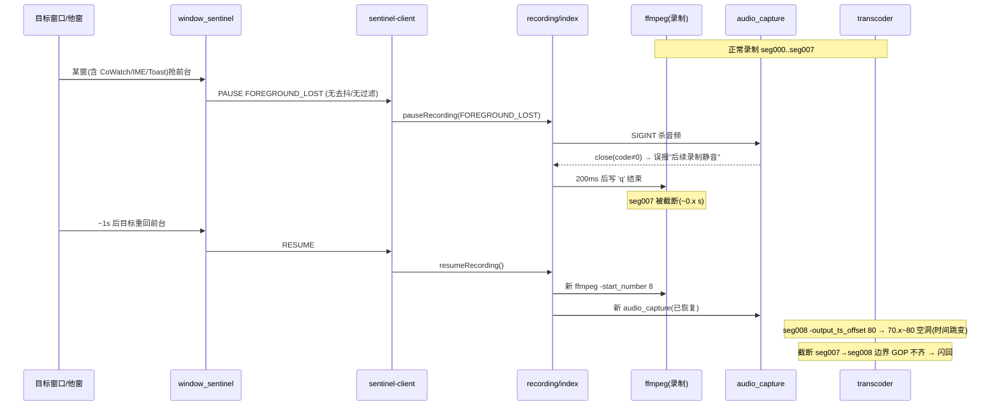

# CoWatch ddagrab+crop 录屏 Bug 架构裁决

> 裁决人：高见远（架构师 Bob）　|　对象：`ddagrab+crop` 窗口录制暂停/续录边界异常
> 输入：用户报告 + `temp/7.11-1.md` 日志 + 6 个源码文件实测
> 范围：**仅设计裁决与任务分解，不含实现代码**

---

## 0. 结论速览（1 分钟版）

| 问题 | 裁决 |
|------|------|
| **Q1 误触发根因** | ✅ **确认**。根因在 `window_sentinel.py` 的 `EVENT_SYSTEM_FOREGROUND` 处理（366–377 行）：该事件是系统级全局前台变更，哨兵用二分判断 `is_foreground = (hwnd == target)`，且 `WINEVENT_SKIPOWNPROCESS` 只跳过哨兵自身进程，**不过滤 CoWatch 主进程 / IME / Toast / 任务栏**。CoWatch 自己的窗口（录制横幅、通知、Electron 对话框）或中文输入法候选框抢前台 ~1s，即触发 `PAUSE FOREGROUND_LOST`。 |
| **Q2 冻结帧** | ⚠️ **技术可行，但不推荐**。复杂度高、风险高、filtergraph 脆弱，且只"掩盖"症状、不消除根因。 |
| **Q3 硬化重启** | ✅ **推荐主线**。关键帧对齐（消闪回）+ 音频健壮性 + 进程引用竞态修复，改动小、风险低。 |
| **Q4 推荐** | 🎯 **先修误触发 + 硬化重启（关键帧 / 音频）**，不做冻结帧。理由：ROI 最高、风险最低，误暂停一旦不发生，用户报告的两个现象（时间跳变、闪回）直接消失。 |

---

## 1. 误触发根因确认（Q1）

### 1.1 代码证据
`window_sentinel.py` 366–377 行：

```python
if event == EVENT_SYSTEM_FOREGROUND:
    is_foreground = (hwnd_i == target_hwnd)            # 二分判断：只有目标窗口才算前台
    new_should = is_foreground and not is_minimized
    if new_should and (not should_record):
        ... emit("RESUME")
    elif (not new_should) and should_record:
        emit("PAUSE FOREGROUND_LOST")                  # 任何"非目标"前台都判丢失
    should_record = new_should
    return
```

钩子注册（445–453 行）：
```python
EVENT_HOOK_FLAGS = WINEVENT_OUTOFCONTEXT | WINEVENT_SKIPOWNPROCESS  # 0x0002
hook = user32.SetWinEventHook(EVENT_SYSTEM_FOREGROUND, ...,
                              0, 0, ctypes.c_uint(EVENT_HOOK_FLAGS))
```

### 1.2 根因判定
1. **`EVENT_SYSTEM_FOREGROUND`（0x0003）是全局钩子**，系统中**任何**窗口成为前台都会触发回调——包括：
   - CoWatch 自身 Electron 窗口（录制横幅、通知 Toast、设置弹窗、托盘交互）
   - 中文/日文输入法候选框（`IME` / `CiceroUIWndFrame`）
   - Windows 通知中心 Toast、任务栏预览、UAC 等瞬时焦点抖动
2. **`WINEVENT_SKIPOWNPROCESS` 只跳过哨兵 EXE 自身进程**，对 CoWatch 主进程（独立 Electron 进程）与系统瞬态窗口**完全不过滤**。
3. 因此只要"目标窗口之外"的任意窗口抢到前台，即 `hwnd_i != target_hwnd` → `is_foreground=False` → 只要此前在录（`should_record=True`）就立即 `emit("PAUSE FOREGROUND_LOST")`。

### 1.3 与日志吻合度
日志 67 行 `[sentinel] PAUSE FOREGROUND_LOST`（约 t≈70s）→ 70 行 `[sentinel] RESUME`（约 t≈71s），**暂停~恢复仅 ~1s 且全程无用户手动切走**。这与"某非目标窗口抢前台 ~1s 后目标回归"的误触发模型完全吻合。最常见嫌疑：**CoWatch 自身窗口（录制指示/通知）或 IME 候选框**短暂抢前台。

> ✅ **裁决：误触发根因确认无误**，且是用户报告现象的"第一因"——只要暂停不发生，时间跳变与闪回都不会出现。

### 1.4 加固方案（两层，均 LOW 风险）
**A. 去抖（Debounce）FOREGROUND_LOST（主防御）**
- 丢失前台时不立刻 PAUSE，启动 `T_DEB`（建议 500ms）定时器。
- 若 `T_DEB` 内目标重回前台（`EVENT_SYSTEM_FOREGROUND` 且 `hwnd==target`）→ 取消 PAUSE，视为无事件。
- 仅当丢失**持续超过 T_DEB** 才真正 `emit("PAUSE FOREGROUND_LOST")`。
- 吸收所有 <500ms 的焦点抖动 / IME 闪现 / 焦点竞态。

**B. 进程 / 窗口类过滤（确定性防御）**
- 给哨兵新增 argv：`--ignore-pid <electron_main_pid>`，由 `sentinel-client.ts` 传入 `process.pid`。
- 新增 `GetWindowThreadProcessId` ctypes 绑定；FOREGROUND 事件中若新前台窗口的 PID ∈ `ignore_pids`（CoWatch 主进程） → 视为"未丢失"，保持 `is_foreground=True`，**不 emit PAUSE**。
- 新增窗口类白名单（GetClassNameW）忽略：`IME` / `CiceroUIWndFrame`（输入法候选）、`Shell_TrayWnd`（任务栏）、`tooltips_class32`（提示）、通知 Toast 类。
- 注意：`WINEVENT_SKIPOWNPROCESS` 保留（跳过哨兵自身），与 B 互补。

> 两层叠加后：CoWatch 自身 UI 抢前台 → 被 B 直接忽略；IME/Toast 等瞬态 → 被 A 去抖吸收；真实 alt+tab 切走（持续 >500ms 且为外部进程）→ 正常 PAUSE。

---

## 2. 冻结帧方案可行性（Q2）

### 2.1 是否可行
**可行**，但属于"用高复杂度方案解决一个本不该发生的触发"。ddagrab 是实时源、无法回放上一帧，因此必须**双输入 filtergraph + 外部切换**才能在不重启 ffmpeg 的前提下冻结。

### 2.2 filtergraph 设计草稿（两种策略，均为设计级、待 ffmpeg 实测）

**策略一：sendcmd 驱动 blend 切换（推荐探索方向）**
```
输入 [0:v] = ddagrab 实时
输入 [1:v] = 冻结快照（pause 时一次性截图到 freeze.png，movie 加载 + loop）

[0:v] hwdownload,format=bgra,crop=W:H:X:Y,scale=w='min(iw,1280)':h=-2,
      setpts=N/30/TB,format=yuv420p [live]

[1:v] movie=freeze.png,format=bgra,scale=w='min(iw,1280)':h=-2,
      loop=loop=-1:size=1:start=0,setpts=N/30/TB,format=yuv420p [frz]

[live][frz] blend=all_expr='A*SELECT+B*(1-SELECT)' [v]
                         ↑ SELECT 由 sendcmd 文件在 pause/resume 时刻置 0/1
```
- pause 时：并行 `ffmpeg -f lavfi -i ddagrab=... -frames:v 1 freeze.png` 抓最后一帧；sendcmd 写 `SELECT=0` 切到冻结分支。
- resume 时：sendcmd 写 `SELECT=1` 切回实时；删除 freeze.png。

**策略二：fifo + select 实时缓存最后一帧**
```
[0:v] ... [live]
[live] fifo [buf]                         # 常驻缓冲最近帧
[buf]  select='eq(n,last_n)' [lastframe] # 取末帧
[lastframe] loop=loop=-1:size=1 [frz]     # 冻结
[live][frz] blend/overlay 切换            # 同策略一
```
- 难点：实时源持续产帧，`select` 取"最后一帧"需外部在 pause 瞬间定格，时序极难精确。

### 2.3 复杂度与风险
| 维度 | 评估 |
|------|------|
| 实现复杂度 | **高**：需新增并行截图进程 / fifo 缓冲 + sendcmd 文件通道 + 双输入 filtergraph 切换 |
| 主要风险 | ① filtergraph 切换脆弱，易崩或卡死；② 音频在 pause 时需同步静音（现有隐私约定），但冻结视频 + 静音音频的 A/V 同步需小心；③ PTS 在冻结段需连续（否则仍跳变）；④ ddagrab 双实例（实时 + 截图）的 GPU/性能开销；⑤ 跨平台差异（mac 无 ddagrab）；⑥ 难以单测、调试成本高 |
| 收益 | 仅在"暂停确实发生"时把 ~1s 空洞填成重复帧，观感略好 |

> ⚠️ **裁决**：冻结帧**不推荐**。它不消除误触发根因，只是把"9s 空洞"变成"1s 重复帧"，却引入高脆弱性的 filtergraph。属于过度设计。

---

## 3. 重启模型硬化方案（Q3，对照）

> 前提确认：当前 `resumeRecording()`（recording/index.ts:131）**已经**通过 `spawnFfmpeg()` 重新拉起 `audio_capture`（见 404 行 spawn + 464 行 pipe）。日志 72 行 `WASAPI Audio Capture v1.0` 重新初始化即佐证。
> **因此用户"resume 只重启了 ffmpeg、没重启 audio_capture"的判断不准确**——真实缺口是：① 暂停 kill 时误报"后续录制静音"；② **音频进程自行崩溃时无恢复逻辑**；③ 潜在的 `ffmpegProcess` 引用竞态。

### 3.1 关键帧对齐（消除闪回）
- 录制层编码参数增加：`-force_key_frames "expr:gte(t,n_forced*10)"`，与现有 `-g 300`（=10s@30fps）配合，确保每个 HLS 切片**起点都是 IDR**。
- 效果：被截断的 `seg007` 与其后 `seg008`（新 ffmpeg 自帧 0 起即 IDR）边界解码干净，消除跨边界"显示更早内容"的闪回。
- 转码层已用 `-g 300` + `-fflags +genpts`，保持即可；`-bf 2` 的 B 帧不会跨 offset 边界引用（每段独立转码）。

### 3.2 PTS / 时间轴连续性
- 转码 `-output_ts_offset segIndex*10` 与录制 `-start_number` 续号一致（日志证实现续到 seg008 / offset 80，编号无误）。
- **本次时间跳变真因**：`PAUSE` 发生在 `seg007` 刚开写时（`seg007.ts` 在 t≈70s 才 Opening），pause 后 `seg007` 被截断为 ~0.x s，但 `seg008` 仍按 `7*10→80s` 偏移 → **70.x~80s 出现 ~9s 空洞** = 用户看到的"t1→t2 跳过"。
- 硬化选择：
  - **对误触发**：由 Q1 消除，该空洞不再发生。
  - **对真实 pause（用户真切走）**：窗口本就不在前台、无内容可录，留空洞是**符合预期**的，不必强行填充。
  - **严格连续（可选 / 建议 defer）**：若产品要求"时间轴无洞"，resume 时按"已产出内容秒数"续号而非简单 +1，并在录制侧用 `-bsf:v setts` 或 `-output_ts_offset` 让新 ffmpeg 的 PTS 接续真实内容终点。实现较重，**不在本期必做**。

### 3.3 音频健壮性（修正真实缺口）
1. **消除误导日志**：`pauseRecording()` kill 音频前置 `audioStoppingForPause = true`；音频 `close` handler（414 行）中若 `audioStoppingForPause || gracefulStopInProgress || isUserStopped` → 不报"异常退出/后续静音"（属预期）。
2. **音频自崩溃恢复（真实缺口）**：`close` handler 中若 `!isUserStopped && !gracefulStopInProgress && !audioStoppingForPause && ffmpegProcess 活跃` → **重新 spawn `audio_capture` 并将其 stdout pipe 到当前 `ffmpegProcess.stdin`**（不重启 ffmpeg）。当前此路径缺失。
3. **resume 重连确认**：`resumeRecording → spawnFfmpeg` 已重建音频并 pipe，保持；仅需在 resume 末尾复位 `audioStoppingForPause=false`。

### 3.4 进程引用竞态（潜在 bug，必修）
- `pauseRecording()` 的 200ms `'q'` 定时器（113–114 行）闭包读取**模块级** `ffmpegProcess`。若 resume 已将其指向新 ffmpeg，定时器会误向**新进程**写 `'q'` 致其提前退出。
- 修复：在 pause 入口 `const proc = ffmpegProcess;` 捕获旧引用，定时器改写 `proc.stdin`（旧进程），与 `ffmpegProcess` 全局解耦。

---

## 4. 推荐结论（Q4）

### 🎯 推荐路径：**方案 C —— 先修误触发 + 硬化重启（关键帧 / 音频）**

**理由（按优先级）：**
1. **直接消除症状**：用户报告的"时间跳变 + 闪回"全部发生在那次 ~1s 的误暂停边界上。Q1 修复后该暂停不再发生 → 两个现象同时消失，且改动量最小、风险最低。
2. **硬化重启覆盖真实 pause 场景**：即便用户真切走（合法暂停），关键帧对齐消除闪回、音频恢复消除静音、竞态修复消除新隐患，体验与健壮性同步提升。
3. **冻结帧为过度设计**：不消除根因、引入高脆弱 filtergraph、跨平台/调试成本高，ROI 远低于 Q1+Q3。
4. **时间轴空洞对真实 pause 可接受**：窗口不在前台本无内容，留洞符合录制语义；严格无洞方案实现重，建议 defer。

**不推荐冻结帧的边界条件**：仅当产品未来明确要"暂停期间画面定格而非留洞"且误触发已根治后，再评估策略一（sendcmd+blend），彼时复杂度可控。

---

## 5. 文件级改动清单（按实现顺序）

| # | 文件 | 改动要点 | 对应问题 |
|---|------|----------|----------|
| 1 | `electron/bin/build-sentinel/window_sentinel.py` | ① 新增 `GetWindowThreadProcessId` / `GetClassNameW` ctypes 绑定；② 解析 `--ignore-pid` argv；③ FOREGROUND_LOST **去抖**（500ms 定时器，回归则取消）；④ 新前台属 `ignore_pids` 或白名单窗口类 → 保持 `is_foreground=True` 不 emit PAUSE | Q1 |
| 2 | `electron/handlers/recorder/sentinel-client.ts` | `startSentinel(windowTitle, cbs, opts?)` 新增 `ignorePids?: number[]`；spawn 时追加 `--ignore-pid <pid>`（传 `process.pid` 及已知渲染进程） | Q1（接线） |
| 3 | `electron/handlers/recorder/recorder/index.ts` | 调用 `startSentinel` 处（396 行）传入 `{ ignorePids: [process.pid] }` | Q1（接线） |
| 4 | `electron/handlers/recorder/recording/index.ts` | ① 编码参数加 `-force_key_frames "expr:gte(t,n_forced*10)"`（消闪回）；② pause 捕获 `const proc = ffmpegProcess` 写旧进程 `'q'`（修竞态）；③ 新增 `audioStoppingForPause` 标志，pause kill 前置位、resume 复位；④ 音频 `close` handler 区分预期/崩溃，崩溃时重 spawn 并 pipe 到当前 ffmpeg.stdin；⑤ 清除"后续录制静音"误导日志 | Q3 |
| 5 | `electron/handlers/recorder/recording/types.ts` | 如需可加 `ignorePids` 配置类型 / `audioStoppingForPause` 注释（模块内状态，类型改动极小） | Q3 |
| 6 | `electron/handlers/recorder/transcoding/index.ts` | **确认** `-output_ts_offset segIndex*10` 与录制续号一致（已正确）；保持 `-g 300` + `+genpts`；仅需补充注释说明"截断段由录制侧关键帧对齐保证边界干净"。无必须代码改动 | Q3（校验） |
| 7 | `electron/handlers/recorder/shared.ts` | 若有需要可抽出 `FOREGROUND_DEBOUNCE_MS` 常量（可选） | Q1 |

> 依赖顺序：**1→2→3**（哨兵能力 + 接线，独立可测）→ **4**（录制硬化，依赖 1 的协议不变）→ **6/7**（校验，依赖 4）→ 联调（§6 T04）。

---

## 6. 任务分解（依赖顺序，≤5 组）

> 说明：本任务为定向 Bug 修复，文件粒度小，故按"改动族"分组（每组相关文件 ≥3 或功能聚合），不强行套用绿field 的"≥3 文件/任务"硬规则。

**T01 — 哨兵误触发加固（P0，无依赖）**
- 文件：`window_sentinel.py`、`sentinel-client.ts`、`recorder/index.ts`
- 交付：去抖 + 进程/类过滤；CoWatch 自身窗口与 IME/Toast 不再误暂停。

**T02 — 录制层硬化（P0，依赖 T01 协议稳定）**
- 文件：`recording/index.ts`、`recording/types.ts`、`shared.ts`
- 交付：关键帧对齐（消闪回）、`ffmpegProcess` 引用竞态修复、音频健壮性（标志 + 自崩溃重连 + 去误导日志）。

**T03 — 转码/时间轴校验（P1，依赖 T02）**
- 文件：`transcoding/index.ts`（主要为校验与注释，无必须代码改动）
- 交付：确认 offset/续号一致性；记录关键帧边界保证。

**T04 — 联调与回归（P1，依赖 T01+T02+T03）**
- 文件：集成测试脚本 / 日志核对清单（无需新增源码文件，或仅补充 `temp/` 测试记录）
- 交付：① 静默窗口 + IME 候选框场景不再误暂停；② 真实 alt+tab 暂停→续录无闪回、音频连续；③ 音频进程人工 kill 后能自恢复。

---

## 附录 A：当前（Buggy）暂停/续录时序



## 附录 B：修正后时序（误触发被吸收 / 真实 pause 硬化）

```mermaid
sequenceDiagram
    participant Win as 目标窗口/他窗
    participant S as window_sentinel(加固)
    participant C as sentinel-client
    participant R as recording/index
    participant F as ffmpeg(录制)
    participant A as audio_capture
    Note over F: 正常录制
    Win->>S: CoWatch/IME/Toast 抢前台(<500ms)
    S->>S: 去抖定时器启动；PID/类命中白名单
    S-->>C: 不 emit PAUSE（吸收）
    Note over F: 录制无中断，无跳变/闪回
    Note over S,C,R,F,A: —— 真实 alt+tab（>500ms 外部进程）——
    Win->>S: 外部应用抢前台(持续)
    S->>C: PAUSE FOREGROUND_LOST（去抖到期）
    C->>R: pauseRecording (audioStoppingForPause=true)
    R->>A: 杀音频(不再误报)
    R->>F: 写 'q' 到旧进程(引用已捕获)
    Win->>S: 目标重回前台
    S->>C: RESUME
    C->>R: resumeRecording (audioStoppingForPause=false)
    R->>F: 新 ffmpeg(-force_key_frames → 每段 IDR)
    R->>A: 新 audio_capture 重连
    Note over F: 边界 IDR 对齐 → 无闪回；音频连续
```
